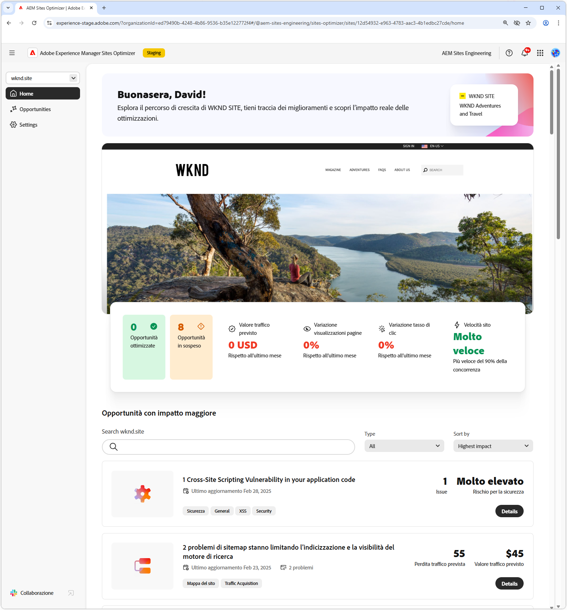
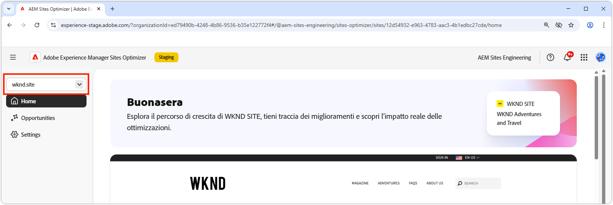
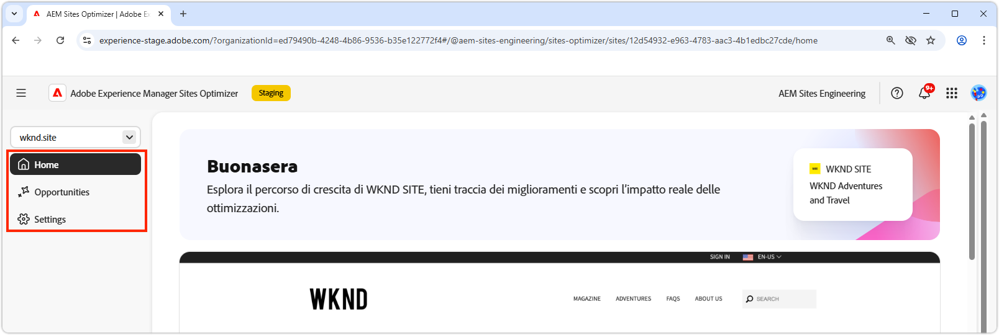
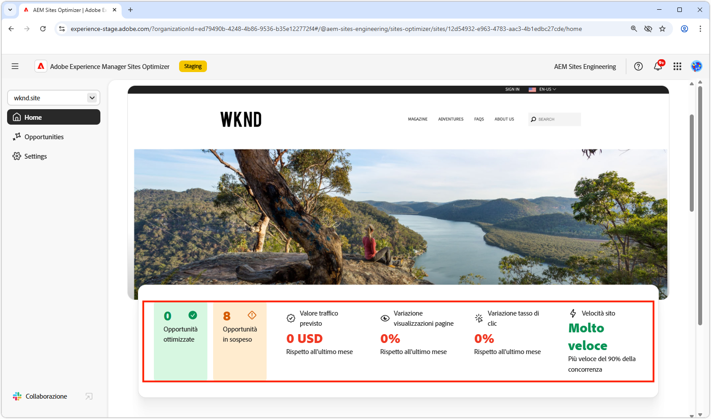
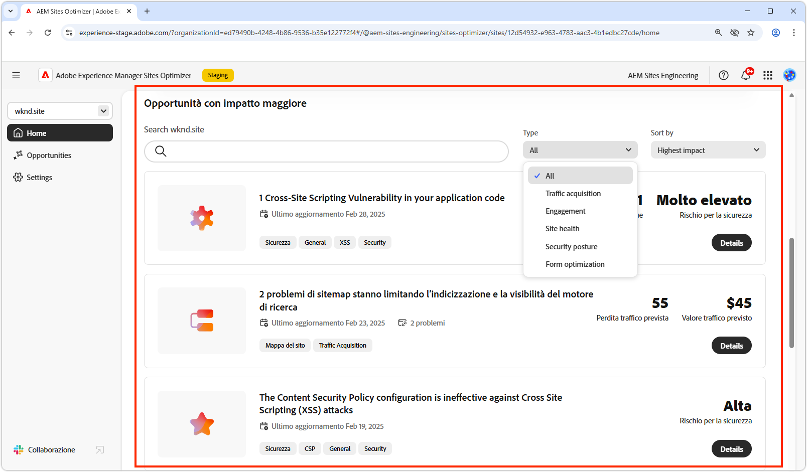
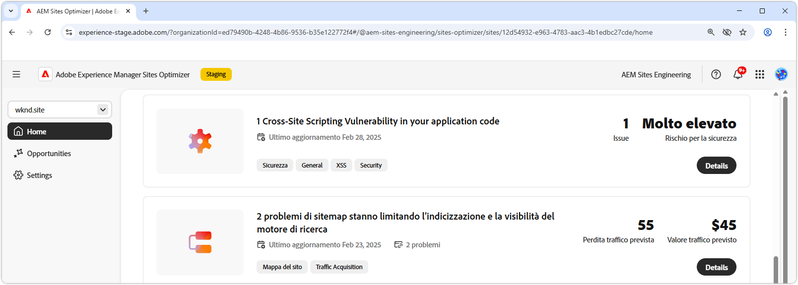

# Nozioni di base su Sites Optimizer

{align="center"}

La dashboard di Sites Optimizer offre una panoramica di alto livello delle prestazioni del sito e delle opportunità di miglioramento.

## Gestione domini

{align="center"}

Il menu di scelta rapida di Gestione dominio consente di scegliere il sito AEM da valutare e ottimizzare in base al dominio. Sites Optimizer fornisce un elenco di tutti i siti AEM di produzione registrati in [Cloud Manager](https://experienceleague.adobe.com/it/docs/experience-manager-cloud-service/content/implementing/using-cloud-manager/edge-delivery-sites/add-edge-delivery-site).

## Navigazione

{align="center"}

La sezione Navigazione consente di accedere in modo rapido e persistente ad aree chiave di Sites Optimizer da qualsiasi punto di Sites Optimizer, tra cui:

* **Pagina Home**: dashboard principale che fornisce una panoramica di alto livello delle prestazioni del sito e delle opportunità di miglioramento.
* **Opportunità**: visualizza e gestisci le opportunità identificate da Sites Optimizer, incluse quelle già ottimizzate e quelle non ottimizzate.
* **Impostazioni**: puoi configurare le impostazioni di Sites Optimizer, inclusi i siti monitorati e le notifiche ricevute.

## Riepilogo sito

{align="center"}

La sezione Riepilogo sito fornisce un’istantanea delle prestazioni del sito, del modo in cui Sites Optimizer ha migliorato il sito nel tempo e delle opportunità di miglioramento. Le metriche chiave includono:

* **Opportunità ottimizzate**: numero di opportunità identificate che sono state migliorate per aumentare le prestazioni aziendali.
* **Opportunità in sospeso**: numero di potenziali miglioramenti non ancora ottimizzati, che rappresentano aree di guadagno per l’azienda.
* **Valore traffico previsto**: modifica del valore stimato del traffico del sito web rispetto al mese scorso, per valutare il contributo di Site Optimizer agli obiettivi aziendali.
* **Modifica delle visualizzazioni di pagina**: il cambiamento percentuale nella frequenza di visualizzazione del sito, che riflette l’interesse degli utenti e l’efficacia dei contenuti.
* **Modifica frequenza di clic**: modifica percentuale della frequenza con cui gli utenti fanno clic, che indica spostamenti in termini di coinvolgimento e potenziale di conversione.
* **Velocità del sito**: un indicatore chiave della velocità e dell’usabilità del sito web, che influisce sull’esperienza utente e sulle classificazioni di ricerca.

## Opportunità ad impatto elevato

{align="center"}

La sezione Opportunità ad impatto elevato evidenzia le opportunità di miglioramento in sospeso più significative, in base al relativo potenziale impatto sulle prestazioni del sito. Queste opportunità sono organizzate per tipo, per facilitare l’assegnazione delle priorità alle attività di ottimizzazione.

Filtra le opportunità per parole chiave, tag, URL o [tipo di opportunità](../opportunity-types/overview.md) per concentrarti sulle aree di miglioramento più critiche.

### Dettagli dell’opportunità

{align="center"}

Ogni opportunità fornisce una breve descrizione del problema, del suo potenziale impatto sul sito e un collegamento ai dettagli completi. Puoi anche visualizzarne lo stato, che indica se è stato ottimizzato o è ancora in sospeso.

* **Titolo dell’opportunità**: breve descrizione del problema e del suo potenziale impatto sulle prestazioni del sito.
* **Ultimo aggiornamento**: Sites Optimizer ha aggiornato l’opportunità con nuovi dati in questa data.
* **Numero di problemi**: numero di istanze del problema identificate sul sito.
* **Tipi di opportunità** - I [tipi di opportunità](../opportunity-types/overview.md) di cui fa parte l&#39;opportunità, ad esempio l&#39;acquisizione del traffico, il coinvolgimento, la conversione o l&#39;integrità del sito.

Le informazioni di riepilogo per ogni opportunità variano in base al tipo e possono includere dettagli sull’impatto sulle entrate, sul traffico, sul coinvolgimento degli utenti o sulle minacce alla sicurezza.

Per visualizzare i dettagli di un’opportunità, fai clic sul pulsante **Dettagli**.

Per escludere un’opportunità dalla dashboard e dai report di Sites Optimizer, fai clic sul pulsante **Ignora**.
