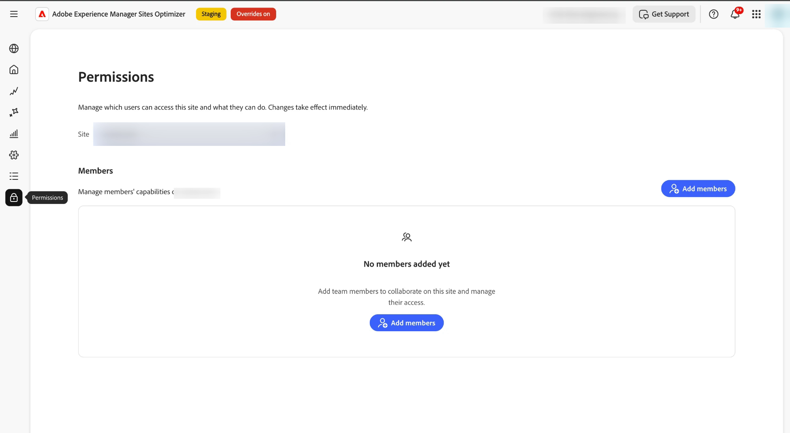

# Gestire le autorizzazioni utente

Controlla chi può accedere a un sito in Sites Optimizer e cosa può farci. L&#39;accesso è basato su un piccolo insieme di *funzionalità indipendenti*, ovvero visualizzazione, modifica, distribuzione, configurazione e gestione degli utenti, concesse a ogni utente.

L&#39;accesso è **additivo**: le autorizzazioni di una persona sono la somma di tutto ciò che le è stato concesso. Non c&#39;è &quot;negazione&quot;, quindi le sovvenzioni non entrano mai in conflitto o si annullano a vicenda. Per concedere a un utente un accesso inferiore, rimuovi una sovvenzione anziché tentare di sovrascriverla.

Per gestire l&#39;accesso, apri la scheda **Autorizzazioni** (l&#39;icona del lucchetto nella navigazione a sinistra), quindi seleziona il sito da gestire.

{align="center"}

## Come viene concesso l’accesso

Ci sono due modi in cui una persona può accedere, e lavorano insieme:

- **Accesso a livello di organizzazione** — assegnato dall&#39;amministratore dell&#39;organizzazione Adobe in [Adobe Admin Console](https://adminconsole.adobe.com/). Si applica a tutti i siti dell’organizzazione. Utilizzalo per le persone che hanno bisogno dello stesso accesso ovunque.
- **Accesso a livello di sito** — assegnato all&#39;interno di Sites Optimizer, nella scheda **Autorizzazioni**. Si applica a un singolo sito e può essere ampio o stretto come è necessario. Non è richiesto alcun accesso ad Admin Console.

>[!NOTE]
>
>I due livelli si sommano. Un utente con un accesso di visualizzazione a livello di organizzazione che dispone anche della possibilità di modificare le modifiche in un sito può visualizzare tutti i siti e modificarli. Per limitare una persona a un singolo sito, accertati che non svolga anche un ruolo a livello di organizzazione.

### Ruoli a livello di organizzazione (Admin Console)

L&#39;accesso a livello di organizzazione proviene da uno dei due ruoli di prodotto **AEM Sites Optimizer**, assegnati in [Adobe Admin Console](https://adminconsole.adobe.com/):

- **ASO Manager**: accesso completo a ogni sito, inclusi **Gestione utenti**. Un manager può aprire la scheda **Autorizzazioni** per qualsiasi sito e assegnare l&#39;accesso ad altri.
- **Utente ASO**: accesso in sola visualizzazione a ogni sito. Nessuna modifica e nessuna gestione degli utenti.

Per assegnare un ruolo, devi essere un **amministratore di sistema** per l&#39;organizzazione o un **amministratore di prodotto** per AEM Sites Optimizer.

1. Accedi a [Adobe Admin Console](https://adminconsole.adobe.com/).
1. Vai a **Prodotti** e seleziona **AEM Sites Optimizer**.
1. Apri la scheda **Utenti** e aggiungi l&#39;utente tramite e-mail (o seleziona un utente esistente).
1. Fai clic sull&#39;icona **+** (aggiungi) per aggiungere un profilo di prodotto, quindi scegli il profilo di prodotto.

   {align="center"}

1. Fai clic su **Avanti**.
1. Scegliere il ruolo **ASO Manager** per l&#39;accesso completo o **ASO Utente** per l&#39;accesso in sola visualizzazione, quindi fare clic su **Applica**.

   {align="center"}

   {align="center"}

Per ulteriori informazioni sull&#39;aggiunta di utenti, vedere [Utenti integrati](setup/onboard-users.md).

>[!IMPORTANT]
>
>Solo un amministratore dell&#39;organizzazione può concedere **Gestione utenti** a livello di organizzazione. Un membro con **Gestione utenti** in un sito può assegnare l&#39;accesso a tale sito, ma non può creare un **ASO Manager** a livello di organizzazione.

## Livelli di funzionalità

Ogni funzionalità controlla un tipo di azione. Sono indipendenti: ad esempio, è possibile concedere la distribuzione senza modificarla.

| Funzionalità | Cosa consente | Cosa non consente |
|---|---|---|
| Visualizzazione | Visualizzare i dati del sito, ovvero opportunità, suggerimenti, correzioni, rapporti e configurazioni, senza apportare alcuna modifica. | Qualsiasi cambiamento. |
| Modifica | Creare e modificare opportunità e suggerimenti (cosa dovrebbe cambiare). | Pubblicazione delle modifiche, modifica delle impostazioni o gestione degli utenti. |
| Distribuzione | Pubblicare le correzioni sul sito in tempo reale e riportarle indietro. | Gestione degli utenti. |
| Configurare | Modificare le impostazioni e le connessioni del sito. | Pubblicazione delle correzioni o gestione degli utenti. |
| Gestisci utenti | Concedere o revocare l&#39;accesso al sito ad altri membri. | Gestione di un sito a cui la persona non ha già accesso. |

>[!NOTE]
>
>**Visualizzazione sempre inclusa.** Ogni sovvenzione include la visualizzazione automatica: non è possibile gestire, configurare, modificare o distribuire qualcosa che non è possibile visualizzare. Per questo motivo, non è possibile rimuovere la visualizzazione da sola. Per rimuovere completamente l&#39;accesso di un utente, rimuovere il membro (vedere [Modificare o rimuovere un membro](#edit-or-remove-a-member) di seguito) invece di deselezionare ogni funzionalità.

## Limitare l’accesso ai tipi di opportunità

In un singolo sito è possibile concedere la visualizzazione, la modifica e la distribuzione per **tipi di opportunità specifici** (ad esempio, Core Web Vitals o collegamenti interni interrotti) anziché per l&#39;intero sito. Ciò consente a una persona di modificare Core Web Vitals visualizzando solo tutto il resto.

- **Visualizza**, **Modifica** e **Distribuisci** possono avere ambito su uno o più tipi di opportunità o su **Tutti** tipi di opportunità.
- **Configura** e **Gestisci utenti** si applicano sempre all&#39;intero sito, non possono essere limitati a un tipo di opportunità.

Ogni concessione con ambito viene visualizzata come riga del membro, con una colonna **Si applica a** che mostra il tipo di opportunità, **Tutti**, o **A livello di sito**.

>[!CAUTION]
>
>L&#39;ambito limita solo ciò che la concessione *che* concede, non rimuove mai l&#39;accesso fornito da un&#39;altra concessione. Se una persona dispone anche di un accesso a livello di organizzazione o di una concessione di **Tutti** i tipi sono ancora validi. Quindi, per limitare realmente qualcuno a specifici tipi di opportunità, assicurati che non abbiano anche un ruolo più ampio o una sovvenzione di **Tutti** i tipi.

## Aggiungi un membro

1. Apri la scheda **Autorizzazioni** (l&#39;icona del lucchetto nella navigazione a sinistra) e seleziona il sito.
1. Fare clic su **Aggiungi membri**.
1. Cerca per nome o e-mail e seleziona una o più persone.
1. Scegli i **tipi di opportunità** a cui si applica l&#39;accesso (o **Tutti**), quindi seleziona le funzionalità da concedere.
1. Fai clic su **Aggiungi**.

## Modificare o rimuovere un membro

Nella tabella **Membri**:

- Fai clic su **Modifica funzionalità** nella riga di un membro per modificare le operazioni che è in grado di eseguire. Quando si modifica una sovvenzione esistente, il relativo tipo di opportunità rimane fisso: vengono modificate solo le funzionalità e almeno una funzionalità deve rimanere selezionata.
- Fare clic su **Rimuovi** per revocare completamente l&#39;accesso del membro al sito.

>[!NOTE]
>
>La modifica delle funzionalità e la rimozione di un membro sono azioni diverse. Per rimuovere tutti gli accessi, utilizzare **Rimuovi**. Non è possibile deselezionare le funzionalità, perché una sovvenzione deve mantenere almeno una funzionalità (e la visualizzazione rimane sempre).

## Chi può gestire le autorizzazioni

La scheda **Autorizzazioni** per un sito è disponibile per:

- Membri con la funzionalità **Gestione utenti** nel sito e
- Amministratori dell’organizzazione (un responsabile ASO).

I membri senza **Gestione utenti** visualizzano un messaggio che indica che non dispongono delle autorizzazioni necessarie per gestire l&#39;accesso al sito.

## Attivare la gestione degli utenti e degli accessi

La gestione degli utenti e degli accessi è controllata da un’impostazione per la tua organizzazione. Puoi assegnare l&#39;accesso prima che sia attivato, ma solo **imposto** una volta che l&#39;impostazione è attiva.

Se non è ancora abilitata, nella scheda **Autorizzazioni** viene visualizzato un banner in cui viene richiesto di contattare il team dell&#39;account. Rivolgiti al team del tuo account Sites Optimizer per accenderlo.

>[!NOTE]
>
>Fino a quando la gestione degli utenti e degli accessi non viene attivata, le autorizzazioni assegnate vengono salvate ma non applicate.

## Imposta l&#39;accesso prima dell&#39;applicazione

Non è necessario attendere che l’imposizione inizi ad assegnare l’accesso. Anche se la gestione degli utenti e degli accessi è ancora **off**, gli utenti con il ruolo **Responsabile ASO** possono aprire la scheda **Autorizzazioni** e assegnare siti e funzionalità ad altri utenti.

Questo ti consente di preparare in anticipo il giusto accesso per tutti. Quando l’imposizione viene successivamente attivata, gli utenti dispongono già dell’accesso necessario, quindi nessuno viene bloccato in modo imprevisto.

>[!IMPORTANT]
>
>Quando l&#39;imposizione è disattivata, la scheda **Autorizzazioni** è disponibile solo per **utenti ASO Manager**. Imposta prima l’accesso per tutti gli utenti, quindi attiva l’imposizione.

## Domande frequenti

**I membri a livello di sito hanno bisogno di un ruolo Admin Console?**

No. L&#39;accesso a livello di sito viene concesso interamente in Sites Optimizer, nella scheda **Autorizzazioni**. In Admin Console vengono assegnati solo ruoli a livello di organizzazione.

**Cosa succede se un utente dispone di accesso sia a livello di organizzazione che a livello di sito?**

Si applicano entrambi. Il loro accesso effettivo è la combinazione dei due. Le concessioni non entrano mai in conflitto, poiché nessuna di esse può negare l’accesso.

**Perché un membro con utenti Manage non può creare un manager a livello di organizzazione?**

La creazione di un ruolo a livello di organizzazione è un’azione di Admin Console. Un membro con **Gestione utenti** può assegnare l&#39;accesso al proprio sito, ma solo un amministratore dell&#39;organizzazione può concedere ruoli a livello di organizzazione.

**Come posso revocare l&#39;accesso di un utente a un sito?**

Rimuovi la relativa concessione nella scheda **Autorizzazioni**. Questa funzione è diversa dalle funzionalità di editing, che devono sempre lasciare almeno una funzionalità.

**È possibile limitare una persona a tipi di opportunità specifici?**

Sì: concedere la visualizzazione, la modifica o la distribuzione con ambito a tipi di opportunità specifici anziché **Tutti**. Poiché l&#39;accesso è additivo, ha effetto solo se la persona non dispone anche di un accesso a livello di organizzazione o di una concessione di tipo **Tutti**.
