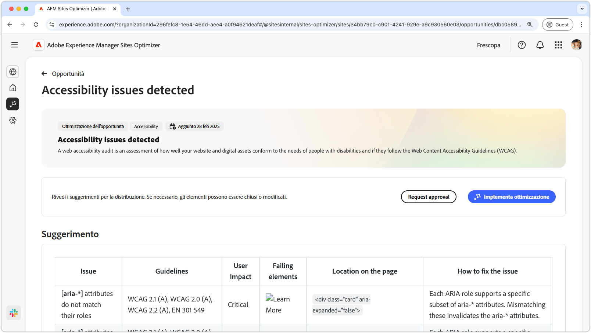
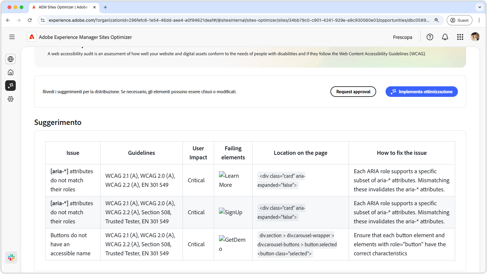
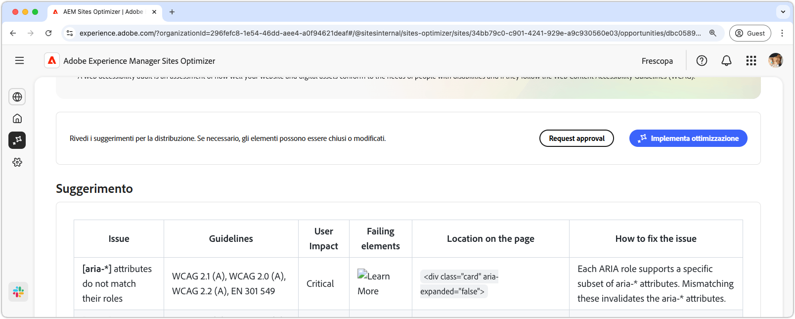

# Opportunità dei problemi di accessibilità

{align="center"}

L’opportunità dei problemi di accessibilità identifica la conformità del sito web alle esigenze delle persone affette da disabilità e se queste seguono le [linee guida per l’accessibilità dei contenuti web (WCAG)](https://www.w3.org/TR/WCAG21/). Valutando la conformità del sito alle linee guida WCAG, puoi contribuire a creare un’esperienza online inclusiva. A sua volta, consente alle persone con disabilità visive, uditive, cognitive e motorie di navigare, interagire con i contenuti e trarne vantaggio. Questa funzionalità è essenziale non solo per motivi etici, ma promuove anche la conformità ai requisiti legali, migliora l’ottimizzazione SEO (Search Engine Optimization) e può aumentare la portata del pubblico, migliorando sia l’esperienza utente che le prestazioni aziendali.

## Identificazione automatica

{align="center"}

L’**opportunità dei problemi di accessibilità** identifica i problemi di accessibilità del sito web e include quanto segue:

* **Problemi**: gli specifici problemi di accessibilità rilevati.
* **Linee guida**: [l’ID delle linee guida per l’accessibilità dei contenuti web](https://www.w3.org/TR/WCAG21/) che il problema viola.
* **Impatto utente**: valutazione dell’impatto sugli utenti affetti da disabilità.
* **Elementi non riusciti**: gli elementi HTML della pagina web interessati dal problema.
* **Posizione nella pagina**: lo snippet HTML dell’elemento nella pagina interessato dal problema.

## Suggerimento automatico

{align="center"}

Il suggerimento automatico fornisce consigli generati dall’intelligenza artificiale nel campo **Come risolvere il problema**, fornendo indicazioni prescrittive su cosa fare per risolvere il problema.

## Ottimizzazione automatica

[!BADGE Ultimate]{type=Positive tooltip="Ultimate"}

{align="center"}

Sites Optimizer Ultimate aggiunge la possibilità di distribuire l’ottimizzazione automatica per le vulnerabilità rilevate.

>[!BEGINTABS]

>[!TAB Implementa ottimizzazione]

{{auto-optimize-deploy-optimization-slack}}

>[!TAB Richiedi approvazione]

{{auto-optimize-request-approval}}

>[!ENDTABS]

## Vedi anche

[Opportunità problemi di accessibilità Forms](/help/documentation/opportunities/forms-accessibility-issues.md)