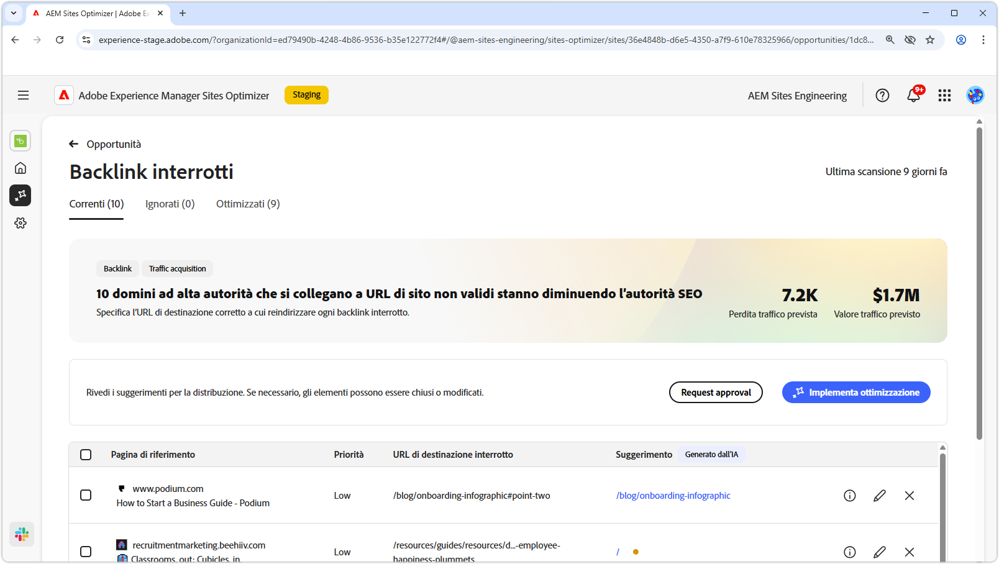
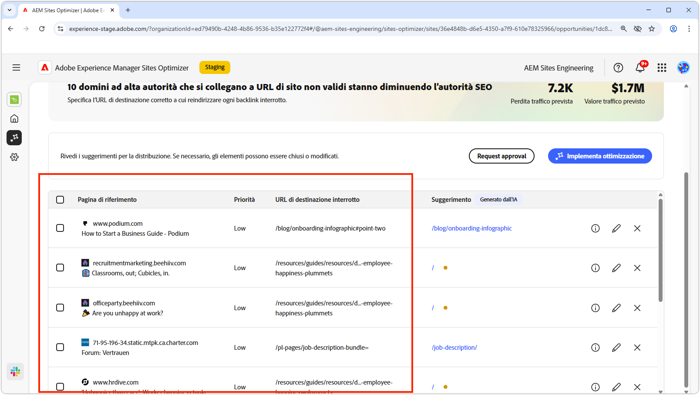
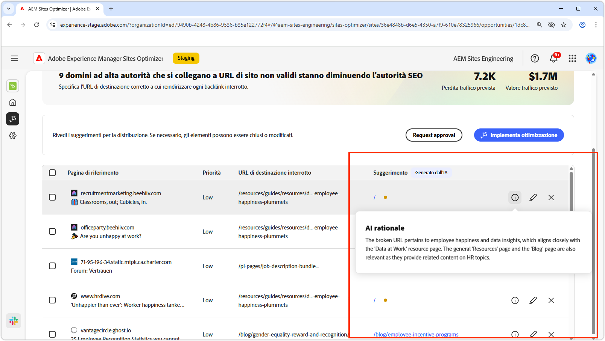
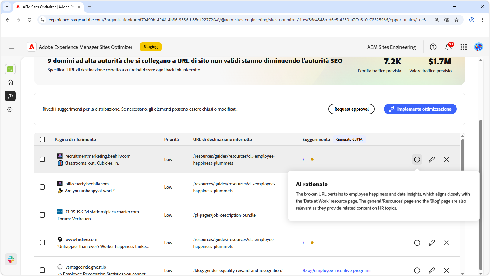
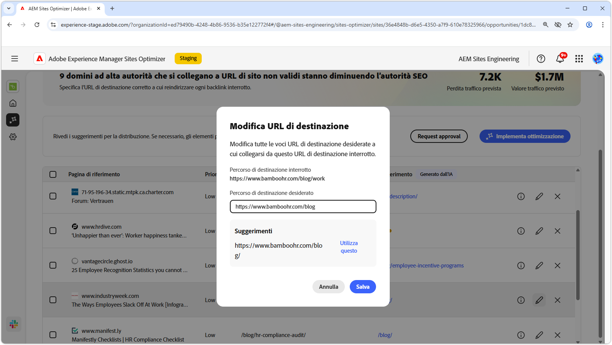
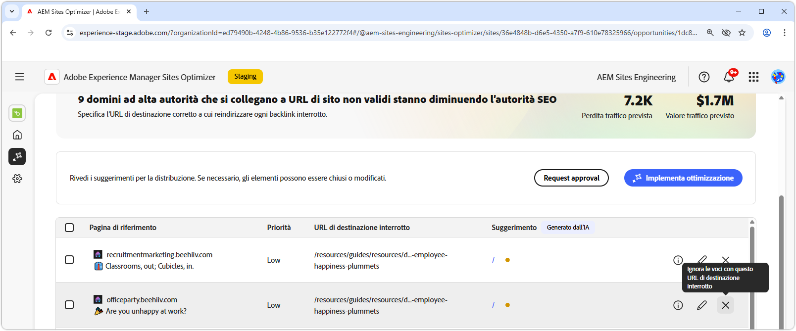
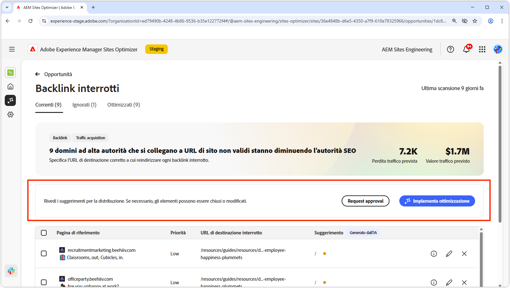
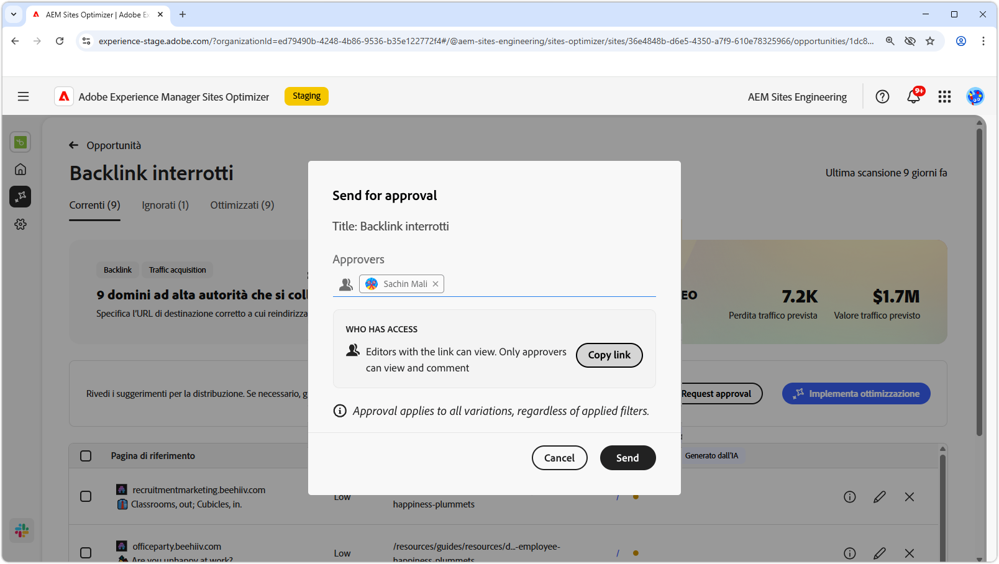

# Opportunità Backlink interrotti

{align="center"}

L’opportunità Backlink interrotti individua i collegamenti al tuo sito da altri siti web che portano a un errore 404. Poiché i motori di ricerca utilizzano i backlink per determinare la rilevanza della ricerca, i collegamenti interrotti possono influire negativamente sulla SEO (Search Engine Optimization) e sulla individuabilità del sito. Questi problemi possono sorgere da fattori come le modifiche dell’URL o la rimozione della pagina collegata.

L’opportunità Backlink interrotti presenta un riepilogo nella parte superiore della pagina, che include una sintesi del problema e il suo impatto sul sito e sul business.

* **Perdita traffico prevista**: perdita di traffico stimata a causa di backlink interrotti.
* **Valore traffico previsto**: valore stimato del traffico perso.

## Identificazione automatica

{align="center"}

L’opportunità Backlink interrotti riporta tutti i backlink interrotti sul sito, tra cui:

* **Pagina di riferimento**: dominio del sito web che contiene il collegamento interrotto.
* **Priorità**: alta, media o bassa; indica l’impatto del collegamento interrotto sulla SEO (Search Engine Optimization) basata su TODO.
* **URL di destinazione interrotto**: URL non esistente nel sito verso il quale viene effettuato il collegamento.

## Suggerimento automatico

{align="center"}

L’opportunità Backlink interrotti fornisce anche suggerimenti generati dall’intelligenza artificiale in merito alla pagina del sito web a cui deve essere reindirizzato l’URL interrotto. I suggerimenti si basano sul testo che forma l’URL interrotto e il contenuto della pagina suggerita.

>[!BEGINTABS]

>[!TAB Base logica dell’intelligenza artificiale]

{align="center"}

Seleziona l’icona **informazioni** per visualizzare la base logica usata dall’IA per l’URL suggerito. La base logica spiega perché l’intelligenza artificiale ritiene che l’URL suggerito sia il più adatto al collegamento interrotto. Può aiutarti a comprendere il processo decisionale dell’intelligenza artificiale e a prendere una decisione informata sull’accettazione o sul rifiuto del suggerimento.

>[!TAB Modifica URL di destinazione]

{align="center"}

Se non sei d’accordo con il suggerimento generato dall’IA, puoi modificare l’URL suggerito selezionando l’**icona di modifica**. La modifica ti consente di inserire manualmente l’URL che ritieni più adatto al collegamento interrotto. Sites Optimizer elenca anche eventuali altri URL sul sito che ritiene possano essere adatti al collegamento interrotto.

>[!TAB Ignorare le voci]

{align="center"}

Puoi scegliere di ignorare alcune voci con l’URL di destinazione interrotto. Se si seleziona , il backlink interrotto verrà rimosso dall&#39;elenco delle opportunità. I backlink interrotti ignorati possono essere riattivati dalla scheda **Ignorate** nella parte superiore della pagina dell’opportunità.

>[!ENDTABS]

## Ottimizzazione automatica

[!BADGE Ultimate]{type=Positive tooltip="Ultimate"}

{align="center"}

Sites Optimizer Ultimate aggiunge la possibilità di implementare l’ottimizzazione automatica per i backlink interrotti. Se selezioni il pulsante **Ottimizzazione automatica**, le regole di reindirizzamento del sito AEM vengono aggiornate in automatico con la mappatura dell’**URL di destinazione interrotto** sull’**URL suggerito**. Questa funzionalità garantisce che i visitatori del sito Web e i bot di ricerca che seguono i collegamenti interrotti nelle **pagine di riferimento** vengano reindirizzati alla pagina corretta del sito, migliorando l&#39;esperienza di utilizzo e SEO.

>[!BEGINTABS]

>[!TAB Implementa ottimizzazione]

{align="center"}

Selezionando **Distribuisci ottimizzazione**, le regole di reindirizzamento del sito AEM vengono aggiornate per mappare l&#39;**URL di destinazione interrotto** all&#39;**URL suggerito**. Questa funzionalità garantisce che i visitatori del sito Web e i bot di ricerca che seguono i collegamenti interrotti nelle **pagine di riferimento** vengano reindirizzati alla pagina corretta del sito, migliorando l&#39;esperienza di utilizzo e SEO.

>[!TAB Richiedi approvazione]

{align="center"}

{{auto-optimize-request-approval}}

>[!ENDTABS]
