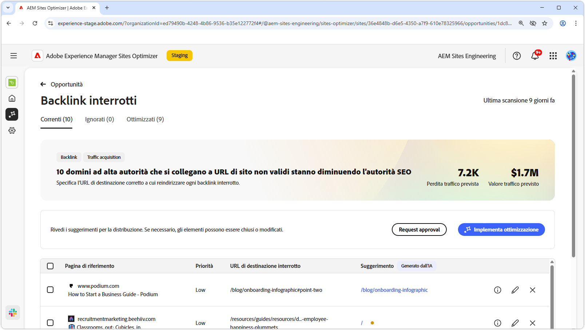
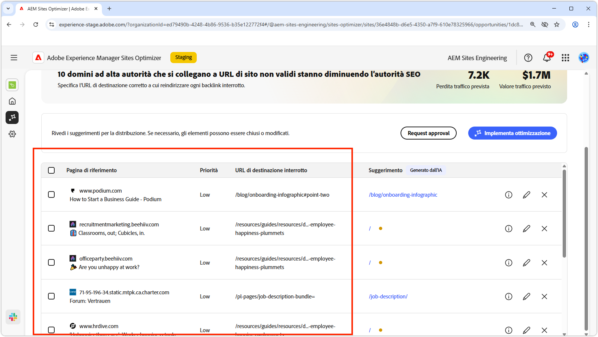
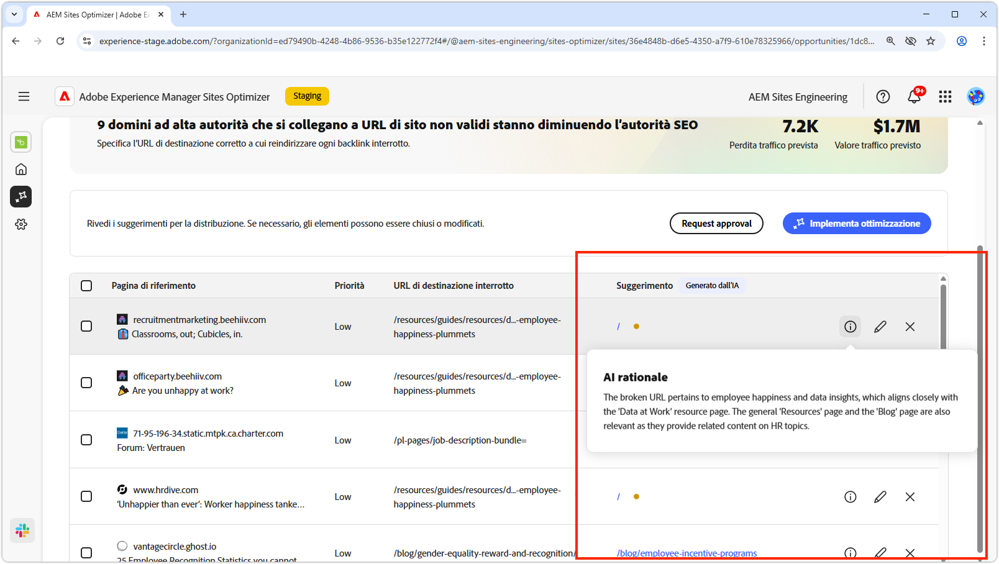
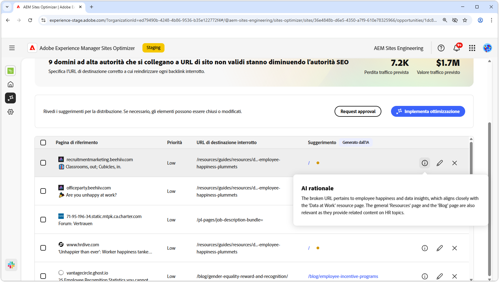
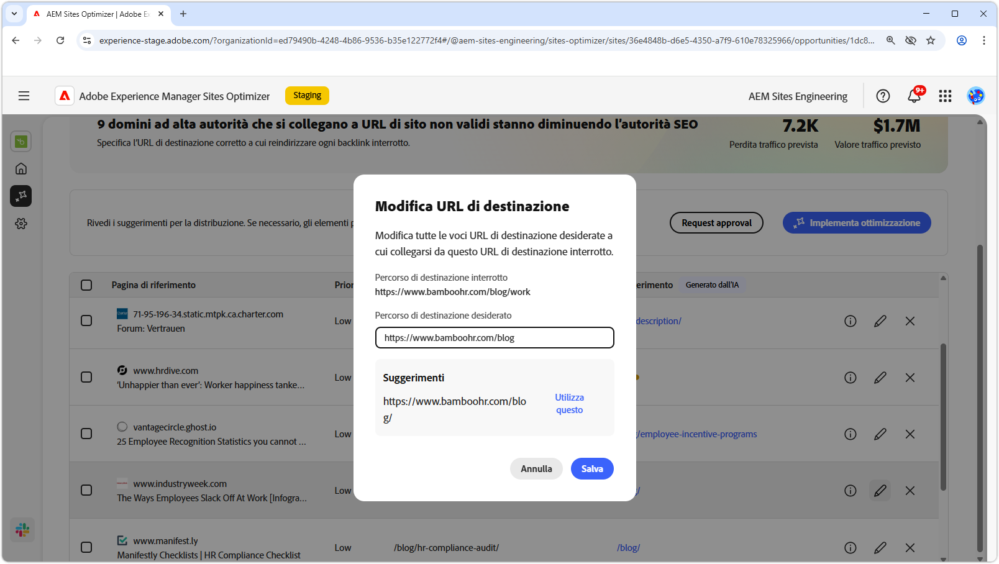
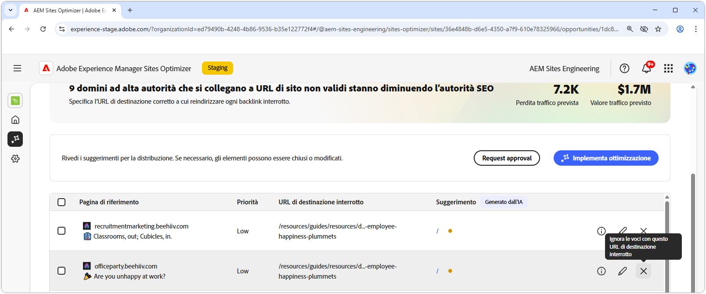

# Opportunità Backlink interrotti

<!--{align="center"}-->

>[!VIDEO](https://video.tv.adobe.com/v/3483250/?learn=on&enablevpops)

L’opportunità da cogliere in caso di backlink interrotti identifica collegamenti esterni che puntano a pagine inesistenti (404) sul tuo sito. Questi collegamenti comportano una perdita di traffico da referral e una riduzione del valore della SEO, in quanto i motori di ricerca si basano su backlink per valutare la rilevanza e l’autorità di un sito. Questi problemi si verificano quando gli URL vengono modificati, il contenuto viene rimosso o le pagine non sono più disponibili senza reindirizzamenti appropriati. AEM Sites Optimizer identifica tutti i backlink interrotti, fornisce consigli IA specifici e consente l’implementazione con un solo clic per correggerli, il tutto in un’unica vista centralizzata.

## Identificazione automatica

<!--{align="center"}-->

AEM Sites Optimizer esegue una scansione continua delle origini dati esterne per rilevare i backlink che puntano a pagine 404 inesistenti sul sito. I dati vengono aggregati da più origini, tra cui Google Search Console, [Telemetria operativa](https://experienceleague.adobe.com/it/docs/experience-manager-cloud-service/content/sites/operational-telemetry-for-aem-as-a-cloud-service) e piattaforme SEO di terze parti. L’opportunità di identificazione automatica identifica i domini esterni che si collegano agli URL interrotti e assegna loro una priorità in base all’impatto, inclusa l’autorità di dominio e le perdite previste di traffico e valore del collegamento.

Questa opportunità elenca tutti i problemi identificati, inclusi i seguenti dettagli:

* **Pagina e dominio di riferimento**: pagina o dominio esterno che contiene il collegamento interrotto.
* **Priorità**: alta, media o bassa; indica l’impatto del collegamento interrotto sul processo SEO.
* **URL di destinazione interrotto**: URL inesistente nel sito a cui viene collegato.

## Suggerimento automatico

<!--{align="center"}-->

Per ogni backlink interrotto identificato, AEM Sites Optimizer consiglia la destinazione più appropriata per ripristinare il traffico e il valore SEO. Determina l’intento del backlink analizzando:

* Struttura URL e token
* Ancoraggio testo
* Titolo e contesto della pagina di riferimento

Questo intento viene confrontato con il contenuto del sito esistente per identificare la pagina di destinazione più rilevante. Ogni URL interrotto viene mappato su una pagina di sostituzione esatta o su una più pertinente. Se non è possibile determinare una destinazione appropriata, il problema viene sottoposto a revisione manuale.

>[!BEGINTABS]

>[!TAB Base logica dell’intelligenza artificiale]

<!--{align="center"}-->

Seleziona l’icona **informazioni** per visualizzare la base logica usata dall’IA per l’URL suggerito. La logica spiega perché l’IA ritiene che l’URL suggerito sia il più adatto al collegamento interrotto. Questo può aiutarti a comprendere il processo decisionale dell’IA e a decidere in modo consapevole se accettare o meno il suggerimento.

>[!TAB Modifica URL di destinazione]

<!--{align="center"}-->

Se non sei d’accordo con il suggerimento generato dall’IA, puoi modificare l’URL suggerito selezionando l’**icona di modifica**. La modifica consente di inserire manualmente l’URL che ritieni più adatto al collegamento interrotto. Sites Optimizer elenca anche eventuali altri URL sul sito che potrebbero essere adatti per il collegamento interrotto.

>[!TAB Ignorare le voci]

<!--{align="center"}-->

Puoi scegliere di ignorare le voci con gli URL di destinazione interrotti. La selezione dell’ rimuove il backlink interrotto dall’elenco delle opportunità. I backlink interrotti ignorati possono essere riattivati dalla scheda **Ignorate** nella parte superiore della pagina dell’opportunità.

>[!ENDTABS]

## Ottimizzazione automatica

<!--[!BADGE Ultimate]{type=Positive tooltip="Ultimate"}-->

Dopo aver esaminato e approvato i suggerimenti, puoi fare clic su **Implementa ottimizzazione**. AEM Sites Optimizer applica quindi le correzioni nell’ambiente di authoring, in base al modo in cui i reindirizzamenti vengono gestiti all’interno dell’implementazione. L’autore di AEM può quindi pubblicare le modifiche da Content Management System (CMS).

A seconda della configurazione, le correzioni vengono applicate come modifiche al contenuto o al codice all’interno dei flussi di lavoro di implementazione esistenti. Il processo di ottimizzazione include i seguenti passaggi:

* **Convalida**: garantisce che le modifiche funzionino come previsto e non introducano regressioni prima dell’implementazione.
* **Implementazione**: applica le modifiche tramite i processi esistenti, ad esempio gli aggiornamenti del contenuto in AEM o l’implementazione del codice tramite pipeline CI/CD.
* **Controllo autorizzazioni**: verifica che l’utente disponga delle autorizzazioni appropriate per implementare le modifiche. In caso contrario, vengono forniti output alternativi come elenchi di reindirizzamento scaricabili o patch di codice.

Questo processo garantisce che i reindirizzamenti siano implementati in modo accurato, convalidati prima del rilascio e allineati alle configurazioni e ai processi di governance esistenti.
