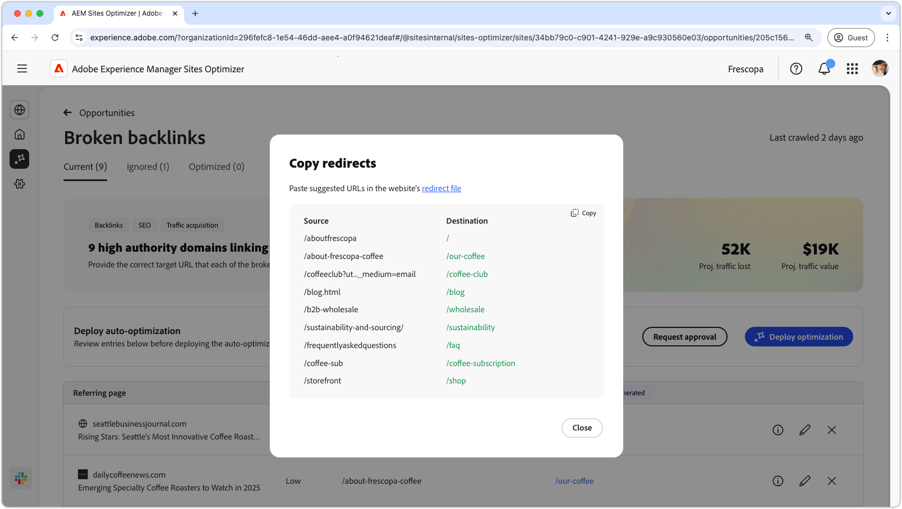

# Opportunità Backlink interrotti

{align="center"}

L’opportunità Backlink interrotti individua i collegamenti al tuo sito da altri siti web che portano a un errore 404. Poiché i motori di ricerca utilizzano i backlink per determinare la rilevanza della ricerca, i collegamenti interrotti possono influire negativamente sulla SEO (Search Engine Optimization) e sulla individuabilità del sito. Questi problemi possono sorgere da fattori come le modifiche dell’URL o la rimozione della pagina collegata.

L’opportunità Backlink interrotti presenta un riepilogo nella parte superiore della pagina, che include una sintesi del problema e il suo impatto sul sito e sul business.

* **Perdita traffico prevista**: perdita di traffico stimata a causa di backlink interrotti.
* **Valore traffico previsto**: valore stimato del traffico perso.

## Identificazione automatica

{align="center"}

L’opportunità Backlink interrotti riporta tutti i backlink interrotti sul sito, tra cui:

* **Pagina di riferimento**: dominio del sito web che contiene il collegamento interrotto.
* **Priorità**: alta, media o bassa; indica l’impatto del collegamento interrotto sulla SEO (Search Engine Optimization) basata su TODO.
* **URL di destinazione interrotto**: URL non esistente nel sito verso il quale viene effettuato il collegamento.

## Suggerimento automatico

{align="center"}

L’opportunità Backlink interrotti fornisce anche suggerimenti generati dall’intelligenza artificiale in merito alla pagina del sito web a cui deve essere reindirizzato l’URL interrotto. I suggerimenti si basano sul testo che forma l’URL interrotto e il contenuto della pagina suggerita.

>[!BEGINTABS]

>[!TAB Base logica dell’intelligenza artificiale]

{align="center"}

Seleziona l’icona **informazioni** per visualizzare la base logica usata dall’IA per l’URL suggerito. La logica spiega perché l’IA ritiene che l’URL suggerito sia il più adatto al collegamento interrotto. Questo può aiutarti a comprendere il processo decisionale dell’IA e a decidere in modo consapevole se accettare o meno il suggerimento.

>[!TAB Modifica URL di destinazione]

{align="center"}

Se non sei d’accordo con il suggerimento generato dall’IA, puoi modificare l’URL suggerito selezionando l’**icona di modifica**. La modifica consente di inserire manualmente l’URL che ritieni più adatto al collegamento interrotto. Sites Optimizer elenca anche eventuali altri URL sul sito che potrebbero essere adatti per il collegamento interrotto.

>[!TAB Ignorare le voci]

{align="center"}

Puoi scegliere di ignorare alcune voci con l’URL di destinazione interrotto. La selezione dell’ rimuove il backlink interrotto dall’elenco delle opportunità. I backlink interrotti ignorati possono essere riattivati dalla scheda **Ignorate** nella parte superiore della pagina dell’opportunità.

>[!ENDTABS]

## Ottimizzazione automatica

[!BADGE Ultimate]{type=Positive tooltip="Ultimate"}

{align="center"}

Sites Optimizer Ultimate aggiunge la possibilità di implementare l’ottimizzazione automatica per i backlink interrotti. Se selezioni il pulsante **Ottimizzazione automatica**, le regole di reindirizzamento del sito AEM vengono aggiornate in automatico con la mappatura dell’**URL di destinazione interrotto** sull’**URL suggerito**. Questa funzionalità assicura che i visitatori del sito web e i bot di ricerca che seguono i collegamenti interrotti nelle **pagine di riferimento** vengano reindirizzati alla pagina corretta del sito, migliorando i SEO e l’esperienza utente.

>[!BEGINTABS]

>[!TAB Implementa ottimizzazione]

{align="center"}

La selezione di **Implementa ottimizzazione** consente di aggiornare le regole di reindirizzamento del sito AEM per mappare l’**URL di destinazione interrotto** sull’**URL suggerito**. Questa funzionalità assicura che i visitatori del sito web e i bot di ricerca che seguono i collegamenti interrotti nelle **pagine di riferimento** vengano reindirizzati alla pagina corretta del sito, migliorando i SEO e l’esperienza utente.

>[!TAB Richiedi approvazione]

{align="center"}

{{auto-optimize-request-approval}}

>[!ENDTABS]
