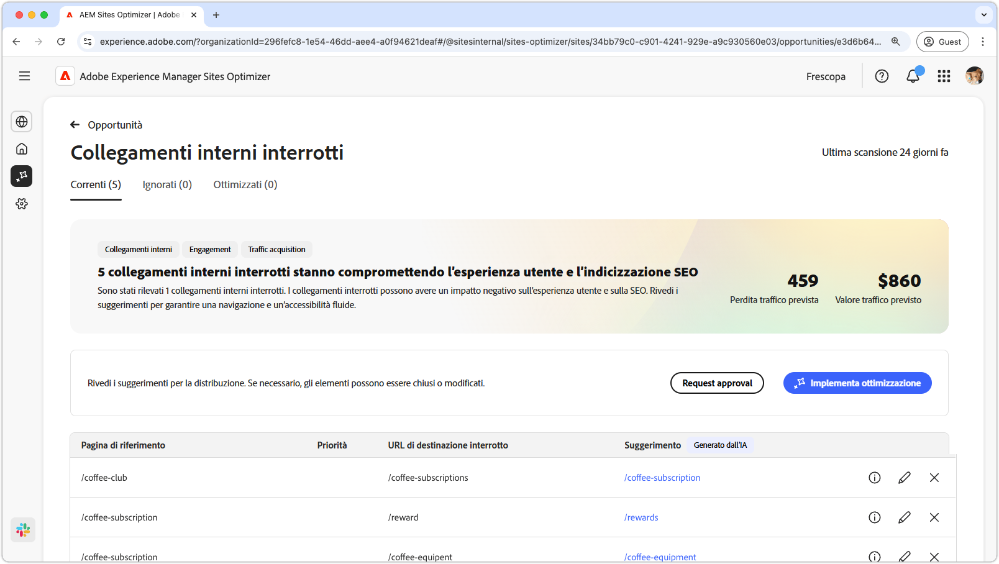
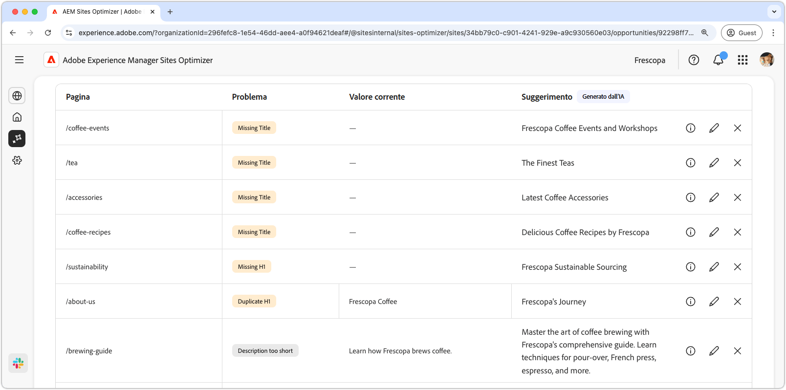

# Opportunità di metadati non validi o mancanti

{align="center"}

I collegamenti interni interrotti influiscono sulla capacità del motore di ricerca di indicizzare il sito e influiscono negativamente sia sull’esperienza utente che sulla SEO (Search Engine Optimization). Per risolvere il problema, l’opportunità di collegamenti interni interrotti evidenzia gli URL interrotti e fornisce suggerimenti per aggiornamenti di collegamenti validi. Affrontare questi problemi migliorerà il coinvolgimento utente e garantirà una navigazione e un’accessibilità più fluide.

L’opportunità di collegamenti interni interrotti nella parte superiore della pagina mostra un riepilogo, che include una sintesi del problema e il relativo impatto sul sito e sull’azienda.

* **Perdita traffico prevista**: perdita di traffico stimato a causa di collegamenti interni interrotti.
* **Valore traffico previsto**: valore stimato del traffico perso.

## Identificazione automatica

<!---{align="center"}-->

L’opportunità di collegamenti interni interrotti identifica ed elenca automaticamente tutti i collegamenti interni interrotti sulle pagine, e include quanto segue:

* **Pagina di riferimento**: pagina contenente il collegamento interrotto.
* **URL di destinazione interrotto**: collegamento interno interrotto.
* **Suggerimento**: suggerimento generato dall’intelligenza artificiale su come aggiornare il collegamento interrotto. Per ulteriori dettagli, consulta la sezione relativa al suggerimento automatico.

## Suggerimento automatico

<!--{align="center"}-->

L’opportunità di collegamenti interni interrotti fornisce suggerimenti generati dall’intelligenza artificiale su come aggiornare i collegamenti interrotti. Questi suggerimenti si basano sull’URL di destinazione danneggiato e forniscono una sostituzione adeguata. La selezione dell’**icona informazioni** fornisce la base logica dell’intelligenza artificiale per l’aggiornamento suggerito.

>[!BEGINTABS]

>[!TAB Base logica dell’intelligenza artificiale]

<!--[AI rationale of broken internal links](./assets/broken-internal-links/auto-suggest-ai-rationale.png) -->

Seleziona l’icona **informazioni** per visualizzare la base logica dell’intelligenza artificiale per l’URL suggerito. La base logica spiega perché l’intelligenza artificiale ritiene che l’URL suggerito sia il più adatto al collegamento interrotto. Questo può aiutarti a comprendere il processo decisionale dell’intelligenza artificiale e a decidere in modo informato se accettare o meno il suggerimento.

>[!TAB Modifica URL di destinazione]

<!--{align="center"}-->

Se non sei d’accordo con il suggerimento generato dall’intelligenza artificiale, puoi modificare il valore del collegamento suggerito selezionando l’**icona di modifica**. Questo ti consente di inserire manualmente il collegamento desiderato. La finestra di modifica contiene il **percorso di destinazione interrotto** del collegamento, il **percorso di destinazione desiderato** in cui è possibile modificare manualmente il collegamento e un campo con il suggerimento generato dall’intelligenza artificiale. Al termine della modifica, fai clic su **Salva** per aggiornare la voce di collegamento interrotta. Nel campo di immissione verrà visualizzato un punto giallo per indicare che il collegamento è stato modificato.

>[!TAB Ignorare le voci]

<!--{align="center"}-->

Puoi scegliere di ignorare le voci con gli URL di destinazione interrotti. La selezione dell’**icona ignora**, rimuove la voce dall’elenco dell’opportunità. Le voci ignorate possono essere riattivate dalla scheda **Ignorato** nella parte superiore della pagina dell’opportunità.

>[!ENDTABS]

## Ottimizzazione automatica

[!BADGE Ultimate]{type=Positive tooltip="Ultimate"}

<!---{align="center"}-->

Sites Optimizer Ultimate aggiunge la possibilità di distribuire l’ottimizzazione automatica per i collegamenti interrotti rilevati dall’opportunità. <!--- TBD-need more in-depth and opportunity specific information here. What does the auto-optimization do?-->

>[!BEGINTABS]

>[!TAB Distribuisci ottimizzazione]

{{auto-optimize-deploy-optimization-slack}}

>[!TAB Richiedi approvazione]

{{auto-optimize-request-approval}}

>[!ENDTABS]

