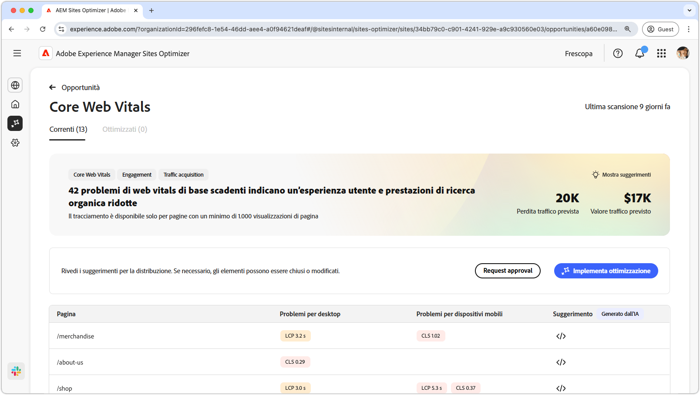
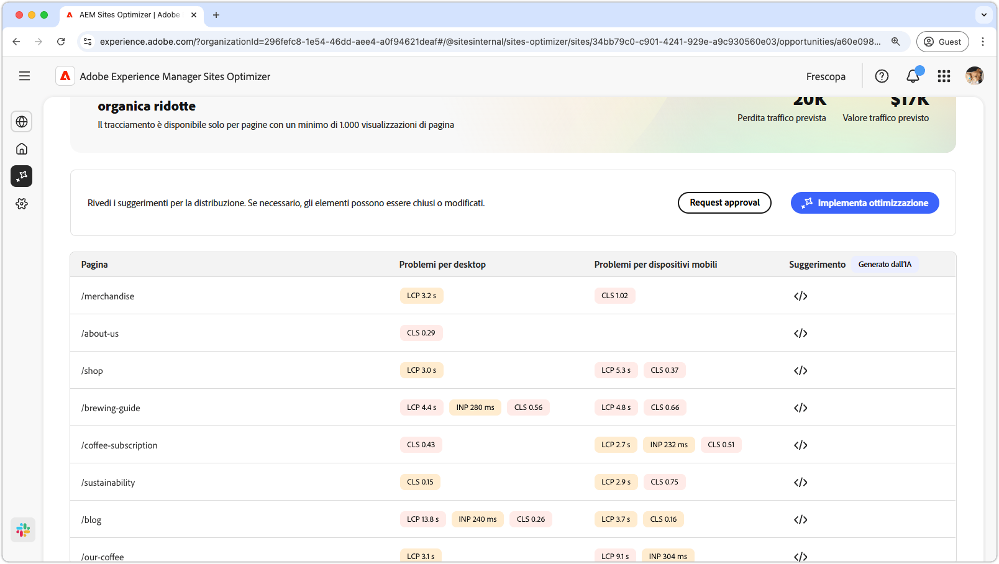
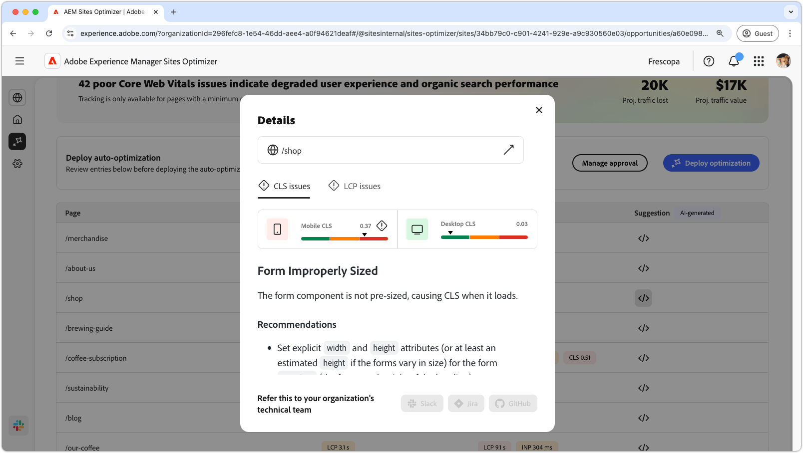

# Opportunità dei web vitals di base

{align="center"}

L’opportunità Core Web Vitals identifica le pagine del sito web con prestazioni inferiori, che influiscono sull’esperienza utente e sulle prestazioni della ricerca organica. Questi problemi possono sorgere da fattori come font personalizzati, dipendenze JavaScript non ottimizzate e script di terze parti. Core Web Vitals misura la velocità di caricamento dei contenuti, la stabilità del layout della pagina e la reattività della pagina alle interazioni dell’utente.

AEM Sites Optimizer rileva le pagine interessate da questi problemi, fornisce consigli specifici sull’intelligenza artificiale a livello di codice e applica le correzioni tramite i flussi di lavoro di sviluppo esistenti. Tieni presente che è possibile analizzare solo le pagine con almeno 1000 visualizzazioni di pagina.

## Identificazione automatica

{align="center"}

AEM Sites Optimizer monitora continuamente le prestazioni del sito utilizzando [Telemetria operativa](https://experienceleague.adobe.com/en/docs/experience-manager-cloud-service/content/sites/operational-telemetry-for-aem-as-a-cloud-service) per rilevare le regressioni nelle metriche di Core Web Vitals, ad esempio LCP (Largest Contentful Paint), CLS (Cumulative Layout Shift) e INP (Interaction to Next Paint). Utilizza i dati utente reali per identificare le regressioni delle prestazioni e assegnare la priorità ai problemi in base al loro impatto sull’esperienza utente.

AEM Sites Optimizer mostra l’elenco di tutti i problemi correnti, dettagliati per dispositivi mobili e desktop. La colonna **Pagina** indica la voce di pagina interessata e i problemi sono suddivisi per categoria in LCP, INP e CLS.

## Suggerimento automatico

{align="center"}

Per ogni problema identificato, AEM Sites Optimizer genera consigli prescrittivi a livello di codice per migliorare le prestazioni di Core Web Vitals. Valuta l’implementazione sottostante accedendo all’archivio del codice. Questo consente al sistema di analizzare il modo in cui i componenti, gli script e gli stili vengono implementati e di identificare la causa principale dei problemi di prestazioni. In base a questa analisi, il sistema fornisce consigli mirati e genera patch di codice che specificano le modifiche necessarie per migliorare le prestazioni. Ogni raccomandazione può essere rivista prima di essere applicata.

Quando si fa clic sul pulsante del suggerimento, viene visualizzata una nuova finestra contenente le metriche delle prestazioni LCP, INP e CLS come categorie. Puoi passare da una categoria all’altra per visualizzare l’elenco dei problemi specifici. Ogni categoria può contenere diversi problemi, quindi accertati di scorrere verso il basso per visualizzare l’elenco completo dei problemi e dei consigli. Inoltre, per ogni metrica sono disponibili due misuratori di prestazioni sia per dispositivi mobili che per sistemi desktop.

## Ottimizzazione automatica

[!BADGE Ultimate]{type=Positive tooltip="Ultimate"}

>[!VIDEO](https://video.tv.adobe.com/v/3483371/?learn=on&enablevpops)

Dopo aver esaminato e approvato i consigli, puoi fare clic su **Distribuisci ottimizzazione**. AEM Sites Optimizer genera patch di codice in base ai problemi identificati e le rende disponibili tramite i processi di controllo delle versioni. Il processo di ottimizzazione include i seguenti passaggi:

* **Creazione del problema** - Crea un problema GitHub con etichetta per ogni correzione, inclusa una descrizione chiara e l&#39;URL interessato per la visibilità.
* **Consegna richiesta pull**: apre automaticamente una richiesta pull collegata con la correzione del codice esatta, pronta per la revisione, il test e l&#39;unione.
* **Tracciamento dello stato** - Tiene traccia di ogni correzione fino al completamento, contrassegnando i tentativi parziali o non riusciti per il completamento.

Prima di rendere disponibili questi aggiornamenti, AEM Sites Optimizer esegue la convalida per garantire che le correzioni risolvano il problema di base e non introducano regressioni. Tutti gli aggiornamenti seguono le procedure di sviluppo standard, che richiedono revisione e approvazione prima di essere uniti alla produzione.

In questo modo le ottimizzazioni delle prestazioni sono accurate, convalidate e integrate nei processi di sviluppo e governance esistenti.
