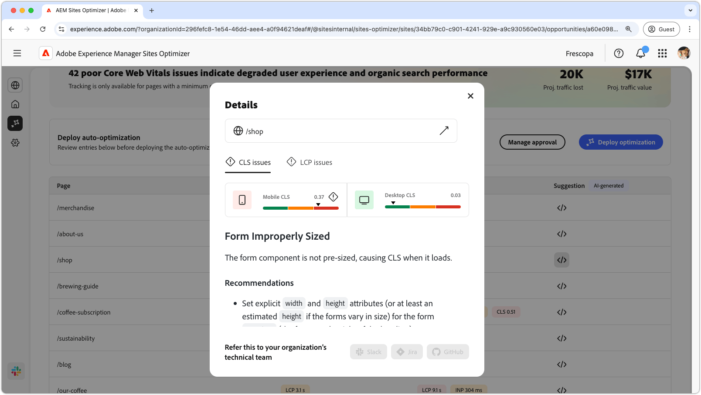

# Opportunità core per i contenuti web vitals

{align="center"}

L’opportunità core di web vitals identifica i problemi che possono compromettere l’esperienza utente e le prestazioni di ricerca organica delle pagine web. Questi problemi derivano da un’ampia gamma di fattori come: font personalizzati, dipendenze JavaScript non ottimizzate, script di terze parti e così via. L’opportunità core di web vitals indica questi elementi difettosi e suggerisce alcune correzioni che possono aumentare le prestazioni della pagina web. È possibile analizzare solo le pagine che hanno almeno 1000 visualizzazioni di pagina.

Per iniziare, l’opportunità core di web vitals mostra un riepilogo nella parte superiore della pagina, inclusa una sintesi del problema e il suo impatto sul sito e sull’azienda.

* **Traffico previsto perduto** - Perdita di traffico stimata a causa di core Web vitals al di sotto delle soglie di prestazioni.
* **Valore traffico previsto** - Valore stimato del traffico perso.

## Identificazione automatica

{align="center"}

Nella parte inferiore della pagina è disponibile un elenco di tutti i problemi correnti raggruppati come:

* **Problemi relativi ai dispositivi mobili** - Elenco di problemi che interessano la versione mobile della pagina.
* **Problemi relativi al desktop** - Elenco di problemi relativi alla versione desktop della pagina.

Ogni problema viene visualizzato in una tabella, con la colonna **Pagina** che identifica la voce della pagina interessata.

Inoltre, questi problemi sono raggruppati anche in base alle metriche standard delle prestazioni del report core Web Vitals: colore con il contenuto più grande **LCP**, interazione con il colore successivo **INP** e spostamento del layout cumulativo **CLS**.

## Suggerimento automatico

{align="center"}

L’opportunità web vitals di base fornisce suggerimenti di correzione generati dall’intelligenza artificiale. Quando fai clic sul pulsante dei suggerimenti, viene visualizzata una nuova finestra contenente le metriche delle prestazioni **LCP**, **INP** e **CLS** come categorie. Puoi passare da una categoria all’altra per visualizzare un elenco di problemi specifici.

Ogni categoria può contenere diversi problemi, quindi accertati di scorrere verso il basso per visualizzare l’elenco completo dei problemi e dei consigli.  Inoltre, per ogni metrica sono disponibili due misuratori di prestazioni sia per dispositivi mobili che per sistemi desktop.

## Ottimizza automaticamente [!BADGE Ultimate]{type=Positive tooltip="Ultimate"}

{align="center"}

Sites Optimizer Ultimate offre la possibilità di distribuire l’ottimizzazione automatica per i problemi rilevati dall’opportunità web vitals di base. <!--- TBD-need more in-depth and opportunity specific information here. What does the auto-optimization do?-->

>[!BEGINTABS]

>[!TAB Ottimizzazione distribuzione]

{{auto-optimize-deploy-optimization-slack}}

>[!TAB Richiedi approvazione]

{{auto-optimize-request-approval}}

>[!ENDTABS]

