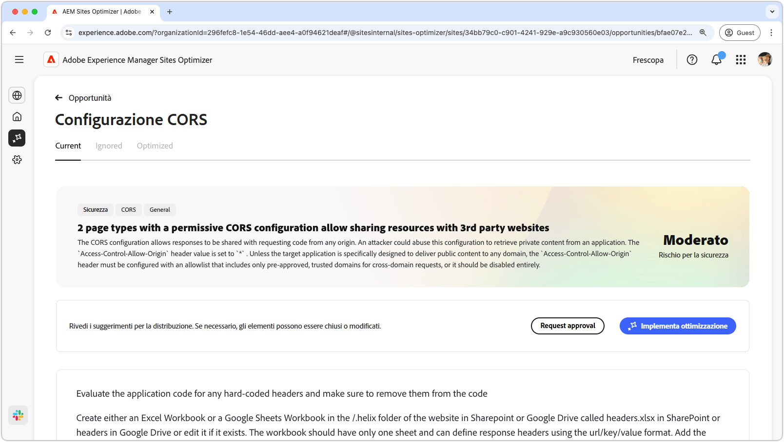
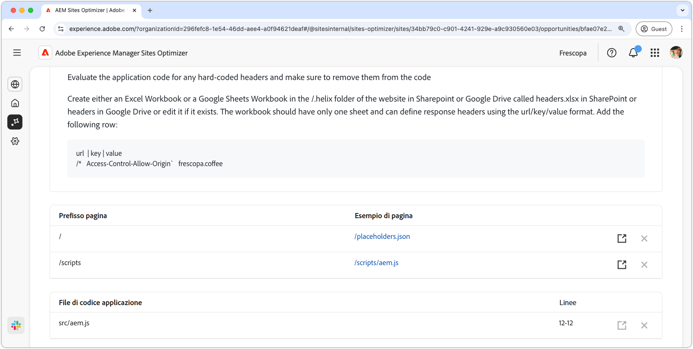

# Opportunità configurazione CORS

{align="center"}

La corretta configurazione CORS (Cross-Origin Resource Sharing) è essenziale per proteggere le applicazioni web dall’accesso non autorizzato ai dati. Quando l’intestazione `Access-Control-Allow-Origin` è impostata su `*`, qualsiasi dominio può richiedere e ricevere risposte, esponendo potenzialmente informazioni riservate ad attacchi. Questo offre la possibilità di rafforzare la sicurezza implementando un elenco Consentiti controllato di domini affidabili o disabilitando CORS laddove non sia richiesto. Garantire una configurazione CORS sicura aiuta a proteggere i contenuti privati mantenendone al contempo l’accesso semplice per gli utenti autorizzati.

## Identificazione automatica

{align="center"}

L’identificazione automatica analizza il sito web per rilevare eventuali configurazioni CORS errate e URL che potrebbero essere suscettibili ad accesso non autorizzato. Questi URL sono elencati nella tabella nella parte superiore, insieme ai seguenti dettagli:

* **Prefisso pagina**: prefisso del percorso URL vulnerabile alla configurazione CORS errata.
* **Esempio di pagina**: URL di esempio suscettibile all’accesso non autorizzato.

## Suggerimento automatico

{align="center"}

Il suggerimento automatico fornisce **file di codice applicazione** e le relative **righe** da rivedere che potrebbero impostare criteri CORS deboli.

## Ottimizzazione automatica

[!BADGE Ultimate]{type=Positive tooltip="Ultimate"}

>[!BEGINTABS]

>[!TAB Distribuisci ottimizzazione]

{{auto-optimize-deploy-optimization-slack}}

>[!TAB Richiedi approvazione]

{{auto-optimize-request-approval}}

>[!ENDTABS]
