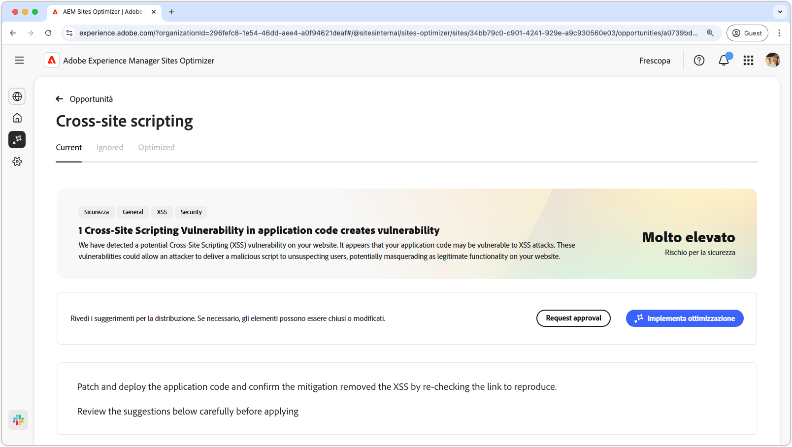
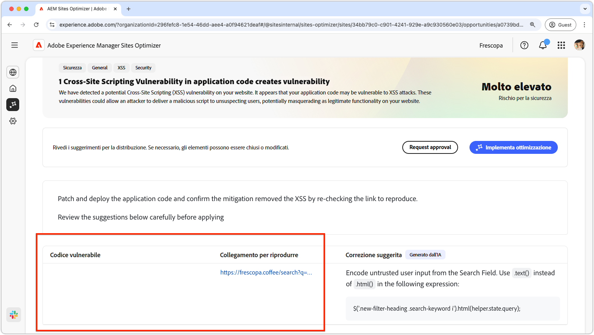
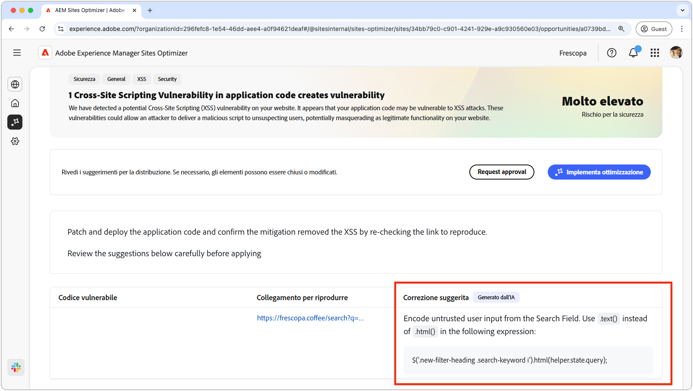

# Opportunità cross-site scripting

{align="center"}

L’opportunità di scripting tra siti identifica le vulnerabilità nel codice del sito. Vengono quindi risolti i problemi che gli aggressori potrebbero sfruttare per inserire script dannosi nelle pagine web visualizzate da altri utenti. Questi script possono sottrarre informazioni riservate, ad esempio cookie di sessione, o eseguire azioni per conto dell’utente, ad esempio modificarne la password.

## Identificazione automatica

{align="center"}

* **Codice vulnerabile**: qualsiasi codice vulnerabile ad attacchi di cross-site scripting.
* **Collegamento da riprodurre**: il collegamento alla pagina in cui è stata trovata la vulnerabilità.

## Suggerimento automatico

{align="center"}

* **Correzione suggerita**: un suggerimento generato dall’intelligenza artificiale su come correggere la vulnerabilità.

## Ottimizzazione automatica

[!BADGE Ultimate]{type=Positive tooltip="Ultimate"}

>[!BEGINTABS]

>[!TAB Distribuisci ottimizzazione]

{{auto-optimize-deploy-optimization-slack}}

>[!TAB Richiedi approvazione]

{{auto-optimize-request-approval}}

>[!ENDTABS]
