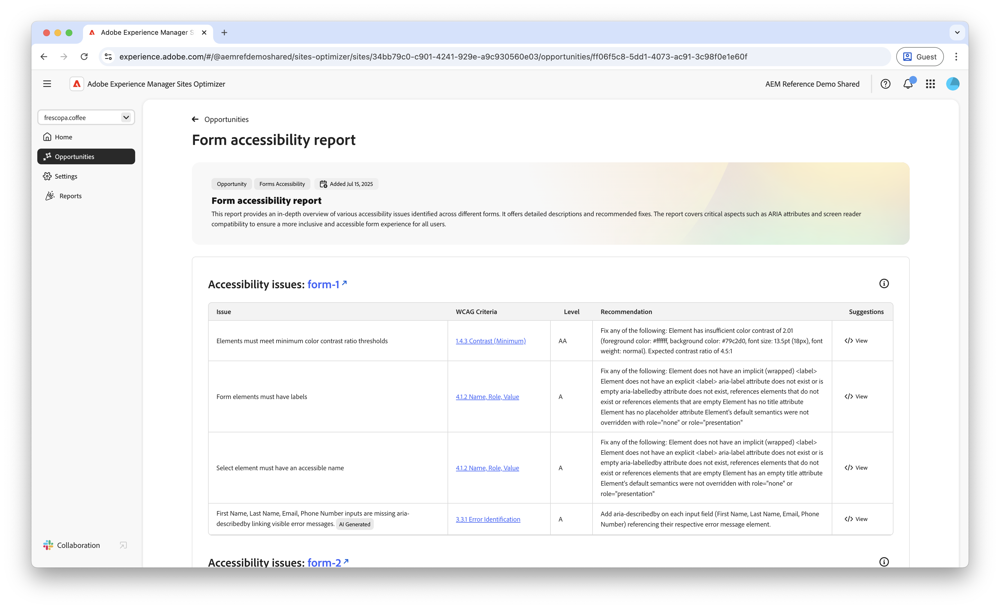

# Opportunità problemi di accessibilità Forms

 La funzionalità di ottimizzazione Forms è disponibile nel programma di accesso anticipato. Puoi scrivere a aem-forms-ea@adobe.com dal tuo ID e-mail ufficiale per partecipare al programma di accesso anticipato e richiedere l’accesso alla funzionalità. 

{align="center"}

L&#39;opportunità Problemi di accessibilità dei moduli identifica la conformità dei moduli alle esigenze delle persone con disabilità e se seguono le [linee guida per l&#39;accessibilità dei contenuti Web (WCAG)](https://www.w3.org/TR/WCAG21/). Valutando la conformità dei moduli alle linee guida WCAG, è possibile creare un’esperienza di moduli inclusivi che consenta agli utenti con disabilità visive, uditive, cognitive e motorie di navigare, interagire con i moduli e completarli con successo. Non solo è essenziale per motivi etici, ma promuove anche la conformità ai requisiti legali, migliora i tassi di completamento dei moduli e può aumentare la portata del pubblico, migliorando sia l’esperienza utente che le prestazioni aziendali.

## Identificazione automatica

{align="center"}

L&#39;**opportunità di problemi di accessibilità di Forms** identifica i problemi di accessibilità specifici nei moduli e include quanto segue:

* **Problemi** - Il problema specifico di accessibilità rilevato nei moduli.
* **Criteri WCAG** - [ID linee guida WCAG](https://www.w3.org/TR/WCAG21/) per cui il problema del modulo viola.
* **Livello** - I [Livelli di conformità](https://www.w3.org/WAI/WCAG21/Understanding/conformance#levels) del problema.
* **Consiglio** - Linee guida specifiche su come risolvere il problema di accessibilità nei moduli, inclusi esempi di codice e best practice.
* **Source HTML** - Frammento HTML dell&#39;elemento forms nella pagina interessata dal problema.

## Suggerimento automatico

{align="center"}

Il suggerimento automatico fornisce consigli generati dall&#39;intelligenza artificiale nel campo **Suggerimenti**, che fornisce indicazioni prescrittive su cosa fare per risolvere il problema di accessibilità dei moduli.

<!-- 

## Auto-optimize

[!BADGE Ultimate]{type=Positive tooltip="Ultimate"}

{align="center"}

Sites Optimizer Ultimate adds the ability to deploy auto-optimization for the form accessibility issues found.

>[!BEGINTABS]

>[!TAB Deploy optimization]

{{auto-optimize-deploy-optimization-slack}}

>[!TAB Request approval]

{{auto-optimize-request-approval}}

>[!ENDTABS]
-->

