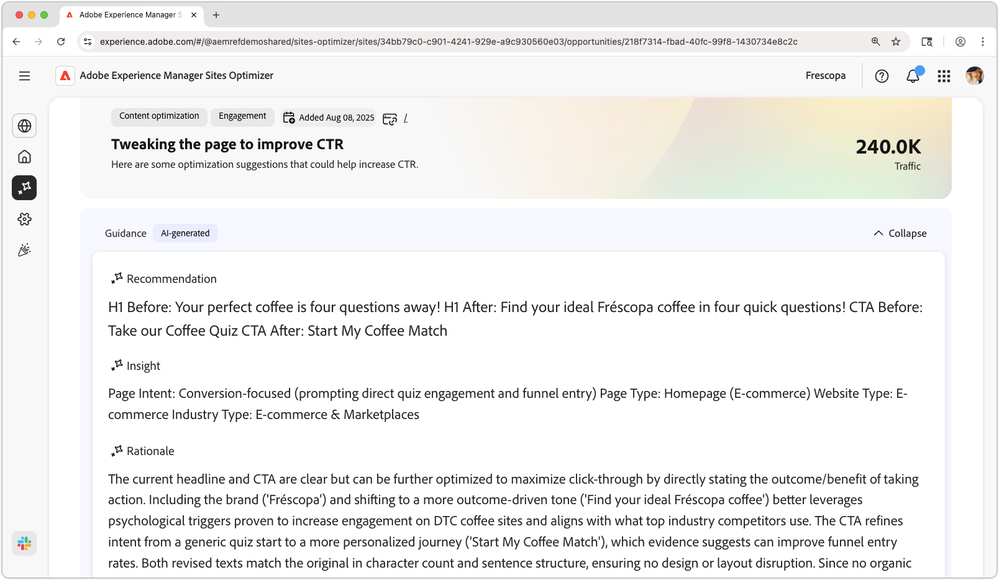

# Opportunità di pagina a traffico elevato con CTR basso

{align="center"}

L’opportunità in caso di pagina a traffico elevato che presenta un CTR basso identifica le pagine del sito web che ricevono una quantità significativa di traffico ma che presentano un tasso di click-through basso (CTR). Analizzando queste pagine, puoi individuare potenziali problemi che potrebbero ostacolare il coinvolgimento degli utenti e adottare misure per migliorarne le prestazioni. Questa opportunità è essenziale per ottimizzare il contenuto e il layout del sito web, in ultima analisi per ottenere tassi di conversione più elevati e migliori esperienze utente.

## Identificazione automatica

{align="center"}

L’**opportunità Pagina a traffico elevato con CTR basso** individua nel sito web le pagine con traffico elevato e CTR basso, e include quanto segue:

* **Consiglio**: azione suggerita per migliorare il CTR della pagina.
* **Approfondimenti**: spiegazione del motivo per cui la pagina ha un CTR basso.
* **Base logica**: il motivo alla base del consiglio.

## Suggerimento automatico

{align="center"}

La funzione di suggerimento automatico fornisce suggerimenti generati dall’intelligenza artificiale basati sull’aspetto di un’esperienza web ottimizzata. I suggerimenti includono una visualizzazione **evidenziata** che semplifica la visualizzazione delle modifiche suggerite.

È possibile selezionare i suggerimenti per visualizzarli in visualizzazione completa, il loro impatto sul CTR previsto e la possibilità di modificarli prima di applicarli alla pagina.

## Ottimizzazione automatica

[!BADGE Ultimate]{type=Positive tooltip="Ultimate"}

{align="center"}

Sites Optimizer Ultimate aggiunge la possibilità di implementare l’ottimizzazione automatica in base all’ottimizzazione suggerita.

>[!BEGINTABS]

>[!TAB Distribuisci ottimizzazione]

{{auto-optimize-deploy-optimization-slack}}

>[!TAB Richiedi approvazione]

{{auto-optimize-request-approval}}

>[!ENDTABS]
