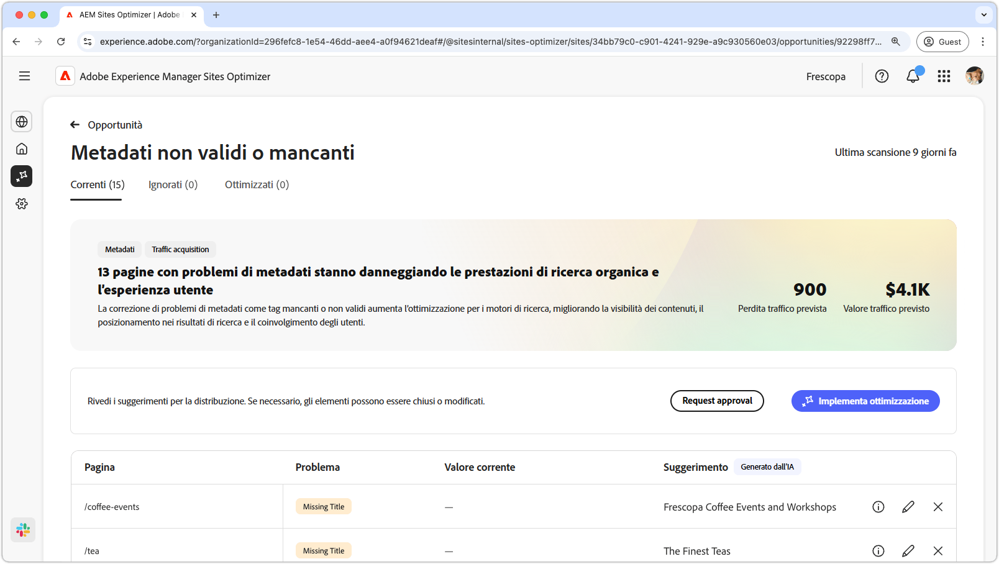
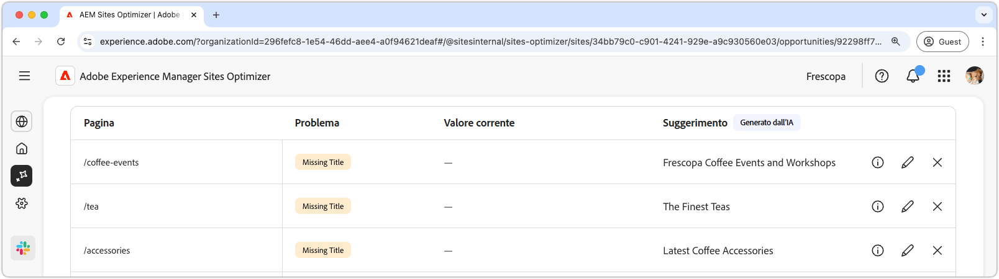
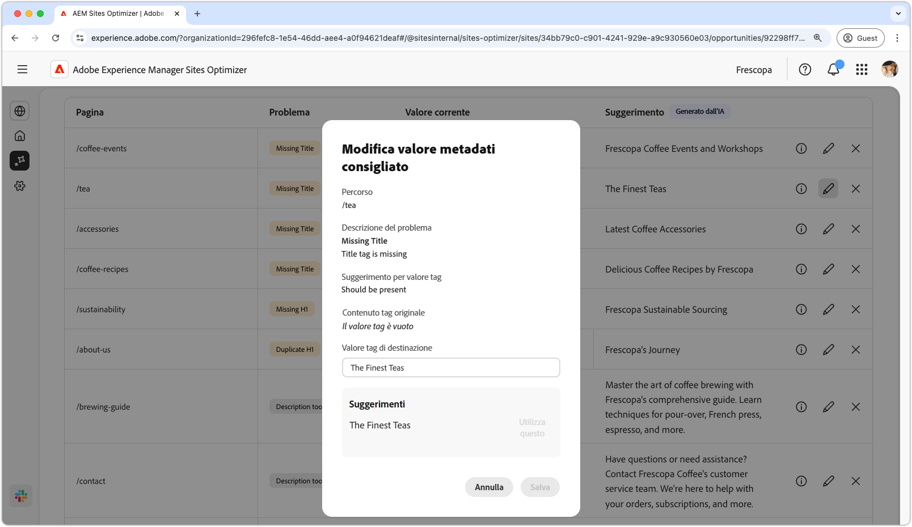
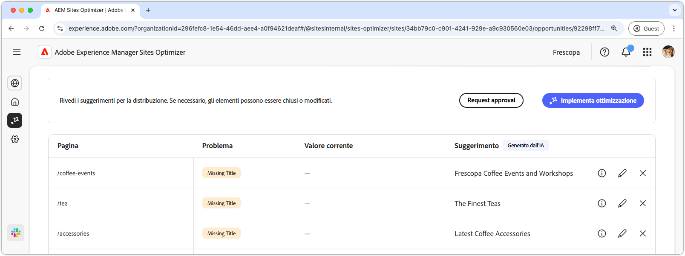

# Opportunità di metadati non validi o mancanti

{align="center"}

L’opportunità di metadati non validi o mancanti identifica i metadati mancanti o errati nelle pagine web. La correzione dei problemi di metadati ottimizza la SEO (Search Engine Optimization) migliorando la visibilità dei contenuti, la classificazione delle ricerche e il coinvolgimento utente. Questi problemi possono derivare da fattori come tag mancanti o non validi, descrizioni troppo lunghe o troppo brevi e così via.

L’opportunità di metadati non validi o mancanti mostra un riepilogo nella parte superiore della pagina, inclusa una sintesi del problema e il relativo impatto sul sito e sull’azienda.

* **Perdita traffico prevista**: perdita di traffico stimata a causa di metadati errati.
* **Valore traffico previsto**: valore stimato del traffico perso.

## Identificazione automatica

{align="center"}

L’opportunità di metadati non validi o mancanti elenca tutti i metadati errati nelle pagine e include quanto segue:

* **Pagina**: pagina contenente i metadati non validi o mancanti.
* **Problema**: indica il tipo di problema che influisce sul tag metadati. Questi problemi possono variare da titoli mancanti a duplicati H1 e così via.
* **Valore**: valore corrente del tag metadati che deve essere modificato.
* **Suggerimento**: suggerimento generato dall’intelligenza artificiale per aggiornamenti di tag appropriati. Per ulteriori dettagli, consulta la sezione di seguito.

## Suggerimento automatico

{align="center"}

L’opportunità di metadati non validi o mancanti fornisce anche suggerimenti su come modificare o aggiornare i tag di metadati generati dall’intelligenza artificiale. Questi suggerimenti si basano sul tag iniziale che comprendeva i metadati errati e sul contenuto dell’aggiornamento suggerito.

>[!BEGINTABS]

>[!TAB Base logica dell’intelligenza artificiale]

La selezione dell’ fornisce la logica dell’IA per l’aggiornamento suggerito.

>[!TAB  Modifica valore metadati suggerito]

{align="center"}

Se non sei d’accordo con il suggerimento generato dall’IA, puoi modificare il valore dei metadati suggerito selezionando l’. Questo ti consente di inserire manualmente il valore che ritieni più adatto per i metadati. La finestra di modifica contiene quanto segue:

* **Percorso**: il percorso della pagina che contiene i metadati (o la mancanza di).
* **Descrizione del problema**: indica il tipo di problema che influisce sul tag di metadati e una breve descrizione.
* **Suggerimento per il valore del tag**: suggerimento generato dall’intelligenza artificiale su come modificare o aggiornare il tag di metadati. Ad esempio, quanti caratteri deve contenere l’aggiornamento del tag e così via.
* **Contenuto tag originale**: valore originale del tag.
* **Valore del tag di destinazione**: modifica questo campo e aggiungi manualmente il valore del tag desiderato. Quando selezioni **Salva**, questo valore verrà applicato all’aggiornamento proposto.
* **Suggerimento**: suggerimento generato dall’intelligenza artificiale sulla modifica del valore.
* **Salva**: salva e applica il valore nel campo **Valore tag di destinazione**.

>[!TAB Ignorare le voci]

Puoi scegliere di ignorare le voci con i metadati di destinazione non validi o interrotti. La selezione dell’ rimuove la voce dall’elenco delle opportunità. Le voci ignorate possono essere riattivate dalla scheda **Ignorato** nella parte superiore della pagina dell’opportunità.

>[!ENDTABS]

## Ottimizzazione automatica

[!BADGE Ultimate]{type=Positive tooltip="Ultimate"}

{align="center"}

Sites Optimizer Ultimate consente inoltre di distribuire l’ottimizzazione automatica dei problemi rilevati da un’opportunità di metadati non validi o mancanti. <!--- TBD-need more in-depth and opportunity specific information here. What does the auto-optimization do?-->

>[!BEGINTABS]

>[!TAB Distribuisci ottimizzazione]

{{auto-optimize-deploy-optimization-slack}}

>[!TAB Richiedi approvazione]

{{auto-optimize-request-approval}}

>[!ENDTABS]
