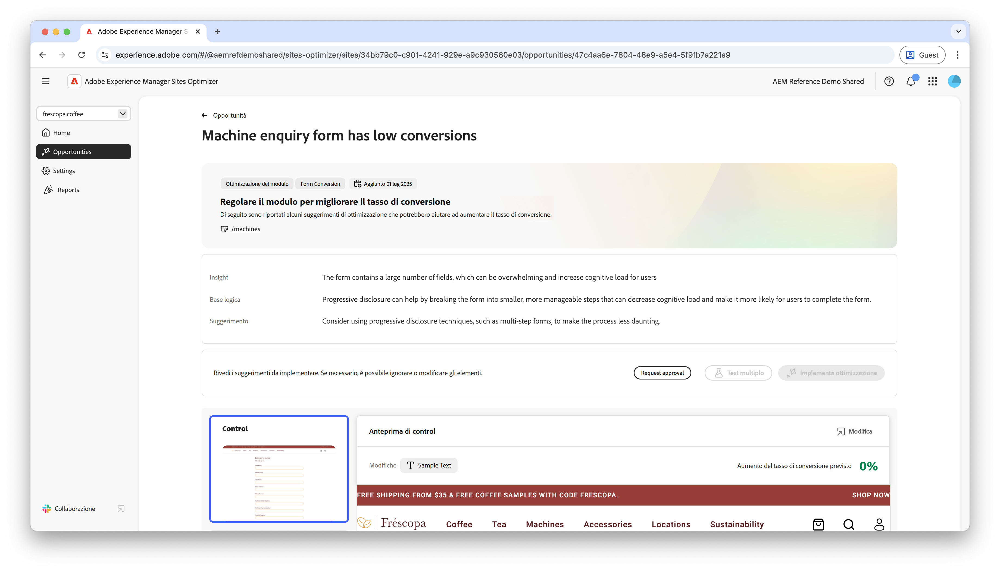

# Opportunità di conversioni basse

{align="center"}

L’opportunità di conversioni basse identifica i moduli sul sito web che hanno tassi di conversione bassi. Questa opportunità consente di comprendere quali moduli non funzionano correttamente e fornisce suggerimenti su come migliorarne i tassi di coinvolgimento. Ottimizzando le conversioni, puoi aumentare il numero di invii di moduli e migliorare le prestazioni complessive del sito web.

## Identificazione automatica

{align="center"}

Ogni pagina Web con un modulo con conversioni basse è elencata come opportunità di **conversioni basse**. Nella parte superiore della pagina dell’opportunità viene visualizzato un breve riepilogo dell’opportunità e della base logica dell’intelligenza artificiale.

## Suggerimento automatico

{align="center"}

La funzione di suggerimento automatico fornisce varianti di pagina web generate dall’intelligenza artificiale progettate per aumentare le conversioni dei moduli. Ogni variante mostra l’**incremento previsto del tasso di conversione del progetto** in base al relativo potenziale di miglioramento del coinvolgimento nei moduli, per aiutarti a dare priorità ai suggerimenti più efficaci.

>[!BEGINTABS]

>[!TAB Variante di controllo]

{align="center"}

La variante di controllo è la forma originale attualmente pubblicata sul sito Web. Questa variante viene utilizzata come base di riferimento per confrontare le prestazioni delle varianti suggerite.

>[!TAB Varianti suggerite]

{align="center"}

Le varianti suggerite sono varianti di pagina web generate dall’intelligenza artificiale progettate per aumentare le conversioni dei moduli. Ogni variante mostra l’**incremento previsto del tasso di conversione** in base al relativo potenziale di miglioramento del coinvolgimento nei moduli, che ti aiuta a dare priorità ai suggerimenti più efficaci.

Fai clic su ciascuna variante per visualizzarne l’anteprima sul lato destro dello schermo. Nella parte superiore dell’anteprima sono disponibili le azioni e le informazioni seguenti:

* **Modifiche**: breve riepilogo delle modifiche apportate dalla variante **Controllo**.
* **Aumento previsto del tasso di conversione**: aumento stimato del coinvolgimento nei moduli se questa variante viene implementata.
* **Modifica**: fai clic per modificare la variante nell’authoring di AEM.

>[!ENDTABS]

## Ottimizzazione automatica

[!BADGE Ultimate]{type=Positive tooltip="Ultimate"}

{align="center"}

Sites Optimizer Ultimate aggiunge la possibilità di distribuire l’ottimizzazione automatica per i problemi rilevati dall’opportunità di conversioni basse.

>[!BEGINTABS]

>[!TAB Test multiplo]

>[!TAB Pubblica selezionato]

{{auto-optimize-deploy-optimization-slack}}

>[!TAB Richiedi approvazione]

{{auto-optimize-request-approval}}

>[!ENDTABS]
