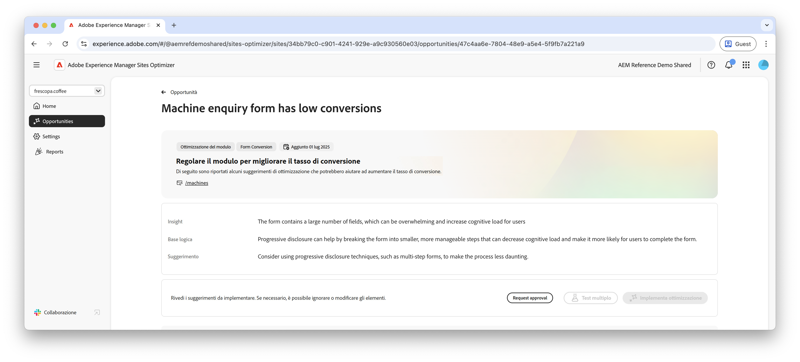

# Opportunità di basse conversioni Forms

 La funzionalità di ottimizzazione Forms è disponibile nel programma di accesso anticipato. Puoi scrivere a aem-forms-ea@adobe.com dal tuo ID e-mail ufficiale per partecipare al programma di accesso anticipato e richiedere l’accesso alla funzionalità. 

{align="center"}

L’opportunità di conversione bassa identifica i moduli sul sito web che hanno tassi di conversione bassi. Questo tipo di opportunità consente di comprendere quali moduli non funzionano correttamente e fornisce suggerimenti su come migliorarne i tassi di coinvolgimento.

## Identificazione automatica

{align="center"}

Ogni pagina Web con moduli con conversioni basse è elencata come propria opportunità di **conversioni basse**. Nella parte superiore della pagina dell’opportunità viene visualizzato un breve riepilogo dell’opportunità e delle motivazioni.

## Suggerimento automatico

{align="center"}

La funzione di suggerimento automatico fornisce varianti di moduli generati dall’intelligenza artificiale progettate per aumentare le conversioni dei moduli. Ogni variante visualizza l&#39;**aumento del tasso di conversione previsto** in base al suo potenziale di miglioramento del coinvolgimento nei moduli, per aiutarti a dare priorità ai suggerimenti più efficaci.

>[!BEGINTABS]

>[!TAB Variante di controllo]

{align="center"}

La variante di controllo è costituita dai moduli originali attualmente disponibili sul sito web. Questa variante viene utilizzata come base di riferimento per confrontare le prestazioni delle varianti suggerite.

>[!TAB Varianti suggerite]

{align="center"}

Le varianti suggerite sono varianti di moduli generati dall’intelligenza artificiale progettate per aumentare le conversioni dei moduli. Ogni variante visualizza l&#39;**aumento del tasso di conversione previsto** in base al suo potenziale di miglioramento del coinvolgimento nei moduli, per aiutarti a dare priorità ai suggerimenti più efficaci.

Fai clic su ciascuna variante per visualizzarne l’anteprima sul lato destro dello schermo. Nella parte superiore dell’anteprima sono disponibili le azioni e le informazioni seguenti:

* **Modifiche**: breve riepilogo delle modifiche apportate dalla variante **Controllo**.
* **Aumento previsto del tasso di conversione** - Aumento stimato del coinvolgimento Forms se questa variante è implementata.
* **Modifica**: fai clic per modificare la variante nell’authoring di AEM.

>[!ENDTABS]

<!-- 

## Auto-optimize

[!BADGE Ultimate]{type=Positive tooltip="Ultimate"}

{align="center"}

Sites Optimizer Ultimate adds the ability to deploy auto-optimization for the issues found by the low conversions opportunity.

>[!BEGINTABS]

>[!TAB Test multiple]

>[!TAB Publish selected]

{{auto-optimize-deploy-optimization-slack}}

>[!TAB Request approval]

{{auto-optimize-request-approval}}

>[!ENDTABS]

-->