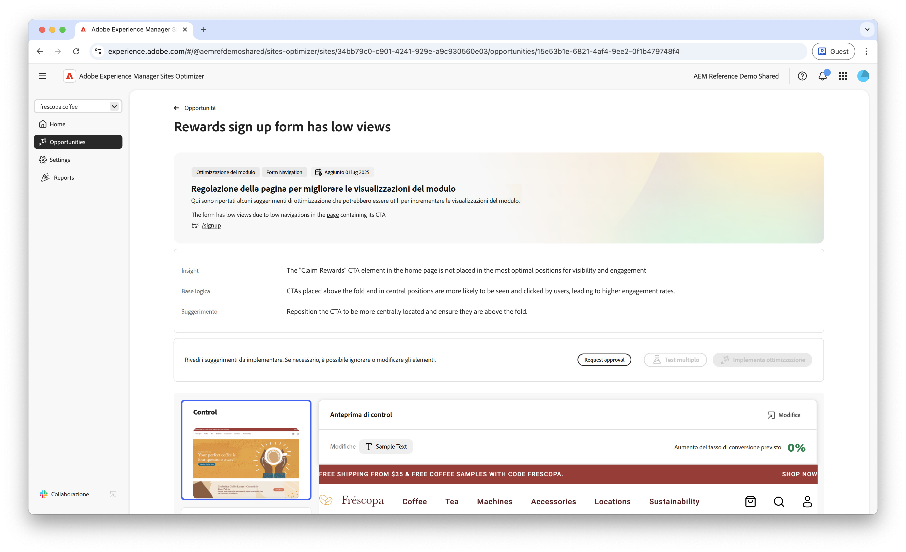
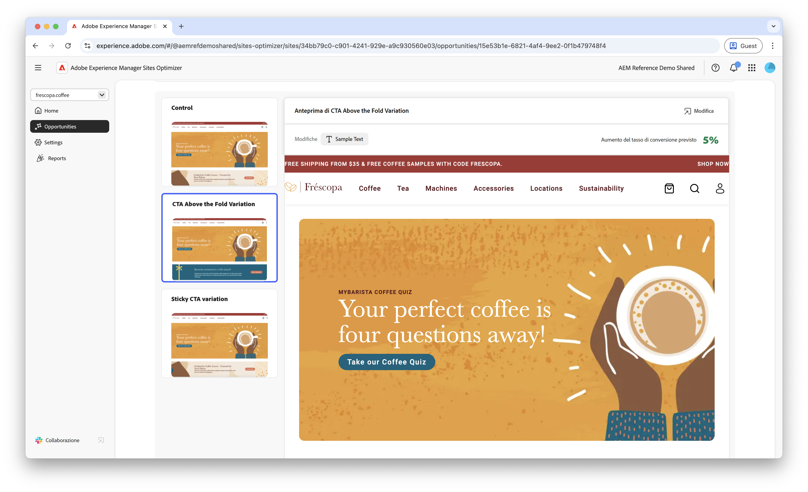
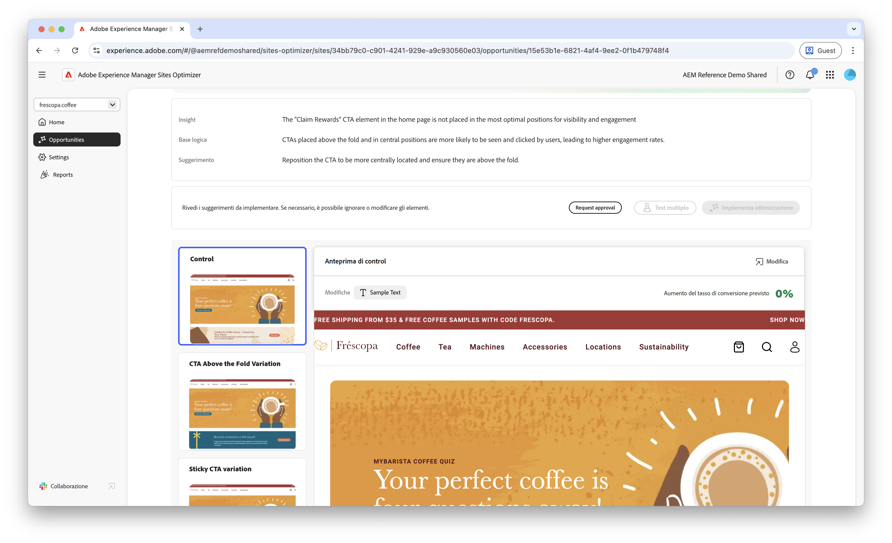

# Opportunità da cogliere in caso di navigazione bassa dei moduli

 La funzionalità Ottimizzazione dei moduli è disponibile nell’ambito del programma di accesso anticipato. Per partecipare al programma di accesso anticipato e richiedere l’accesso alla funzionalità, invia un’e-mail dal tuo ID e-mail ufficiale all’indirizzo aem-forms-ea@adobe.com. 

{align="center"}

L’opportunità di navigazione bassa identifica i moduli sul sito web che hanno tassi di navigazione bassi. Questo tipo di opportunità consente di capire quali moduli non vengono rilevati o a cui gli utenti non accedono e fornisce suggerimenti su come migliorarne la reperibilità.

## Identificazione automatica

{align="center"}

Ogni pagina web con moduli con navigazione bassa viene elencata come propria opportunità di **navigazione bassa**. Nella parte superiore della pagina dell’opportunità viene visualizzato un breve riepilogo dell’opportunità e della logica.

## Suggerimento automatico

La funzione di suggerimento automatico fornisce varianti di moduli generate dall’intelligenza artificiale, progettate per aumentarne la navigazione su di essi. Ogni variante mostra l’**incremento previsto del tasso di conversione** in base al rispettivo potenziale di miglioramento della reperibilità ed accessibilità dei moduli, che ti aiuta a dare priorità ai suggerimenti più efficaci.

>[!BEGINTABS]

>[!TAB Variante di controllo]

{align="center"}

La variante di controllo è il modulo originale attualmente pubblicato sul sito web. Questa variante viene utilizzata come base di riferimento per confrontare le prestazioni delle varianti suggerite.

>[!TAB Varianti suggerite]

{align="center"}

Le varianti suggerite sono generate dall’intelligenza artificiale e progettate per aumentare la navigazione sui moduli. Ogni variante mostra l’**incremento previsto del tasso di conversione** in base al rispettivo potenziale di miglioramento della reperibilità ed accessibilità dei moduli, che ti aiuta a dare priorità ai suggerimenti più efficaci.

Fai clic su ciascuna variante per visualizzarne l’anteprima sul lato destro dello schermo. Nella parte superiore dell’anteprima sono disponibili le azioni e le informazioni seguenti:

* **Modifiche**: breve riepilogo delle modifiche apportate dalla variante **Controllo**.
* **Aumento previsto del tasso di conversione**: aumento stimato del coinvolgimento nei moduli se questa variante viene implementata.
* **Modifica**: fai clic per modificare la variante nell’authoring di AEM.

>[!ENDTABS]

<!-- 

## Auto-optimize

[!BADGE Ultimate]{type=Positive tooltip="Ultimate"}

{align="center"}

Sites Optimizer Ultimate adds the ability to deploy auto-optimization for the issues found by the low navigation opportunity.

>[!BEGINTABS]

>[!TAB Test multiple]

>[!TAB Publish selected]

{{auto-optimize-deploy-optimization-slack}}

>[!TAB Request approval]

{{auto-optimize-request-approval}}

>[!ENDTABS]

-->
