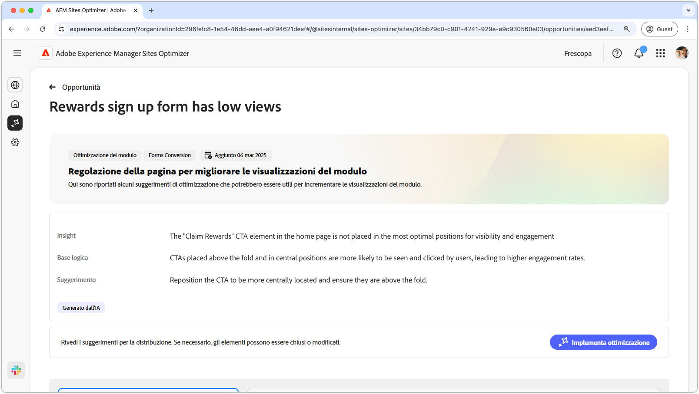
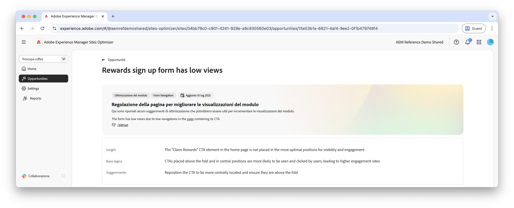
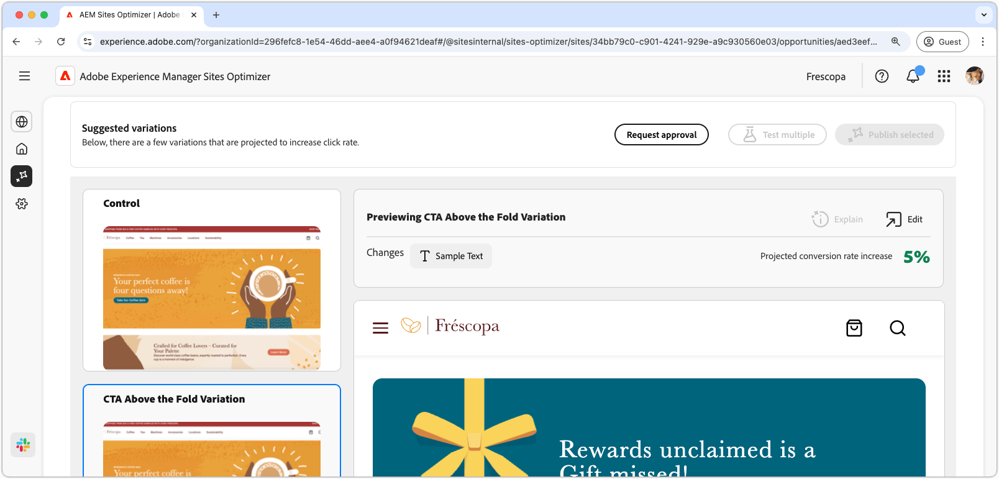

# Opportunità da cogliere in caso di visualizzazioni basse dei moduli

 La funzionalità di ottimizzazione Forms è disponibile in un programma di accesso anticipato. Per partecipare al programma di accesso anticipato e richiedere l’accesso alla funzionalità, invia un’e-mail dal tuo ID e-mail ufficiale all’indirizzo aem-forms-ea@adobe.com. 

{align="center"}

L’opportunità Visualizzazioni basse identifica i moduli sul sito web che hanno tassi di visualizzazione bassi. Questo tipo di opportunità consente di comprendere quali moduli non funzionano correttamente e fornisce suggerimenti su come migliorarne i tassi di coinvolgimento.

## Identificazione automatica

{align="center"}

Ogni pagina web con moduli con visualizzazioni basse viene elencata come opportunità **Visualizzazioni basse**. Nella parte superiore della pagina dell’opportunità viene visualizzato un breve riepilogo dell’opportunità e della logica.

## Suggerimento automatico

{align="center"}

La funzione di suggerimento automatico fornisce varianti di moduli generate dall’intelligenza artificiale progettate per aumentare le visualizzazioni dei moduli. Ogni variante mostra l’**incremento previsto del tasso di conversione** in base al relativo potenziale di miglioramento del coinvolgimento nei moduli, che consente di dare priorità ai suggerimenti più efficaci.

>[!BEGINTABS]

>[!TAB Variante di controllo]

{align="center"}

La variante di controllo è il modulo originale attualmente pubblicato sul sito web. Questa variante viene utilizzata come base di riferimento per confrontare le prestazioni delle varianti suggerite.

>[!TAB Varianti suggerite]

{align="center"}

Le varianti suggerite sono varianti di moduli generate dall’intelligenza artificiale e progettate per aumentare le visualizzazioni dei moduli. Ogni variante mostra l’**incremento previsto del tasso di conversione** in base al relativo potenziale di miglioramento del coinvolgimento nei moduli, che consente di dare priorità ai suggerimenti più efficaci.

Fai clic su ciascuna variante per visualizzarne l’anteprima sul lato destro dello schermo. Nella parte superiore dell’anteprima sono disponibili le azioni e le informazioni seguenti:

* **Modifiche**: breve riepilogo delle modifiche apportate dalla variante **Controllo**.
* **Aumento previsto del tasso di conversione**: aumento stimato del coinvolgimento nei moduli se questa variante viene implementata.
* **Modifica**: fai clic per modificare la variante nell’authoring di AEM.

>[!ENDTABS]

<!-- 

## Auto-optimize

[!BADGE Ultimate]{type=Positive tooltip="Ultimate"}

{align="center"}

Sites Optimizer Ultimate adds the ability to deploy auto-optimization for the issues found by the low views opportunity.

>[!BEGINTABS]

>[!TAB Test multiple]

>[!TAB Publish selected]

{{auto-optimize-deploy-optimization-slack}}

>[!TAB Request approval]

{{auto-optimize-request-approval}}

>[!ENDTABS]

-->

