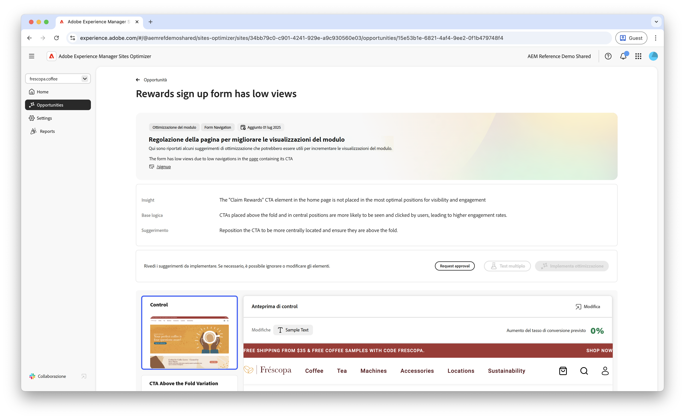

# Opportunità di visualizzazione ridotta

{align="center"}

L’opportunità di visualizzazione ridotta identifica i moduli sul sito web che hanno tassi di visualizzazione bassi. Questa opportunità consente di comprendere quali moduli non funzionano correttamente e fornisce suggerimenti su come migliorarne i tassi di coinvolgimento. Ottimizzando le visualizzazioni dei moduli, puoi aumentare il numero di invii di moduli e migliorare le prestazioni complessive del sito web.

## Identificazione automatica

{align="center"}

Ogni pagina Web con un modulo con visualizzazioni basse è elencata come propria opportunità **Visualizzazioni basse**. Nella parte superiore della pagina dell’opportunità viene visualizzato un breve riepilogo dell’opportunità e la motivazione basata sull’intelligenza artificiale.

## Suggerimento automatico

{align="center"}

La funzione di suggerimento automatico fornisce varianti di pagina web generate dall’intelligenza artificiale progettate per aumentare le visualizzazioni dei moduli. Ogni variante visualizza l&#39;**aumento del tasso di conversione del progetto** in base al suo potenziale di miglioramento del coinvolgimento dei moduli, per aiutarti a dare priorità ai suggerimenti più efficaci.

>[!BEGINTABS]

>[!TAB Variante di controllo]

{align="center"}

La variante di controllo è la forma originale attualmente live sul sito Web. Questa variante viene utilizzata come base di riferimento per confrontare le prestazioni delle varianti suggerite.

>[!TAB Varianti suggerite]

{align="center"}

Le varianti suggerite sono varianti di pagina web generate da IA progettate per aumentare le visualizzazioni dei moduli. Ogni variante visualizza il **incremento previsto del tasso di conversione** in base al suo potenziale di miglioramento del coinvolgimento del modulo, che ti aiuta a dare priorità ai suggerimenti più efficaci.

Fai clic su ciascuna variante per visualizzarne l’anteprima sul lato destro dello schermo. Nella parte superiore dell’anteprima sono disponibili le azioni e le informazioni seguenti:

* **Modifiche** - Breve riepilogo delle modifiche apportate alla variante **Controllo**.
* **Aumento previsto del tasso di conversione** - Aumento stimato dell&#39;engagement dei moduli se questa variante viene implementata.
* **Modifica** - Fai clic per modificare la variante nell&#39;authoring di AEM.

>[!ENDTABS]

## Ottimizzazione automatica

[!BADGE Ultimate]{type=Positive tooltip="Ultimate"}

{align="center"}

Sites Optimizer Ultimate offre la possibilità di distribuire l’ottimizzazione automatica per i problemi rilevati dall’opportunità di visualizzazioni ridotte.

>[!BEGINTABS]

>[!TAB Test multiplo]

>[!TAB Pubblicazione selezionata]

{{auto-optimize-deploy-optimization-slack}}

>[!TAB Richiedi approvazione]

{{auto-optimize-request-approval}}

>[!ENDTABS]
