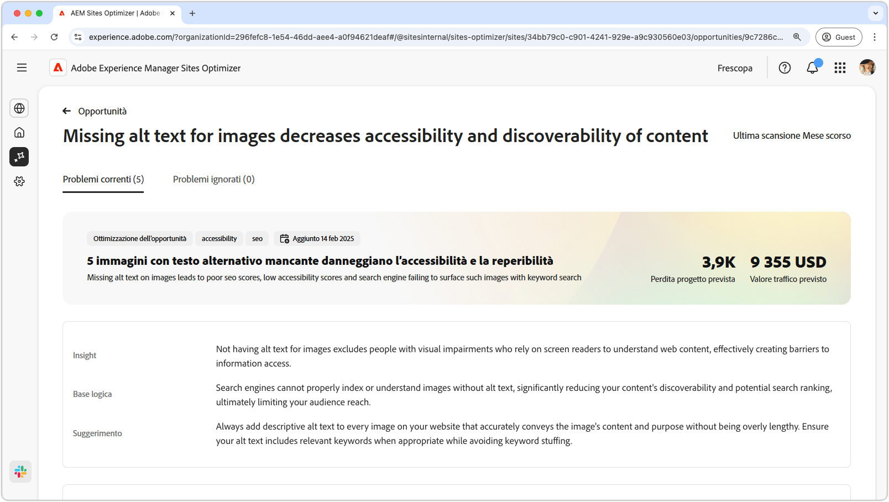
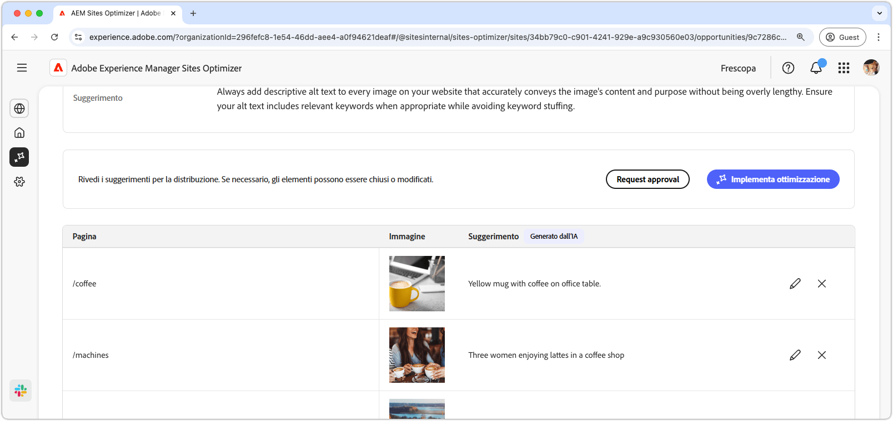
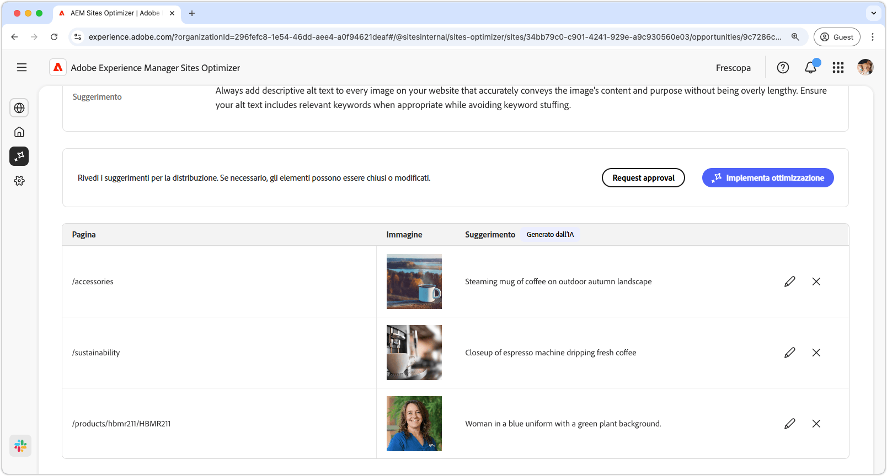
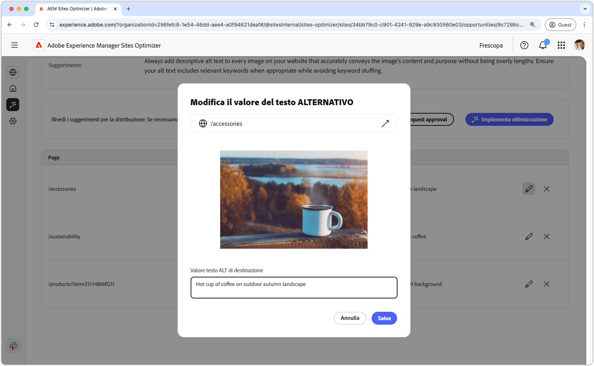
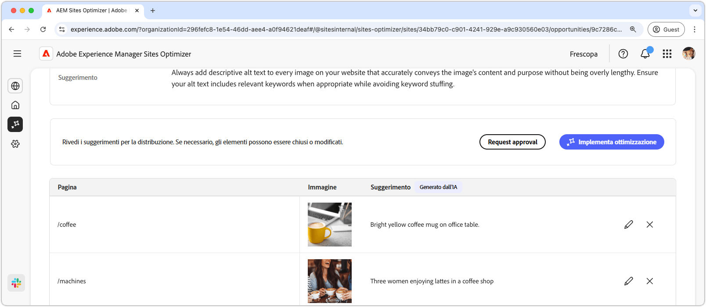

# Opportunità Testo alternativo mancante

{align="center"}

L’opportunità Testo alternativo mancante individua sul sito web le immagini prive di testo alternativo descrittivo. I motori di ricerca non sono in grado di indicizzare o comprendere correttamente le immagini senza testo alternativo. Questa funzionalità riduce in modo significativo la reperibilità dei contenuti e la classificazione delle ricerche, limitando in ultima analisi la portata del pubblico. Inoltre, l’assenza di testo alternativo per le immagini esclude le persone con disabilità visive che si servono di assistenti vocali per comprendere i contenuti web, ostacolando l’accesso alle informazioni.

L’opportunità Testo alternativo mancante mostra un riepilogo nella parte superiore della pagina, con una sintesi del problema e il suo impatto sul sito e sul business.

* **Perdita traffico prevista**: perdita di traffico stimata a causa di testo alternativo mancante.
* **Valore traffico previsto**: valore stimato del traffico perso.

Inoltre, un campo aggiuntivo mostra la logica su cui si basano tali stime, insight e suggerimenti relativi all’opportunità.

## Identificazione automatica

{align="center"}

L’opportunità Testo alternativo mancante elenca tutte le immagini del sito web a cui manca il testo alternativo. Questa sezione contiene le seguenti categorie:

* **Pagina**: percorso della pagina contenente l’immagine priva di testo alternativo.
* **Immagine**: immagine prima di testo alternativo descrittivo.
* **Suggerimento**: testo alternativo suggerito e generato dall’IA.

## Suggerimento automatico

{align="center"}

La funzione Suggerimento automatico fornisce suggerimenti generati dall’IA per il testo alternativo delle immagini. I suggerimenti generati dall’intelligenza artificiale sono progettati per consentire di aggiungere rapidamente testo alternativo alle immagini senza dover analizzare manualmente ogni immagine.

>[!BEGINTABS]

>[!TAB Modificare il testo alternativo mancante]

{align="center"}

Se non sei d’accordo con il suggerimento generato dall’IA, puoi modificare il testo alternativo suggerito selezionando l’**icona Modifica**. Questa funzione consente di regolare manualmente il testo che ritieni più adatto all’immagine. La finestra di modifica contiene quanto segue:

* **Percorso pagina**: campo di sola lettura che mostra il percorso della pagina in cui si è verificato il problema di testo alternativo mancante. Fai clic sulla freccia accanto al percorso per aprire la pagina corrispondente.
* **Immagine**: anteprima di sola lettura dell’immagine che richiede testo alternativo.
* **Testo alternativo di destinazione**: campo modificabile in cui puoi immettere manualmente un testo alternativo descrittivo per l’immagine. Assicurati che il testo alt trasmetta chiaramente il contenuto e lo scopo dell’immagine in modo conciso. Se pertinente, puoi includere alcune parole chiave naturali, ma senza esagerare.

>[!TAB Ignorare le voci]

Puoi scegliere di ignorare alcune voci nell’elenco dell’opportunità. Se si seleziona , la voce verrà rimossa dall&#39;elenco. Le voci ignorate possono essere riattivate dalla scheda **Ignorato** nella parte superiore della pagina dell’opportunità.

>[!ENDTABS]

## Ottimizzazione automatica

[!BADGE Ultimate]{type=Positive tooltip="Ultimate"}

{align="center"}

Sites Optimizer Ultimate offre la possibilità di implementare l’ottimizzazione automatica per i problemi rilevati dall’opportunità Testo alternativo mancante. <!--- TBD-need more in-depth and opportunity specific information here. What does the auto-optimization do?-->

>[!BEGINTABS]

>[!TAB Implementa ottimizzazione]

{{auto-optimize-deploy-optimization-slack}}

>[!TAB Richiedi approvazione]

{{auto-optimize-request-approval}}

>[!ENDTABS]
