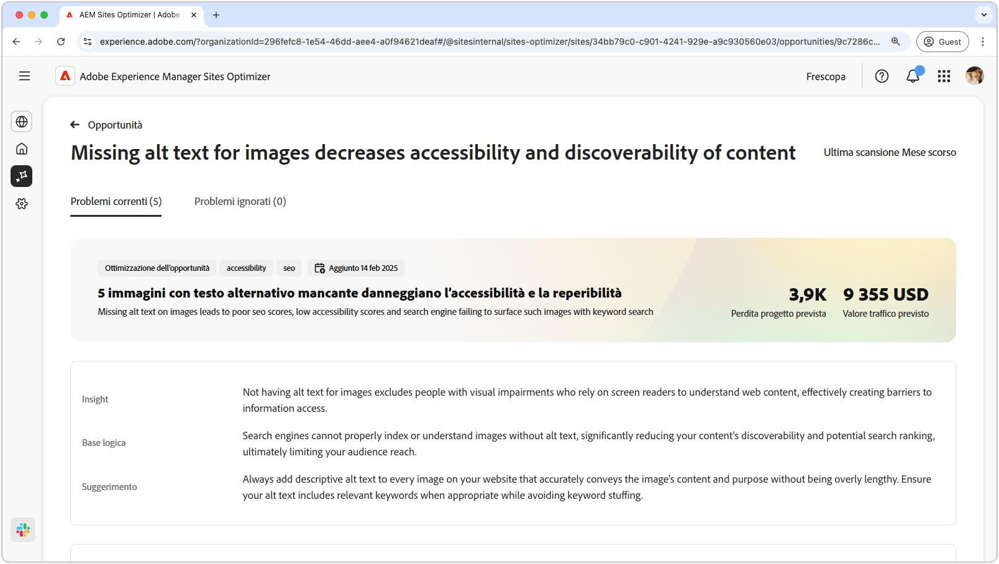
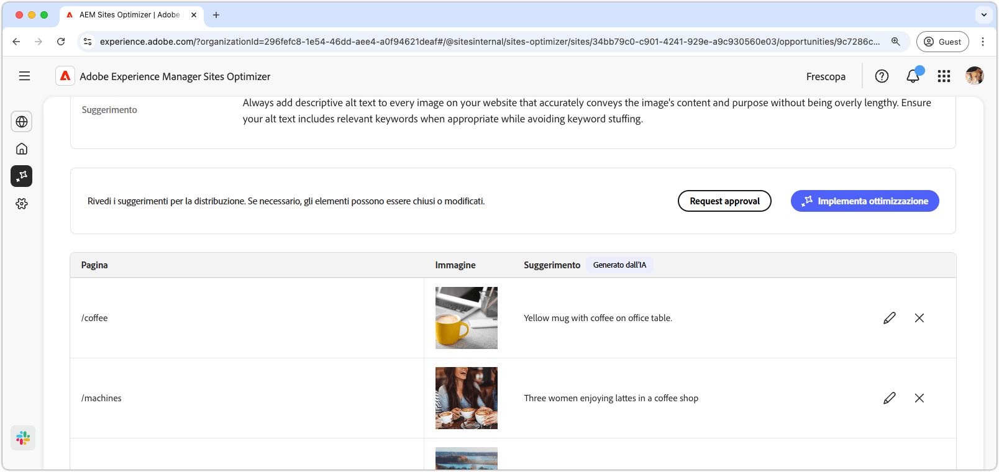
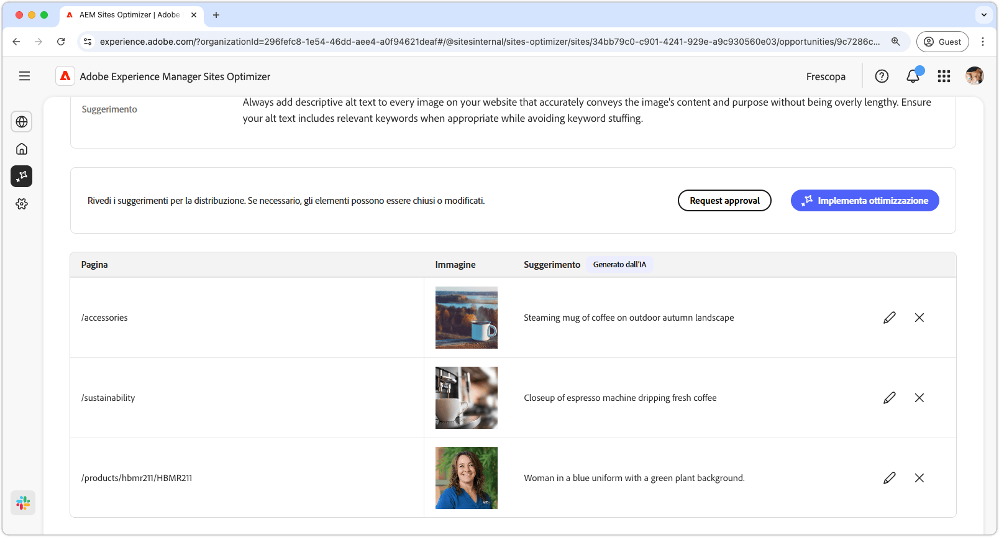
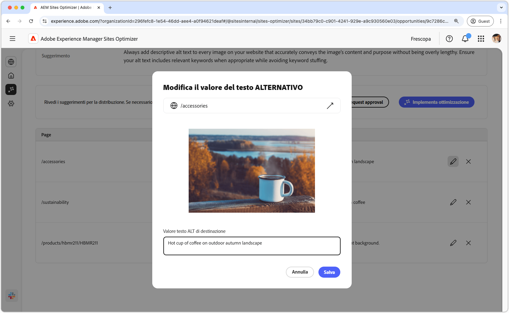

# Opportunità Testo alternativo mancante

<!--{align="center"}-->

>[!VIDEO](https://video.tv.adobe.com/v/3483251/?learn=on&enablevpops)

L’opportunità relativa al testo alternativo mancante identifica le immagini sul tuo sito web che non dispongono di un testo alternativo descrittivo. Senza testo alternativo, gli utenti che si affidano agli assistenti vocali non possono interpretare i contenuti visivi, creando barriere all’accessibilità. Inoltre, limita la comprensione e l’indicizzazione delle immagini da parte dei motori di ricerca, riducendo la possibilità di individuare i contenuti e le prestazioni di ricerca. AEM Sites Optimizer identifica i problemi relativi al testo alternativo mancante, fornisce consigli IA specifici e consente l’implementazione con un solo clic per risolverli in un’unica vista centralizzata.

## Identificazione automatica

<!--{align="center"}-->

AEM Sites Optimizer esegue la scansione del sito web utilizzando un audit in più passaggi che combina la ricerca per indicizzazione del sito, dati sul traffico utente reale e analisi IA per identificare le immagini senza testo alternativo definito, ma che lo richiedono. Valuta inoltre le immagini sulla pagina per determinare se è necessario testo alternativo, escludendo le immagini decorative o non informative in conformità alle linee guida per l’accessibilità dei contenuti web (WCAG). Le immagini vengono analizzate in base al relativo ruolo e rilevanza all’interno della pagina, dando priorità a correzioni che hanno il maggiore impatto su accessibilità e SEO.

Questa opportunità fornisce un elenco dei problemi identificati, tra cui:

* **Pagina**: percorso della pagina contenente l’immagine priva di testo alternativo.
* **Immagine**: immagine prima di testo alternativo descrittivo.

## Suggerimento automatico

<!--{align="center"}-->

Per ogni problema identificato, AEM Sites Optimizer suggerisce un testo alternativo descrittivo per l’immagine. Utilizza modelli di visione IA per analizzare l’immagine e generare una descrizione che ne rifletta il contenuto e il ruolo all’interno della pagina. I consigli sono concisi, pertinenti e in linea con le best practice in materia di accessibilità. Puoi rivedere e modificare ogni suggerimento prima di essere applicato.

>[!BEGINTABS]

>[!TAB Modificare il testo alternativo mancante]

<!--{align="center"}-->

Se non sei d’accordo con il suggerimento generato dall’IA, puoi modificare il testo alternativo suggerito selezionando l’**icona Modifica**. Potrai quindi modificare manualmente il testo per renderlo più adatto all’immagine. La finestra di modifica contiene quanto segue:

* **Percorso pagina**: campo di sola lettura che mostra il percorso della pagina in cui si è verificato il problema di testo alternativo mancante. Fai clic sulla freccia accanto al percorso per aprire la pagina corrispondente.
* **Immagine**: anteprima di sola lettura dell’immagine che richiede testo alternativo.
* **Testo alternativo di destinazione**: campo modificabile in cui puoi immettere manualmente un testo alternativo descrittivo per l’immagine. Assicurati che il testo alternativo trasmetta in modo chiaro e conciso il contenuto e lo scopo dell’immagine. Se pertinente, puoi includere alcune parole chiave naturali, ma senza esagerare.

>[!TAB Ignorare le voci]

Puoi scegliere di ignorare alcune voci nell’elenco dell’opportunità. La selezione dell’ rimuove la voce dall’elenco. Le voci ignorate possono essere riattivate dalla scheda **Ignorate** nella parte superiore della pagina delle opportunità.

>[!ENDTABS]

## Ottimizzazione automatica

<!--[!BADGE Ultimate]{type=Positive tooltip="Ultimate"}-->

Una volta esaminati e approvati i suggerimenti, puoi fare clic su **Implementa ottimizzazione**. AEM Sites Optimizer applica quindi le correzioni nell’ambiente di authoring, in base a come viene gestito il testo alternativo all’interno dell’implementazione. L’autore di AEM può quindi pubblicare le modifiche da Content Management System (CMS).

A seconda della configurazione, gli aggiornamenti possono essere applicati direttamente al contenuto della pagina, ai metadati delle risorse o ai modelli di contenuto di supporto. Il processo di ottimizzazione include i seguenti passaggi:

* **Convalida**: garantisce che gli aggiornamenti vengano applicati in modo sicuro senza influire sulle funzionalità esistenti.
* **Implementazione**: applica gli aggiornamenti tramite processi esistenti, ad esempio gli aggiornamenti del contenuto in AEM o l’integrazione con le API di contenuto.
* **Controllo autorizzazioni**: verifica che l’utente disponga delle autorizzazioni appropriate per applicare le modifiche. In caso contrario, puoi utilizzare output alternativi come aggiornamenti scaricabili per l’handoff.

Se supportati, gli aggiornamenti vengono sottoposti a controllo delle versioni, fornendo visibilità e capacità di rollback. Ciò garantisce che gli aggiornamenti del testo alternativo vengano applicati con precisione, siano in linea con le implementazioni esistenti e coerenti con gli standard di governance e accessibilità.

AEM Sites Optimizer applica automaticamente gli aggiornamenti del testo alternativo in base alla configurazione, come segue:

>[!BEGINTABS]

>[!TAB Edge Delivery Services]

Aggiorna il documento di origine, ad esempio Documenti di Google o SharePoint.

>[!TAB AEM as a Cloud Service]

Scrive gli aggiornamenti direttamente tramite l’API dei contenuti con il supporto del controllo delle versioni e del fallback.

>[!TAB Digital Asset Management (facoltativo)]

Se applicabile, aggiorna il testo alternativo a livello di risorsa.

>[!ENDTABS]
