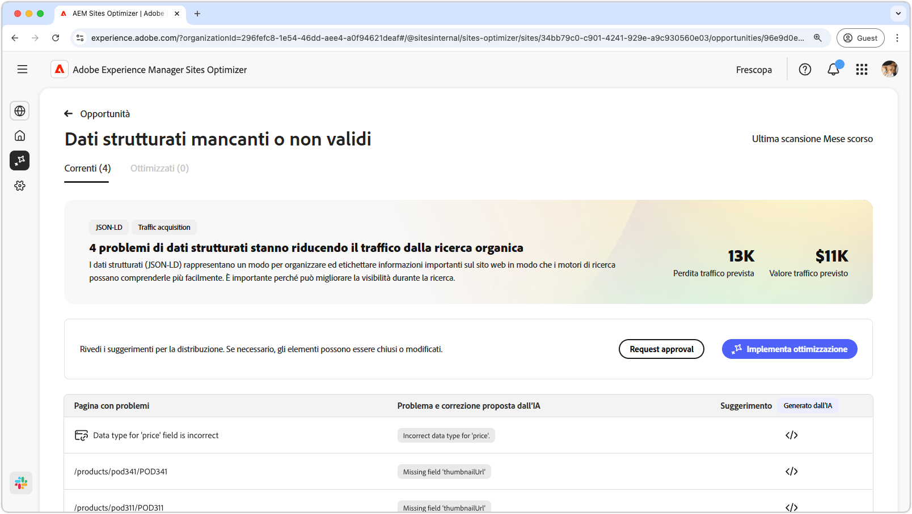
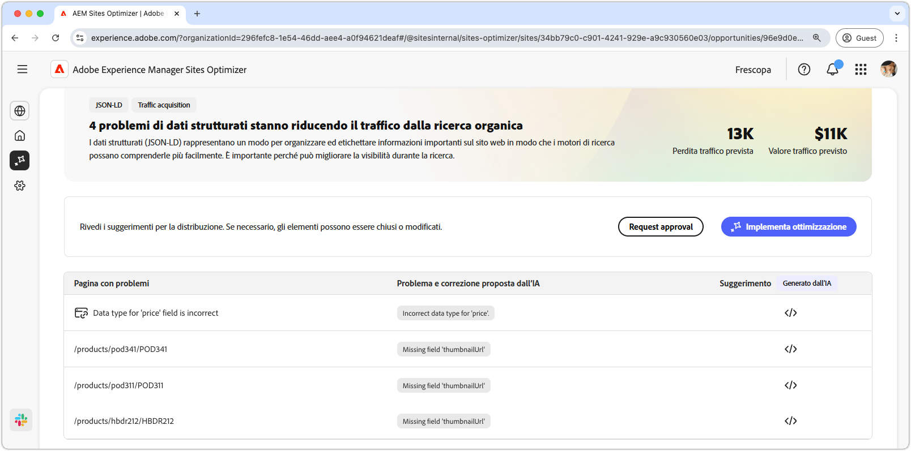
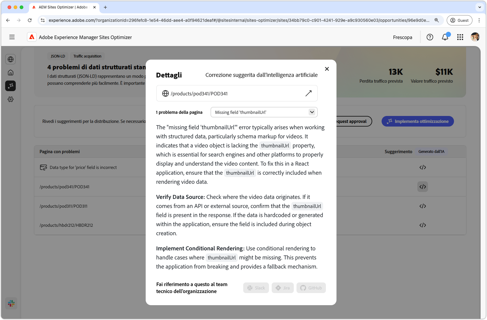
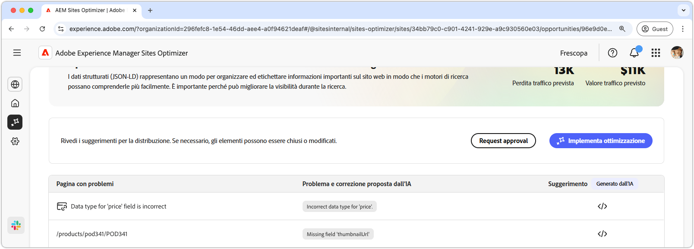

# Opportunità Dati strutturati mancanti o non validi

{align="center"}

L’opportunità Dati strutturati mancanti o non validi identifica dati strutturati mancanti o errati nel formato standardizzato Json-LD. I dati strutturati sono un modo per organizzare, descrivere ed etichettare informazioni importanti sul sito web. Aiutano i motori di ricerca a interpretare il contenuto delle pagine e migliorano la visibilità nei risultati di ricerca. Risultati di ricerca migliori possono portare più utenti a interagire con il tuo sito web.

L’opportunità Dati strutturati mancanti o non validi mostra un riepilogo nella parte superiore della pagina, inclusa una sintesi del problema e il relativo impatto sul sito e sull’azienda.

* **Perdita traffico prevista**: perdita di traffico stimata a causa di dati strutturati errati.
* **Valore traffico previsto**: valore stimato del traffico perso.

## Identificazione automatica

{align="center"}

L’opportunità Dati strutturati mancanti o non validi elenca tutti i problemi rilevati nelle pagine e contiene le seguenti categorie:

* **Pagina con problemi**: la pagina che contiene i dati strutturati non validi o mancanti.
* **Problema e correzione proposta dall’intelligenza artificiale**: indica il tipo di problema di dati strutturati che influisce sulla pagina.
* **Suggerimento**: suggerimento generato dall’intelligenza artificiale per aggiornamenti appropriati di dati strutturati. Per ulteriori dettagli, consulta la sezione di seguito.

## Suggerimento automatico

{align="center"}

L’opportunità Dati strutturati mancanti o non validi fornisce anche suggerimenti generati dall’intelligenza artificiale su come modificare o aggiornare i dati strutturati. Quando fai clic sul pulsante dei suggerimenti, viene visualizzata una nuova finestra contenente i seguenti elementi:

* **Percorso pagina**: campo contenente il percorso della pagina con dati strutturati non validi o mancanti.
* **Problemi**: campo contenente il numero di problemi e un menu a discesa in cui sono elencati tutti i problemi.
* **Campo suggerimento**: descrizione generata dall’intelligenza artificiale e suggerimenti per aggiornamenti di dati strutturati appropriati. Puoi scorrere verso il basso per ulteriori suggerimenti e problemi.

## Ottimizzazione automatica

[!BADGE Ultimate]{type=Positive tooltip="Ultimate"}

{align="center"}

Sites Optimizer Ultimate aggiunge la possibilità di distribuire l’ottimizzazione automatica per i problemi rilevati dall’opportunità Dati strutturati non validi o mancanti. <!--- TBD-need more in-depth and opportunity specific information here. What does the auto-optimization do?-->

>[!BEGINTABS]

>[!TAB Distribuisci ottimizzazione]

{{auto-optimize-deploy-optimization-slack}}

>[!TAB Richiedi approvazione]

{{auto-optimize-request-approval}}

>[!ENDTABS]
