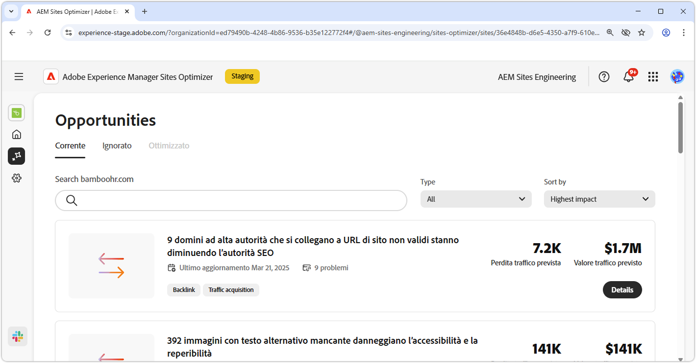
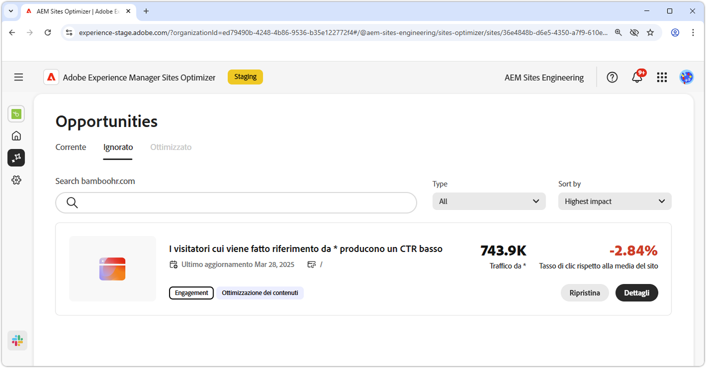

# Documentazione sulle opportunità

{align="center"}

Sites Optimizer è composto da un set di opportunità in continua crescita basate sull’IA di Adobe, progettate per identificare e suggerire miglioramenti per il sito web. Ogni opportunità offre informazioni sul potenziale valore aziendale, evidenzia le aree che richiedono attenzione e fornisce consigli pratici per l’ottimizzazione. Fai clic su ogni opportunità per esplorare i problemi identificati, i miglioramenti suggeriti e le indicazioni dettagliate su come implementare queste modifiche per migliorare le prestazioni del sito web e l’esperienza utente.

Le opportunità sono disponibili tramite l’opzione di menu **Opportunità** nella barra di navigazione persistente di [Site Optimizer](/help/documentation/basics.md#navigation).

## Stato delle opportunità

Utilizza le schede nella parte superiore per organizzare e filtrare le opportunità per stato.

>[!BEGINTABS]

>[!TAB Correnti]

{align="center"}

Opportunità attualmente in sospeso, in attesa di un tuo intervento.

>[!TAB Ignorate]

{align="center"}

Opportunità che sono state ignorate. Da questa vista è possibile ripristinare le opportunità ignorate.

>[!TAB Ottimizzate]

Elenco cronologico delle opportunità ottimizzate.

>[!ENDTABS]

## Opportunità

Per lo [stato di opportunità](#opportunity-status) selezionato, puoi visualizzare un elenco di opportunità. È possibile filtrare l&#39;elenco delle opportunità nei modi seguenti:

* **Ricerca**: ricerca di opportunità per **parole chiave, tag o URL**.
* **Tipo di opportunità**: utilizzare il menu a discesa **Tipo** per filtrare le opportunità in base al [tipo di opportunità](/help/opportunity-types/overview.md).

### Dettagli dell’opportunità

{align="center"}

Ogni opportunità fornisce una breve descrizione del problema, del suo potenziale impatto sul sito e un collegamento ai dettagli completi. Puoi anche visualizzarne lo stato, che indica se è stato ottimizzato o è ancora in sospeso.

* **Titolo dell’opportunità**: breve descrizione del problema e del suo potenziale impatto sulle prestazioni del sito.
* **Ultimo aggiornamento** - Sites Optimizer ha aggiornato l&#39;opportunità con nuovi dati in questa data.

* **Numero di problemi**: numero di istanze del problema identificate sul sito.
* **Tipi di opportunità** - I [tipi di opportunità](/help/opportunity-types/overview.md) di cui fa parte l&#39;opportunità, ad esempio l&#39;acquisizione del traffico, il coinvolgimento o l&#39;integrità del sito.

Le informazioni di riepilogo per ogni opportunità variano in base al tipo e possono includere dettagli sull’impatto sulle entrate, sul traffico, sul coinvolgimento degli utenti o sulle minacce alla sicurezza.

Per visualizzare i dettagli di un’opportunità, fai clic sul pulsante **Dettagli**.

Per escludere un’opportunità dalla dashboard di Sites Optimizer, fai clic sul pulsante **Ignora**.  Questa azione consente di spostare l’opportunità nella scheda [**Ignorate**](#opportunity-status).

## Tutte le opportunità

Esplora tutte le opportunità disponibili in Sites Optimizer:

<!-- CARDS

* ./accessibility-issues.md
  {title=Accessibility issues}
  {image=../../assets/common/card-arrows.png} 
* ./broken-backlinks.md
  {title=Broken backlinks}
  {image=../../assets/common/card-arrows.png}
* ./broken-internal-links.md
  {title=Broken internal links}
  {image=../../assets/common/card-link.png}
* ./cors-configuration.md
  {title=CORS configuration}
  {image=../../assets/common/card-code.png}
* ./core-web-vitals.md
  {title=Core web vitals}
  {image=../../assets/common/card-performance.png}
* ./cross-site-scripting.md
  {title=Cross-site scripting}
  {image=../../assets/common/card-code.png}
* ./high-bounce-rate.md
  {title=High bounce rate}
  {image=../../assets/common/card-arrows.png}    
* ./invalid-or-missing-metadata.md
  {title=Invalid or missing metadata}
  {image=../../assets/common/card-code.png}
* ./missing-alt-text.md
  {title=Missing alt text}
  {image=../../assets/common/card-arrows.png}
* ./missing-invalid-structured-data.md
  {title=Missing or invalid structured data}
  {image=../../assets/common/card-bag.png}
* ./sitemap-issues.md
  {title=Sitemap issues}
  {image=../../assets/common/card-relationship.png}
* ./website-permissions.md
  {title=Website permissions}
  {image=../../assets/common/card-people.png}
* ./website-vulnerabilities.md
  {title=Website vulnerabilities}
  {image=../../assets/common/card-puzzle.png}
  
--->
<!-- START CARDS HTML - DO NOT MODIFY BY HAND -->

    

        

            

                <figure class="image x-is-16by9">
                    
                </figure>
            

            

                

                    

                        <a href="./accessibility-issues.md" target="_blank" rel="referrer" title="Problemi di accessibilità">Problemi di accessibilità</a>
                    

                    
Scopri l’opportunità da cogliere in caso di problemi di accessibilità e come utilizzarla per aumentare la sicurezza di sul tuo sito web.

                

                <a href="./accessibility-issues.md" target="_blank" rel="referrer" class="spectrum-Button spectrum-Button--outline spectrum-Button--primary spectrum-Button--sizeM" style="align-self: flex-start; margin-top: 1rem;">
                    Ulteriori informazioni
                </a>
            

        

    

    

        

            

                <figure class="image x-is-16by9">
                    
                </figure>
            

            

                

                    

                        <a href="./broken-backlinks.md" target="_blank" rel="referrer" title="Backlink interrotti">Backlink interrotti</a>
                    

                    
Scopri l’opportunità da cogliere in caso di backlink interrotti e come utilizzarla per migliorare l’acquisizione del traffico.

                

                <a href="./broken-backlinks.md" target="_blank" rel="referrer" class="spectrum-Button spectrum-Button--outline spectrum-Button--primary spectrum-Button--sizeM" style="align-self: flex-start; margin-top: 1rem;">
                    Ulteriori informazioni
                </a>
            

        

    

    

        

            

                <figure class="image x-is-16by9">
                    
                </figure>
            

            

                

                    

                        <a href="./broken-internal-links.md" target="_blank" rel="referrer" title="Collegamenti interni interrotti">Collegamenti interni interrotti</a>
                    

                    
Scopri l’opportunità da cogliere in caso di collegamenti interrotti e come utilizzarla per migliorare il coinvolgimento sul tuo sito web.

                

                <a href="./broken-internal-links.md" target="_blank" rel="referrer" class="spectrum-Button spectrum-Button--outline spectrum-Button--primary spectrum-Button--sizeM" style="align-self: flex-start; margin-top: 1rem;">
                    Ulteriori informazioni
                </a>
            

        

    

    

        

            

                <figure class="image x-is-16by9">
                    
                </figure>
            

            

                

                    

                        <a href="./cors-configuration.md" target="_blank" rel="referrer" title="Configurazione CORS">Configurazione CORS</a>
                    

                    
Scopri l’opportunità da cogliere in caso di configurazione CORS e come identificare e correggere le vulnerabilità di sicurezza del sito.

                

                <a href="./cors-configuration.md" target="_blank" rel="referrer" class="spectrum-Button spectrum-Button--outline spectrum-Button--primary spectrum-Button--sizeM" style="align-self: flex-start; margin-top: 1rem;">
                    Ulteriori informazioni
                </a>
            

        

    

    

        

            

                <figure class="image x-is-16by9">
                    
                </figure>
            

            

                

                    

                        <a href="./core-web-vitals.md" target="_blank" rel="referrer" title="Web vitals di base">Web vitals di base</a>
                    

                    
Scopri l’opportunità da cogliere in caso di web vitals di base e come utilizzarla per migliorare l’acquisizione del traffico.

                

                <a href="./core-web-vitals.md" target="_blank" rel="referrer" class="spectrum-Button spectrum-Button--outline spectrum-Button--primary spectrum-Button--sizeM" style="align-self: flex-start; margin-top: 1rem;">
                    Ulteriori informazioni
                </a>
            

        

    

    

        

            

                <figure class="image x-is-16by9">
                    
                </figure>
            

            

                

                    

                        <a href="./cross-site-scripting.md" target="_blank" rel="referrer" title="Cross-site scripting">Cross-site scripting</a>
                    

                    
Scopri l’opportunità da cogliere in caso di cross-site scripting e come identificare e correggere le vulnerabilità relative alla sicurezza dei siti.

                

                <a href="./cross-site-scripting.md" target="_blank" rel="referrer" class="spectrum-Button spectrum-Button--outline spectrum-Button--primary spectrum-Button--sizeM" style="align-self: flex-start; margin-top: 1rem;">
                    Ulteriori informazioni
                </a>
            

        

    

    

        

            

                <figure class="image x-is-16by9">
                    
                </figure>
            

            

                

                    

                        <a href="./high-bounce-rate.md" target="_blank" rel="referrer" title="Tasso di mancato recapito elevato">Tasso di mancato recapito elevato</a>
                    

                    
Scopri l’opportunità da cogliere in caso di visualizzazioni basse e come utilizzarla per migliorare il coinvolgimento con i moduli sul tuo sito web.

                

                <a href="./high-bounce-rate.md" target="_blank" rel="referrer" class="spectrum-Button spectrum-Button--outline spectrum-Button--primary spectrum-Button--sizeM" style="align-self: flex-start; margin-top: 1rem;">
                    Ulteriori informazioni
                </a>
            

        

    

    

        

            

                <figure class="image x-is-16by9">
                    
                </figure>
            

            

                

                    

                        <a href="./invalid-or-missing-metadata.md" target="_blank" rel="referrer" title="Metadati non validi o mancanti">Metadati non validi o mancanti</a>
                    

                    
Scopri l’opportunità da cogliere in caso di metadati non validi o mancanti e come utilizzarla per migliorare l’acquisizione del traffico.

                

                <a href="./invalid-or-missing-metadata.md" target="_blank" rel="referrer" class="spectrum-Button spectrum-Button--outline spectrum-Button--primary spectrum-Button--sizeM" style="align-self: flex-start; margin-top: 1rem;">
                    Ulteriori informazioni
                </a>
            

        

    

    

        

            

                <figure class="image x-is-16by9">
                    
                </figure>
            

            

                

                    

                        <a href="./missing-alt-text.md" target="_blank" rel="referrer" title="Testo alternativo mancante">Testo alternativo mancante</a>
                    

                    
Scopri l’opportunità da cogliere in caso di testo alternativo mancante e come utilizzarla per migliorare il coinvolgimento sul tuo sito web.

                

                <a href="./missing-alt-text.md" target="_blank" rel="referrer" class="spectrum-Button spectrum-Button--outline spectrum-Button--primary spectrum-Button--sizeM" style="align-self: flex-start; margin-top: 1rem;">
                    Ulteriori informazioni
                </a>
            

        

    

    

        

            

                <figure class="image x-is-16by9">
                    
                </figure>
            

            

                

                    

                        <a href="./missing-invalid-structured-data.md" target="_blank" rel="referrer" title="Dati strutturati mancanti o non validi">Dati strutturati mancanti o non validi</a>
                    

                    
Scopri l’opportunità da cogliere in caso di dati strutturati mancanti o non validi e come utilizzarla per migliorare l’acquisizione del traffico.

                

                <a href="./missing-invalid-structured-data.md" target="_blank" rel="referrer" class="spectrum-Button spectrum-Button--outline spectrum-Button--primary spectrum-Button--sizeM" style="align-self: flex-start; margin-top: 1rem;">
                    Ulteriori informazioni
                </a>
            

        

    

    

        

            

                <figure class="image x-is-16by9">
                    
                </figure>
            

            

                

                    

                        <a href="./sitemap-issues.md" target="_blank" rel="referrer" title="Problemi relativi alla mappa del sito">Problemi relativi alla mappa del sito</a>
                    

                    
Scopri l’opportunità da cogliere in caso di problemi relativi alla mappa del sito e come utilizzarla per migliorare l’acquisizione del traffico.

                

                <a href="./sitemap-issues.md" target="_blank" rel="referrer" class="spectrum-Button spectrum-Button--outline spectrum-Button--primary spectrum-Button--sizeM" style="align-self: flex-start; margin-top: 1rem;">
                    Ulteriori informazioni
                </a>
            

        

    

    

        

            

                <figure class="image x-is-16by9">
                    
                </figure>
            

            

                

                    

                        <a href="./website-permissions.md" target="_blank" rel="referrer" title="Autorizzazioni del sito web">Autorizzazioni del sito web</a>
                    

                    
Scopri l’opportunità da cogliere in caso di autorizzazioni del sito web e come utilizzarla per aumentare la sicurezza del sito web.

                

                <a href="./website-permissions.md" target="_blank" rel="referrer" class="spectrum-Button spectrum-Button--outline spectrum-Button--primary spectrum-Button--sizeM" style="align-self: flex-start; margin-top: 1rem;">
                    Ulteriori informazioni
                </a>
            

        

    

    

        

            

                <figure class="image x-is-16by9">
                    
                </figure>
            

            

                

                    

                        <a href="./website-vulnerabilities.md" target="_blank" rel="referrer" title="Vulnerabilità del sito web">Vulnerabilità del sito web</a>
                    

                    
Scopri l’opportunità da cogliere in caso di vulnerabilità dei siti web e come utilizzarla per aumentare la sicurezza del sito web.

                

                <a href="./website-vulnerabilities.md" target="_blank" rel="referrer" class="spectrum-Button spectrum-Button--outline spectrum-Button--primary spectrum-Button--sizeM" style="align-self: flex-start; margin-top: 1rem;">
                    Ulteriori informazioni
                </a>
            

        

    

<!-- END CARDS HTML - DO NOT MODIFY BY HAND -->

