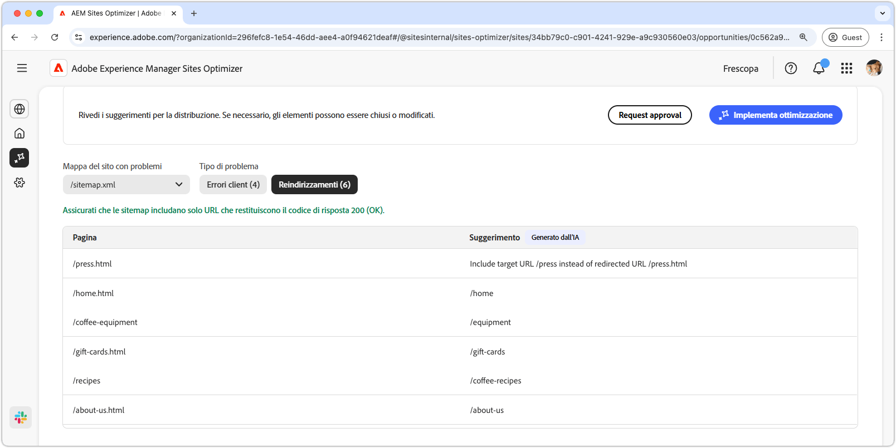

# Opportunità Poblemi di mappa del sito

{align="center"}

Una mappa del sito completa e precisa consente ai motori di ricerca di eseguire l’indicizzazione e indicizzare in modo efficiente le pagine del sito web, per una migliore visibilità nei risultati di ricerca. L’opportunità Problemi di mappa del sito identifica potenziali problemi relativi alla mappa del sito. La risoluzione di questi problemi può migliorare notevolmente l’indicizzazione da parte dei motori di ricerca e la reperibilità dei contenuti sul sito.

Nella parte superiore della pagina, un riepilogo include una sintesi del problema e del relativo impatto sul sito e sul business.

* **Perdita traffico prevista**: perdita di traffico stimata a causa di problemi nella mappa del sito.
* **Valore traffico previsto**: valore stimato del traffico perso.

## Identificazione automatica

I problemi di mappa del sito possono essere filtrati utilizzando i seguenti criteri:

* **Mappa del sito con problemi**: URL della mappa del sito analizzata che presenta potenziali problemi.
* **Tipo di problema**: tipo di problema identificato nella mappa del sito:
   * **Errori client**: voci che non restituiscono una risposta `200 Success`.
   * **Reindirizzamenti**: reindirizzamenti errati o non configurati correttamente.

>[!BEGINTABS]

>[!TAB Errori client]

{align="center"}

Se gli URL nella mappa del sito restituiscono errori client, i motori di ricerca potrebbero presumere che la mappa del sito sia obsoleta o che le pagine siano state rimosse per errore. Il client indica che la richiesta del client (browser o crawler) non è valida. Gli errori più comuni sono:

* **404 Non trovato**: la pagina richiesta non esiste.
* **403 Non consentito**: il server nega l’accesso alla pagina richiesta.
* **410 Non più disponibile**: la pagina è stata rimossa intenzionalmente e non verrà restituita.
* **401 Non autorizzato**: l’autenticazione è obbligatoria ma non è stata fornita.

Questi errori possono avere un effetto negativo sulla SEO, soprattutto se le pagine importanti restituiscono errori **404 o 410**, in quanto i motori di ricerca potrebbero deindicizzarle.

Ogni problema è riportato in una tabella in cui la colonna **Pagina** identifica la voce della mappa del sito interessata:

* **Pagina**: URL della voce della mappa del sito con un problema.

>[!TAB Reindirizzamenti]

{align="center"}

La mappa del sito dovrebbe includere solo URL di destinazione finali, non URL di reindirizzamento. I reindirizzamenti hanno lo scopo di guidare gli utenti e i crawler verso la posizione corretta, ma possono causare problemi se non configurati correttamente:

* **302 Trovato (reindirizzamento temporaneo)**: può causare problemi SEO se utilizzato per errore al posto di **301**.
* **307 Reindirizzamento temporaneo**: simile a 302 ma mantiene il metodo HTTP.
* **Loop di reindirizzamento**: quando una pagina viene reindirizzata su se stessa o crea un ciclo infinito.
* **Reindirizzamenti interrotti**: quando un reindirizzamento conduce a una pagina inesistente o con errori 4xx.

Ogni problema è riportato in una tabella in cui la colonna **Pagina** identifica la voce della mappa del sito interessata:

* **Pagina**: URL della voce della mappa del sito con un problema.

>[!ENDTABS]

## Suggerimento automatico

Ogni problema di mappa del sito [che soddisfa i criteri di filtro](#auto-identify) è elencato in una tabella con le colonne seguenti:

* **Pagina**: URL della voce della mappa del sito con un problema.
* **Suggerimento**: correzione consigliata per il problema.

I suggerimenti in genere includono un percorso del sito aggiornato per correggere la voce della mappa del sito. In alcuni casi, possono anche fornire istruzioni più dettagliate, ad esempio possono specificare la destinazione corretta del reindirizzamento.

## Ottimizzazione automatica

[!BADGE Ultimate]{type=Positive tooltip="Ultimate"}

{align="center"}

Sites Optimizer Ultimate aggiunge la possibilità di distribuire l’ottimizzazione automatica delle mappa del sito.

>[!BEGINTABS]

>[!TAB Distribuisci ottimizzazione]

{{auto-optimize-deploy-optimization-slack}}

>[!TAB Richiedi approvazione]

{{auto-optimize-request-approval}}

>[!ENDTABS]
