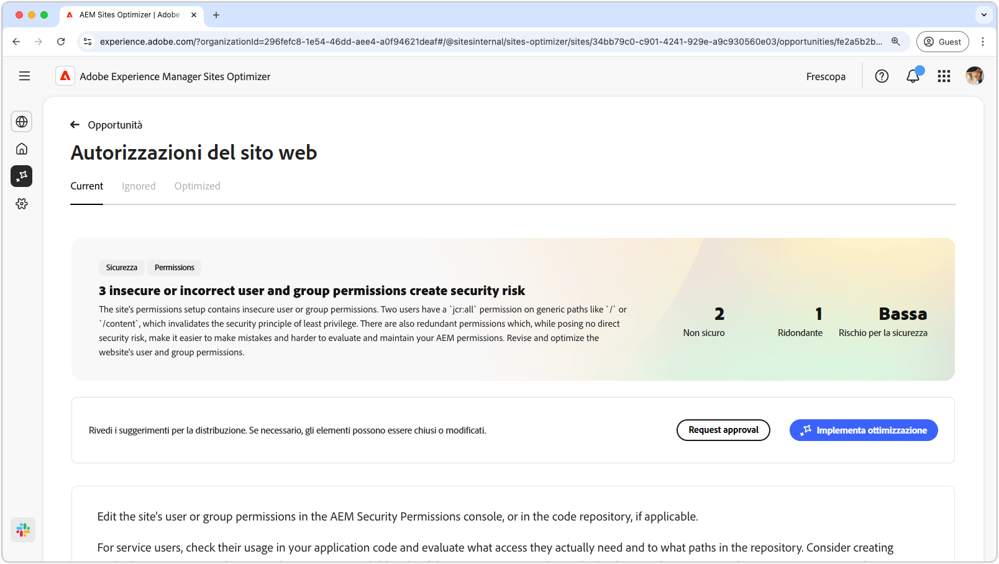
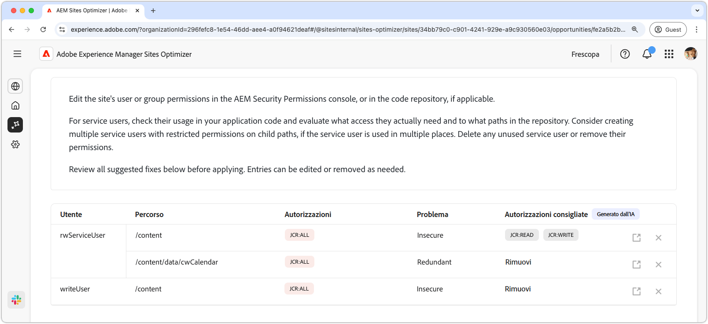
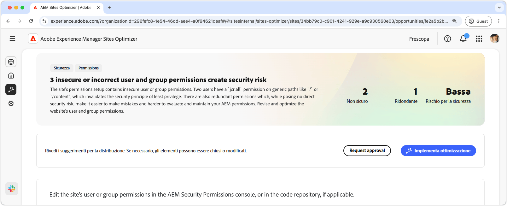

# Opportunità Autorizzazioni del sito web

{align="center"}

L’opportunità da cogliere in caso di autorizzazioni del sito web ottimizza le autorizzazioni del sito web, essenziali per mantenere un ambiente AEM sicuro e gestibile. Questa opportunità consente di perfezionare i controlli di accesso rimuovendo le autorizzazioni eccessivamente ampie, ad esempio `jcr:all` su percorsi generici come `/` o `/content`, e allineando l’accesso utenti al principio del privilegio minimo. Semplificando le autorizzazioni ed eliminando le ridondanze, è possibile ridurre i rischi per la sicurezza, migliorare la manutenzione ed evitare configurazioni errate in futuro. Rivedi e aggiorna le autorizzazioni nella console Autorizzazioni di sicurezza di AEM o nell’archivio del codice. In questo modo gli utenti del servizio potranno accedere solo a quelli effettivamente necessari.

## Identificazione automatica

{align="center"}

La funzionalità **Opportunità autorizzazioni sito web** identifica ed elenca automaticamente

* **Utente**: l’account utente con l’autorizzazione sospetta.
* **Percorso**: utilizza le schede nella parte superiore per organizzare e filtrare le opportunità in base allo stato.
* **Autorizzazione** - Autorizzazione sospetta.
* **Problema**: indica il tipo di problema che influisce sull’autorizzazione.

## Suggerimento automatico

{align="center"}

Il suggerimento automatico fornisce consigli generati dall’intelligenza artificiale nel campo **Autorizzazioni suggerite**, consentendoti di sostituire eventuali autorizzazioni contrassegnate con alternative sicure.

## Ottimizzazione automatica

[!BADGE Ultimate]{type=Positive tooltip="Ultimate"}

{align="center"}

Sites Optimizer Ultimate aggiunge la possibilità di distribuire l’ottimizzazione automatica per le vulnerabilità rilevate.

>[!BEGINTABS]

>[!TAB Implementa ottimizzazione]

{{auto-optimize-deploy-optimization-slack}}

>[!TAB Richiedi approvazione]

{{auto-optimize-request-approval}}

>[!ENDTABS]
