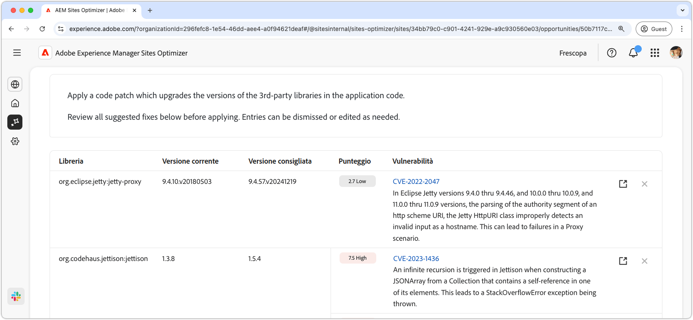

# Opportunità di vulnerabilità del sito web

{align="center"}

L’opportunità di vulnerabilità del sito web identifica le vulnerabilità di sicurezza nelle librerie di terze parti utilizzate dal codice dell’applicazione. Queste vulnerabilità potrebbero essere sfruttate da un utente malintenzionato, aumentando il rischio e riducendo la postura di sicurezza del sito web.

L’opportunità vulnerabilità del sito web visualizza un riepilogo nella parte superiore della pagina, che include quanto segue:

* **Problemi rilevati** - Numero di vulnerabilità rilevate, classificate in base al rischio di sicurezza che rappresentano (basso, medio, alto).
* **Rischio di sicurezza aggregato**: il rischio di sicurezza complessivo per il sito Web in base alle vulnerabilità rilevate dall&#39;opportunità.

## Identificazione automatica

{align="center"}

La funzionalità **Opportunità vulnerabilità sito Web** identifica ed elenca automaticamente le vulnerabilità trovate nelle librerie di terze parti utilizzate dal codice dell&#39;applicazione. Fornisce i seguenti dettagli:

* **Libreria**: la libreria di terze parti contenente la vulnerabilità. Una singola libreria può avere più vulnerabilità.
* **Versione corrente** - Versione della libreria attualmente in uso.
* **Versione consigliata**: la versione suggerita che risolve la vulnerabilità.
* **Punteggio** - Il livello di gravità della vulnerabilità, riassunto anche nella parte superiore della pagina.
* **Vulnerabilità** - Identificatore di vulnerabilità, breve descrizione e collegamento al database nazionale delle vulnerabilità (NVD) per ulteriori dettagli. Accedi al collegamento NVD facendo clic sull’identificatore o sul collegamento accanto alla descrizione.

## Suggerimento automatico

{align="center"}

La funzione di suggerimento automatico fornisce suggerimenti generati dall&#39;intelligenza artificiale per la **versione consigliata** della libreria vulnerabile a cui eseguire l&#39;aggiornamento. Ogni voce ha un **Punteggio** che ne indica la gravità complessiva, aiutando a dare priorità alle vulnerabilità più critiche.

>[!BEGINTABS]

>[!TAB Dettagli vulnerabilità]

Ogni vulnerabilità contiene un collegamento alle informazioni dettagliate nel [National Vulnerability Database (NVD)](https://nvd.nist.gov/). Facendo clic sull’identificatore di vulnerabilità o sull’elemento di collegamento a destra della descrizione verrai indirizzato alla pagina NVD relativa a tale vulnerabilità.

>[!TAB Ignora voci]

Puoi scegliere di ignorare le voci dall’elenco delle vulnerabilità. Se si seleziona l&#39;icona **ignora**, la voce verrà rimossa dall&#39;elenco. Le voci ignorate possono essere riattivate dalla scheda **Ignorato** nella parte superiore della pagina dell&#39;opportunità.<!---right now it does not seem to be implemented, but the page description mentions this functionality-->

>[!ENDTABS]

## Ottimizza automaticamente [!BADGE Ultimate]{type=Positive tooltip="Ultimate"}

{align="center"}

Sites Optimizer Ultimate consente inoltre di distribuire l’ottimizzazione automatica per le vulnerabilità rilevate.

>[!BEGINTABS]

>[!TAB Ottimizzazione distribuzione]

{{auto-optimize-deploy-optimization-slack}}

>[!TAB Richiedi approvazione]

{{auto-optimize-request-approval}}

>[!ENDTABS]