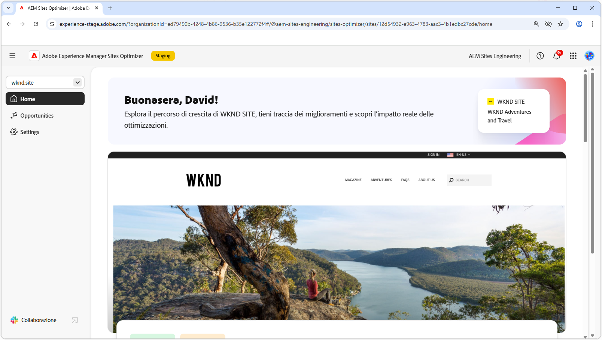
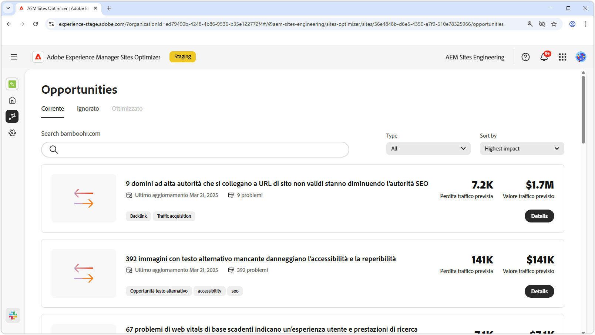
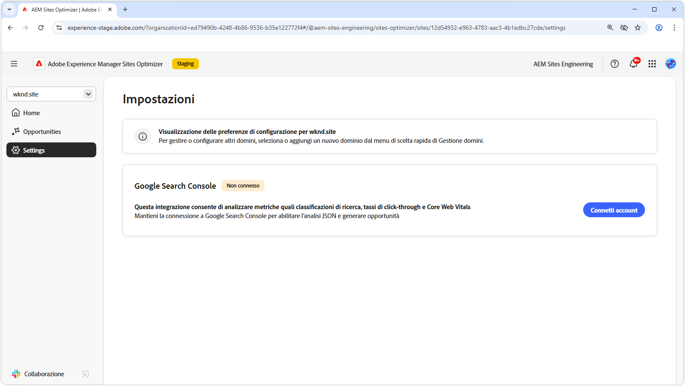

# Documentazione di Sites Optimizer

{align="center"}

Ti diamo il benvenuto nella documentazione di Sites Optimizer. Qui troverai informazioni su come utilizzare Sites Optimizer per ottimizzare i siti AEM.

## Nozioni di base su Site Optimizer

Esplora la documentazione di AEM Sites Optimizer per scoprire i componenti chiave dell’interfaccia utente, tra cui la dashboard Home, le configurazioni delle impostazioni e l’elenco Opportunità per informazioni approfondite sull’ottimizzazione.

<!-- CARDS 

* ./basics.md
  {title = Basics}
  {image = ./assets/basics/card.png}
* ./opportunities/overview.md
  {title = Opportunities}
* ./settings.md
  {title = Settings}

-->
<!-- START CARDS HTML - DO NOT MODIFY BY HAND -->

    

        

            

                <figure class="image x-is-16by9">
                    
                </figure>
            

            

                

                    

                        <a href="./basics.md" target="_blank" rel="referrer" title="Funzioni di base">Nozioni di base</a>
                    

                    
Scopri le nozioni di base di Sites Optimizer e come navigarlo.

                

                <a href="./basics.md" target="_blank" rel="referrer" class="spectrum-Button spectrum-Button--outline spectrum-Button--primary spectrum-Button--sizeM" style="align-self: flex-start; margin-top: 1rem;">
                    Ulteriori informazioni
                </a>
            

        

    

    

        

            

                <figure class="image x-is-16by9">
                    
                </figure>
            

            

                

                    

                        <a href="./opportunities/overview.md" target="_blank" rel="referrer" title="Opportunità">Opportunità</a>
                    

                    
Scopri tutte le opportunità di Site Optimizer disponibili e come utilizzarle per migliorare le prestazioni del sito.

                

                <a href="./opportunities/overview.md" target="_blank" rel="referrer" class="spectrum-Button spectrum-Button--outline spectrum-Button--primary spectrum-Button--sizeM" style="align-self: flex-start; margin-top: 1rem;">
                    Ulteriori informazioni
                </a>
            

        

    

    

        

            

                <figure class="image x-is-16by9">
                    
                </figure>
            

            

                

                    

                        <a href="./settings.md" target="_blank" rel="referrer" title="Impostazioni">Impostazioni</a>
                    

                    
Scopri come configurare le impostazioni di Sites Optimizer e integrarle con altri strumenti.

                

                <a href="./settings.md" target="_blank" rel="referrer" class="spectrum-Button spectrum-Button--outline spectrum-Button--primary spectrum-Button--sizeM" style="align-self: flex-start; margin-top: 1rem;">
                    Ulteriori informazioni
                </a>
            

        

    

<!-- END CARDS HTML - DO NOT MODIFY BY HAND -->

