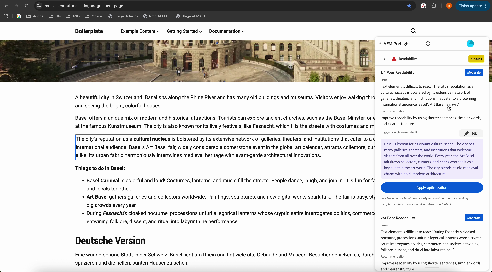

# Risultati dell’audit in Verifica preliminare

Al termine dell’audit, Verifica preliminare visualizza i risultati dell’audit come opportunità. Ogni opportunità è organizzata per tipo e include consigli per migliorare e ottimizzare la pagina. All’interno di un’opportunità, i singoli problemi identificano elementi specifici da rivedere o correggere.

Nella parte superiore della finestra di dialogo Verifica preliminare di AEM si trova una barra di avanzamento utente che riflette i risultati complessivi del controllo di audit. Mostra la percentuale di opportunità passate senza problemi e il numero totale di problemi trovati in tutte le opportunità. La barra Avanzamento utente consente agli autori di valutare lo stato complessivo delle pagine in una panoramica.

{align="center"}

La barra è codificata da un colore:

* Rosso per **meno di 1/3** di opportunità completate
* Arancione da **1/3 a 2/3 completo**
* Verde per **più di 2/3 completati**
* Blu mentre i controlli sono **ancora in esecuzione**

Consulta l&#39;[elenco completo dei tipi di opportunità disponibili e come gestirli](./overview.md#preflight-opportunities).

## Individua i problemi e applica i suggerimenti

Al termine del controllo di audit, puoi passare rapidamente ai problemi identificati e applicare i suggerimenti generati dall’intelligenza artificiale direttamente nell’anteprima.

{align="center"}

### Passare a un problema

1. Selezionare un problema dall&#39;elenco dei problemi nel pannello Verifica preliminare.
1. L’anteprima scorre automaticamente fino alla posizione corrispondente sulla pagina ed evidenzia tale posizione, in modo da poter esaminare il problema nel contesto senza effettuare una ricerca manuale.

### Applicare suggerimenti generati dall’intelligenza artificiale

Per i problemi che includono consigli generati dall’intelligenza artificiale, puoi applicare le ottimizzazioni suggerite direttamente dal pannello dei suggerimenti.

#### Applicare un’ottimizzazione

1. Rivedi il suggerimento generato da IA.
1. Selezionare **Applica ottimizzazione**.

Il contenuto consigliato viene applicato direttamente al contenuto.

#### Modifica prima dell’applicazione

Se sono necessari adeguamenti:

1. Modificate il suggerimento generato dall&#39;intelligenza artificiale nel pannello dei suggerimenti.
1. Selezionare **Applica ottimizzazione**.

La versione modificata viene applicata all’anteprima.
