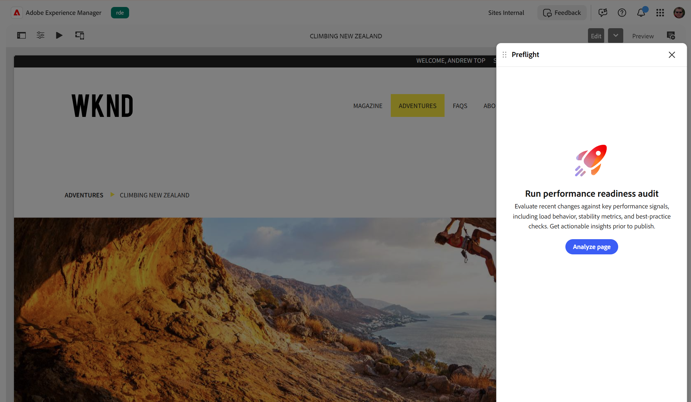

# Audit nella verifica preliminare

La verifica preliminare esegue l’audit della pagina per identificare le opportunità di miglioramento dei contenuti prima della pubblicazione. A differenza di una scansione automatica, puoi scegliere quando eseguire i controlli di audit, in modo da poter analizzare una pagina ogni volta che sei pronto.

{align="center"}

Per eseguire gli audit di verifica preliminare per una pagina:

1. Apri la pagina di cui eseguire l’audit nell’[ambiente di authoring](./access-preflight.md) (editor universale, authoring basato su documenti o Editor pagina per AEM Sites).
1. Apri il [pannello Verifica preliminare](./access-preflight.md). Verrà visualizzata la schermata di destinazione **Esegui verifica di preparazione alle prestazioni**.
1. Selezionare **Analizza pagina**. La verifica preliminare esegue tutti i controlli di audit sulla pagina corrente e apre il dashboard di preparazione, in cui visualizza un punteggio di preparazione e le opportunità trovate, raggruppate per categoria.

Per comprendere i risultati dell&#39;anteprima e identificare le opportunità di ottimizzazione, vedere [Risultati dell&#39;audit in Verifica preliminare](./audit-results.md).

## Utilizzare il pulsante Verifica preliminare integrato

Se nell&#39;ambiente di authoring è in esecuzione [AEM 2026.7.0 (versione 27083)](https://experienceleague.adobe.com/it/docs/experience-manager-cloud-service/content/release-notes/maintenance/2026/2026-7-0#release-27083) o successiva, la verifica preliminare è incorporata nella barra degli strumenti dell&#39;Editor pagine di AEM Sites. Seleziona l&#39;icona **Verifica preliminare** (pulsante Riproduci) per aprire il pannello per la pagina corrente, quindi seleziona **Analizza pagina** per eseguire i controlli di audit.

>[!VIDEO](https://video.tv.adobe.com/v/3496629?learn=on&enablevpops)

## Continua una sessione precedente

La verifica preliminare ricorda l&#39;esecuzione più recente, quindi non è necessario eseguire nuovamente i controlli se si esce e si torna indietro.

* Se riapri il pannello Verifica preliminare nella **stessa scheda del browser**, anche dopo un aggiornamento, la verifica preliminare carica automaticamente i risultati dell&#39;ultima esecuzione.
* Se si restituisce **in una nuova scheda o dopo aver chiuso il browser**, nella schermata di destinazione viene visualizzato un pulsante **Continua ultima sessione** accanto a **Analizza pagina**. Seleziona **Continua ultima sessione** per ricaricare i risultati più recenti, oppure seleziona **Analizza pagina** per avviare una nuova esecuzione.

La verifica preliminare tiene traccia separatamente dell&#39;ultima esecuzione per ogni pagina, quindi **Continua ultima sessione** ricarica sempre l&#39;ultima esecuzione per la pagina in cui ti trovi.

Quando ricarichi un&#39;esecuzione precedente, l&#39;intestazione mostra quanto tempo è trascorso dall&#39;esecuzione, ad esempio *2 minuti fa* o *ieri*, in modo da poter verificare immediatamente l&#39;attualità dei risultati. L’etichetta viene aggiornata con il passare del tempo e rimane visibile mentre ci si sposta tra la dashboard di preparazione e le pagine di dettaglio del controllo di audit.

Al termine dei controlli e alla visualizzazione dei risultati, selezionare **Rianalizza** dalle **Altre azioni** (**...**) nella barra degli strumenti per eliminare i risultati ed eseguire nuovamente ogni controllo di audit. Vedi [Risultati dell&#39;audit in Verifica preliminare](./audit-results.md#toolbar).

