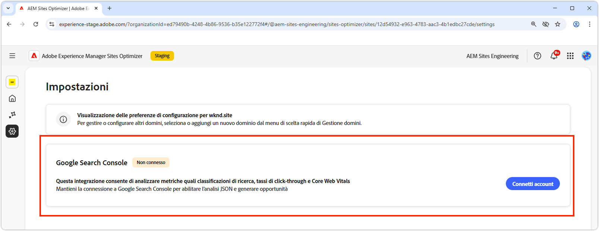

# Impostazioni di Sites Optimizer

{align="center"}

Le impostazioni di Site Optimizer sono l’hub centrale per configurare l’esperienza di Sites Optimizer.

## Google Search Console

{align="center"}

Il connettore di impostazioni di Google Search Console in AEM Sites Optimizer consente di analizzare le metriche SEO (Search Engine Optimization) chiave quali classificazione nei risultati di ricerca, tassi di click-through e Core Web Vitals. Mantenendo la connessione con Google Search Console, puoi sfruttare l’analisi JSON per individuare opportunità di ottimizzazione e migliorare le prestazioni del sito.

Per configurare questo connettore, è necessario disporre di credenziali con accesso amministrativo a Google Search Console per il dominio.
