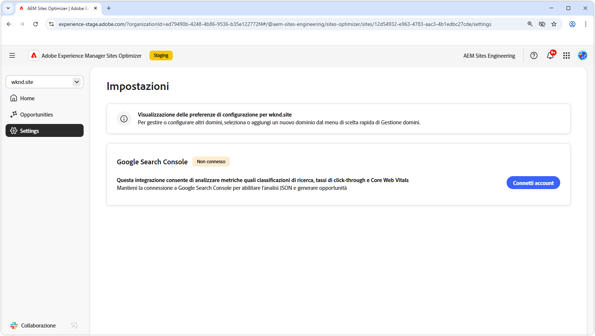
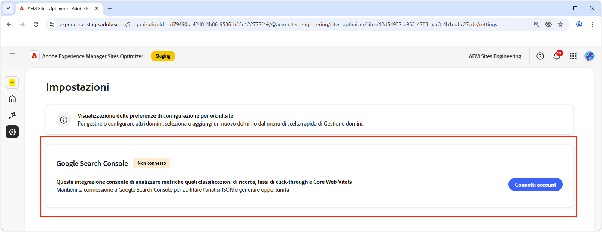
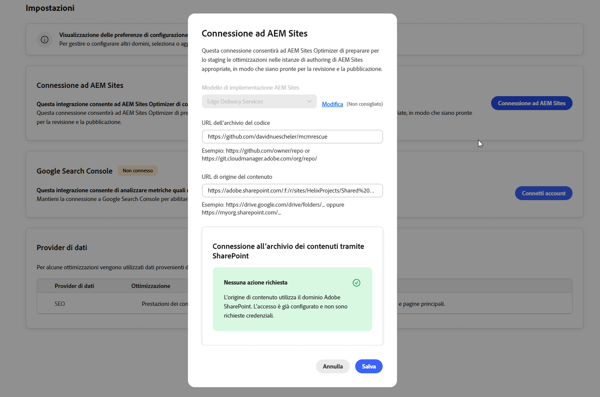
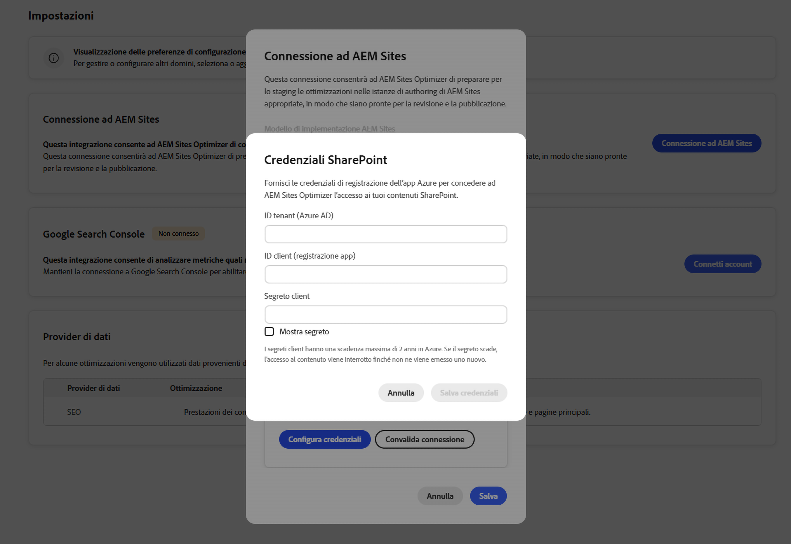
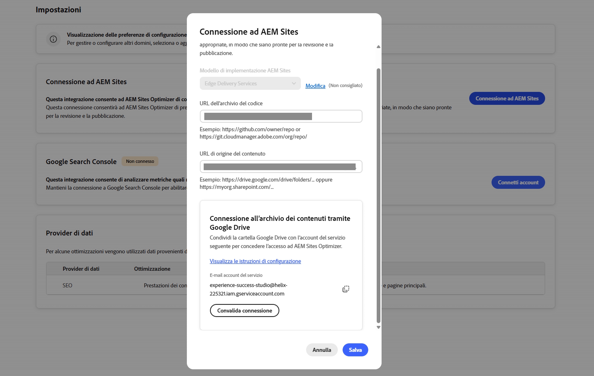

# Impostazioni di Sites Optimizer

{align="center"}

Le impostazioni di Sites Optimizer rappresentano l’hub centrale per configurare l’esperienza di Sites Optimizer.

## Google Search Console

{align="center"}

Il connettore di impostazioni di Google Search Console in AEM Sites Optimizer consente di analizzare le metriche SEO (Search Engine Optimization) chiave quali classificazione nei risultati di ricerca, tassi di click-through e Core Web Vitals. Mantenendo la connessione con Google Search Console, puoi sfruttare l’analisi JSON per individuare opportunità di ottimizzazione e migliorare le prestazioni del sito.

Per configurare questo connettore, è necessario disporre di credenziali con accesso amministrativo a Google Search Console per il dominio.

## Connessione ad AEM Sites

Questa guida spiega come connettere il sito Edge Delivery Services (EDS) esistente ad AEM Sites Optimizer. Prima di iniziare, verifica che il sito EDS sia già configurato e funzionante. Questa connessione serve specificatamente a consentire ad AEM Sites Optimizer di accedere ai tuoi contenuti.

La connessione richiede due passaggi:

1. Specificare l’URL dell’archivio del codice e l’URL dell’origine dei contenuti.
2. Concedere ad AEM Sites Optimizer l’accesso all’origine contenuto.

### Passaggio 1: collegare l’archivio del codice e l’origine contenuto

In AEM Sites Optimizer, passa a **Impostazioni → Connetti ad AEM Sites** e inserisci quanto segue:

- **URL archivio codice**: l’URL GitHub del sito EDS, ad esempio:
  `https://github.com/owner/repo`

- **URL origine contenuto**: l’URL della cartella SharePoint o della cartella Google Drive che supporta il sito EDS, ad esempio:
  `https://drive.google.com/drive/folders/...` oppure `https://myorg.sharepoint.com/...`

Dopo aver inserito l’URL dell’origine contenuto, AEM Sites Optimizer rileverà il tipo di origine contenuto e mostrerà le istruzioni di accesso pertinenti di seguito.

### Passaggio 2: concedere l’accesso all’origine contenuto

Segui la sezione che corrisponde all’origine contenuto.

#### SharePoint — Dominio Adobe

{align="center"}

Se l’URL dell’origine contenuto utilizza il dominio Adobe SharePoint, non è necessaria alcuna ulteriore azione. L’accesso è già configurato. Fai clic su **Salva** per completare la connessione.

#### SharePoint — Dominio personalizzato

Se l’URL dell’origine contenuto utilizza il dominio SharePoint della tua organizzazione, devi registrare un’applicazione Azure e fornire le relative credenziali ad AEM Sites Optimizer.

##### Di cosa avrai bisogno

- Autorizzazione a registrare applicazioni nel portale di Azure o un contatto che può registrare applicazioni per tuo conto.
- I diritti di amministratore tenant per concedere il consenso API o un amministratore che può approvare il consenso API per tuo conto.

##### Passaggio 2a: registrare un’applicazione in Azure

1. Passa a **Portale di Azure → Microsoft Entra ID → Registrazioni app → Nuova registrazione**.
2. Assegna un nome, ad esempio: `AEM Sites Optimizer`.
3. Lascia tutte le altre impostazioni predefinite e fai clic su **Registra**.
4. Nella pagina **Panoramica**, annota:
   - **ID applicazione (client)**
   - **ID directory (tenant)**

##### Passaggio 2b: aggiungere le autorizzazioni API

1. Passa a **Autorizzazioni API → Aggiungi autorizzazione → Microsoft Graph → Autorizzazioni applicazione**.
2. Aggiungi entrambe le opzioni seguenti:
   - `Sites.Selected`: accesso con ambito a raccolte siti di SharePoint specifiche.
   - `Files.SelectedOperations.Selected`: accesso ai file senza un utente connesso.
3. Fai clic su **Concedi consenso amministratore** per entrambi.

{align="center"}

>[!NOTE]
>
>La concessione del consenso amministratore richiede i diritti di amministratore tenant. In caso contrario, chiedi all’amministratore IT o di Azure di completare questo passaggio prima di procedere.

##### Passaggio 2c: creare un segreto client

{align="center"}

1. Pass a **Certificati e segreti → Nuovo segreto client**.
2. Imposta una descrizione e una scadenza, quindi fai clic su **Aggiungi**.
3. Copia immediatamente il valore del segreto perché viene visualizzato una sola volta.

##### Passaggio 2d: concedere all’app l’accesso al sito SharePoint

Puoi concedere l’accesso all’app utilizzando le chiamate API di Microsoft Graph Explorer, PowerShell o Graph dirette.

Passa a [Microsoft Graph Explorer](https://developer.microsoft.com/graph/graph-explorer), accedi con il tuo account Microsoft ed esegui queste richieste:

1. Ricerca l’ID del sito:

```
GET https://graph.microsoft.com/v1.0/sites/{tenant}.sharepoint.com:/sites/{site-name}
```

1. Copia `id` dalla risposta, quindi concedi l’accesso a livello di sito:

```
POST https://graph.microsoft.com/v1.0/sites/{siteId}/permissions
```

Corpo:

```json
{
  "roles": ["write"],
  "grantedToIdentities": [{
    "application": {
      "id": "{your-client-id}",
      "displayName": "{Your app name}"
    }
  }]
}
```

##### Passaggio 2e: inserire le credenziali in AEM Sites Optimizer

{align="center"}

Torna nella finestra di dialogo **Connetti ad AEM Sites**, inserisci quanto segue in **Connessione all’archivio dei contenuti tramite SharePoint**:

- **ID tenant (Azure AD)**: da Registrazione app → Panoramica.
- **ID client (registrazione app)**: da Registrazione app → Panoramica.
- **Segreto client**: creato nel passaggio 2c.

Fai clic su **Convalida connessione** per confermare l’accesso, quindi fai clic su **Salva**.

#### Google Drive

{align="center"}

1. In Google Drive, fai clic con il pulsante destro del mouse sulla cartella che supporta il sito EDS e seleziona **Condividi**.
2. Nel campo **Aggiungi persone e gruppi**, inserisci l’e-mail dell’account del servizio visualizzata nella finestra di dialogo **Connetti ad AEM Sites**:
   `experience-success-studio@helix-225321.iam.gserviceaccount.com`
3. Imposta il livello di autorizzazione su **Editor**.
4. Deseleziona **Notifica alle persone** e fai clic su **Condividi**.

Al termine della condivisione, fai clic su **Convalida connessione** nella finestra di dialogo, quindi fai clic su **Salva**.
