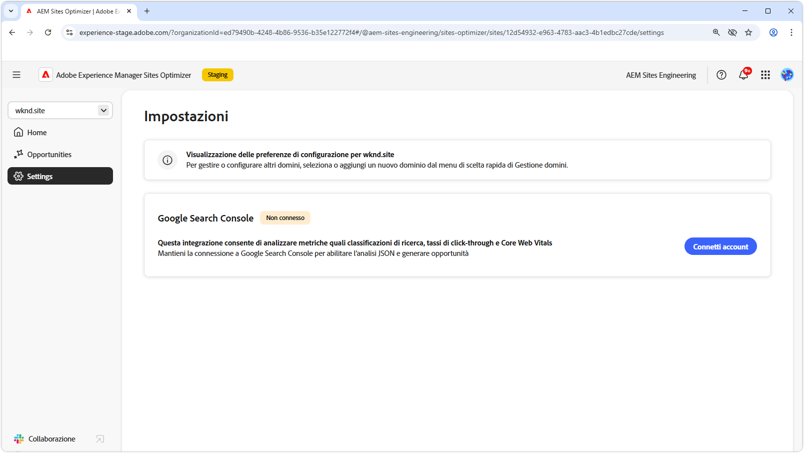

# Impostazioni Sites Optimizer

{align="center"}

Le impostazioni di Site Optimizer sono l’hub centrale per configurare l’esperienza di Sites Optimizer.

## Google Search Console

{align="center"}

Il connettore delle impostazioni della console di ricerca di Google in AEM Sites Optimizer consente di analizzare le metriche SEO (Search Engine Optimization) chiave, come le classificazioni di ricerca, i tassi di click-through e i valori web vitali principali. Mantenendo connessa la console di Google Search, puoi sfruttare l’analisi JSON per individuare opportunità di ottimizzazione e migliorare le prestazioni del sito.

Per configurare questo connettore, è necessario disporre di credenziali con accesso amministrativo alla console di Google Search per il dominio.
