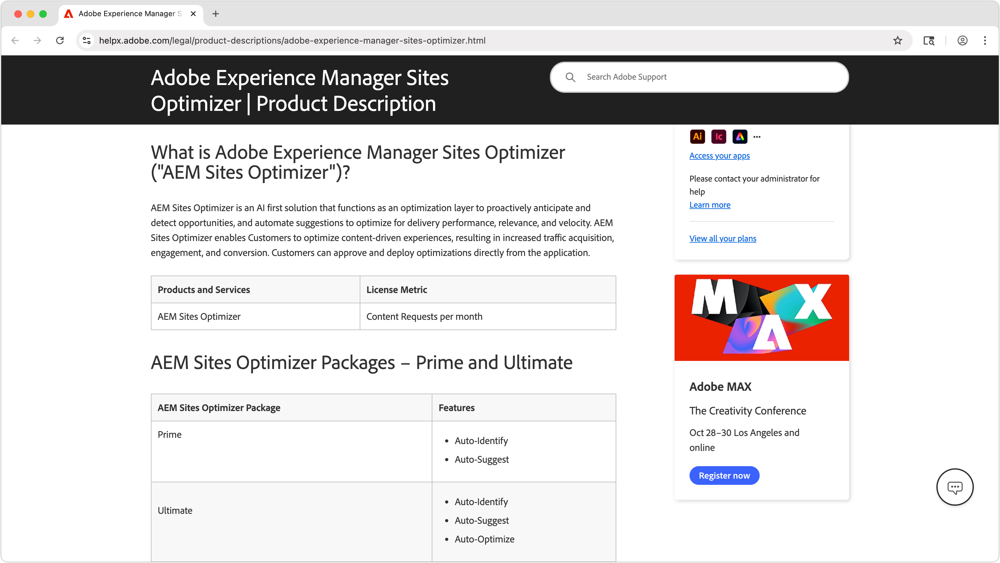

# AEM Sites Optimizer

>[!VIDEO](https://video.tv.adobe.com/v/3455085/?learn=on&enablevpops)

Adobe Experience Manager (AEM) Sites Optimizer è un servizio basato su cloud che analizza e migliora le prestazioni dei siti web basati su AEM. Sites Optimizer identifica aree per il miglioramento del caricamento delle pagine, dell’utilizzo dei componenti e della distribuzione dei contenuti. Questa funzionalità consente di migliorare le prestazioni del sito web riducendo al contempo i costi di manutenzione e aggiornamento. Utilizzando Sites Optimizer, puoi garantire un’esperienza online fluida e affidabile, importante per mantenere il coinvolgimento e le conversioni.

## Introduzione a Sites Optimizer

<!-- CARDS 

* ./opportunity-types/overview.md
    * {title=Opportunity types}
    * {description = Learn about the available Site Optimizer opportunities and how to use them to improve your site's performance.}
* ./documentation/overview.md
  * {title=Documentation}
  * {description=Explore the Sites Optimizer documentation to learn about all its capabilities.}

-->
<!-- START CARDS HTML - DO NOT MODIFY BY HAND -->

    

        

            

                <figure class="image x-is-16by9">
                    
                </figure>
            

            

                

                    

                        <a href="./opportunity-types/overview.md" target="_blank" rel="referrer" title="Tipi di opportunità">Tipi di opportunità</a>
                    

                    
Scopri le opportunità di Site Optimizer disponibili e come utilizzarle per migliorare le prestazioni del sito.

                

                <a href="./opportunity-types/overview.md" target="_blank" rel="referrer" class="spectrum-Button spectrum-Button--outline spectrum-Button--primary spectrum-Button--sizeM" style="align-self: flex-start; margin-top: 1rem;">
                    Ulteriori informazioni
                </a>
            

        

    

    

        

            

                <figure class="image x-is-16by9">
                    
                </figure>
            

            

                

                    

                        <a href="./documentation/overview.md" target="_blank" rel="referrer" title="Documentazione">Documentazione</a>
                    

                    
Esplora la documentazione di Sites Optimizer per scoprire tutte le sue funzionalità.

                

                <a href="./documentation/overview.md" target="_blank" rel="referrer" class="spectrum-Button spectrum-Button--outline spectrum-Button--primary spectrum-Button--sizeM" style="align-self: flex-start; margin-top: 1rem;">
                    Ulteriori informazioni
                </a>
            

        

    

<!-- END CARDS HTML - DO NOT MODIFY BY HAND -->

## Ulteriori informazioni su Sites Optimizer

<!-- CARDS 
* https://helpx.adobe.com/it/legal/product-descriptions/adobe-experience-manager-sites-optimizer.html
    {title=Packages and licensing}
    {description=Learn about AEM Sites Optimizer packages and licensing.}
    {image=./assets/home/licensing.png}
    {target=_blank}
    {cta=Learn more}
* https://business.adobe.com/products/experience-manager/sites/optimizer.html
    {title=Explore the capabilities of AEM Sites Optimizer}
    {description=Learn what AEM Site Optimizer can do for your company.}
    {image=./assets/home/business-adobe-com.png}
    {target=_blank}
    {cta=Learn more}
-->
<!-- START CARDS HTML - DO NOT MODIFY BY HAND -->

    

        

            

                <figure class="image x-is-16by9">
                    
                </figure>
            

            

                

                    

                        <a href="https://helpx.adobe.com/it/legal/product-descriptions/adobe-experience-manager-sites-optimizer.html" target="_blank" rel="referrer" title="Pacchetti e licenze">Pacchetti e licenze</a>
                    

                    
Scopri i pacchetti e le licenze di AEM Sites Optimizer.

                

                <a href="https://helpx.adobe.com/it/legal/product-descriptions/adobe-experience-manager-sites-optimizer.html" target="_blank" rel="referrer" class="spectrum-Button spectrum-Button--outline spectrum-Button--primary spectrum-Button--sizeM" style="align-self: flex-start; margin-top: 1rem;">
                    Ulteriori informazioni
                </a>
            

        

    

    

        

            

                <figure class="image x-is-16by9">
                    
                </figure>
            

            

                

                    

                        <a href="https://business.adobe.com/products/experience-manager/sites/optimizer.html" target="_blank" rel="referrer" title="Esplorare le funzionalità di AEM Sites Optimizer">Esplora le funzionalità di AEM Sites Optimizer</a>
                    

                    
Scopri cosa può fare AEM Site Optimizer per la tua azienda.

                

                <a href="https://business.adobe.com/products/experience-manager/sites/optimizer.html" target="_blank" rel="referrer" class="spectrum-Button spectrum-Button--outline spectrum-Button--primary spectrum-Button--sizeM" style="align-self: flex-start; margin-top: 1rem;">
                    Ulteriori informazioni
                </a>
            

        

    

<!-- END CARDS HTML - DO NOT MODIFY BY HAND -->
