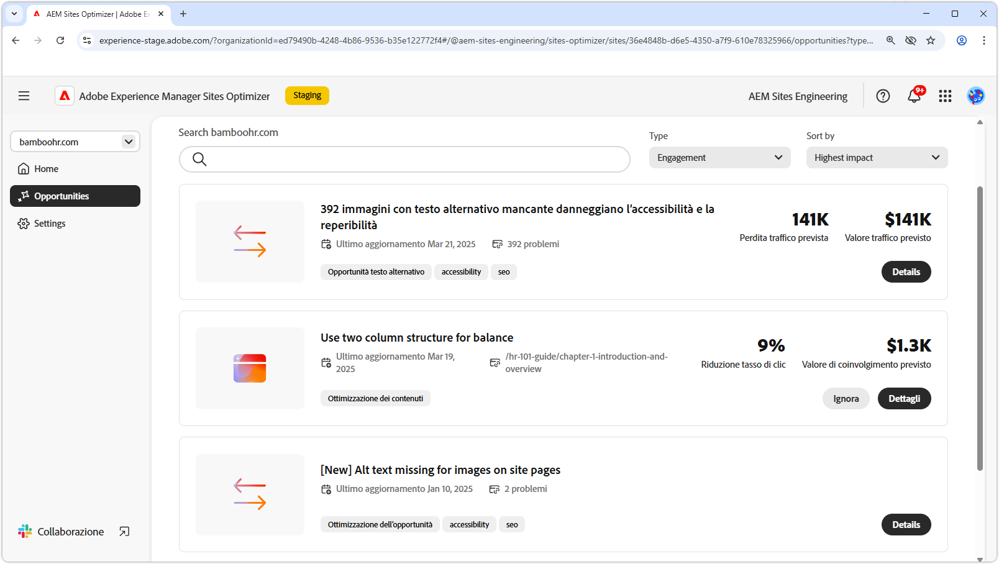

# Opportunità di coinvolgimento

{align="center"}

Le opportunità di coinvolgimento in AEM Sites Optimizer sono fondamentali per migliorare le esperienze digitali fornendo informazioni fruibili sul modo in cui gli utenti interagiscono con le pagine web. Identificando le aree da migliorare, ad esempio problemi di accessibilità, collegamenti interni interrotti, tassi di mancato recapito elevati e testo alternativo mancante, i marketer e chi crea i contenuti possono ottimizzare i siti per migliorare le prestazioni e il coinvolgimento utenti. Queste opportunità contribuiscono a garantire che i contenuti siano efficaci, individuabili e coinvolgenti, promuovendo in ultima analisi conversioni più elevate e un percorso cliente più semplice. Sfruttando i consigli di AEM Sites Optimizer i team possono perfezionare continuamente la propria strategia digitale e fornire esperienze di alto impatto su larga scala.

## Opportunità

<!-- CARDS

* ../documentation/opportunities/accessibility-issues.md
  {title=Accessibility issues}
  {image=../assets/common/card-puzzle.png}
* ../documentation/opportunities//broken-internal-links.md
  {title=Broken internal links}
  {image=../assets/common/card-link.png}
* ../documentation/opportunities//high-bounce-rate.md
  {title=High bounce rate}
  {image=../assets/common/card-arrows.png}
* ../documentation/opportunities/missing-alt-text.md  
  {title=Missing alt text}
  {image=../assets/common/card-arrows.png}

-->
<!-- START CARDS HTML - DO NOT MODIFY BY HAND -->

    

        

            

                <figure class="image x-is-16by9">
                    
                </figure>
            

            

                

                    

                        <a href="../documentation/opportunities/accessibility-issues.md" target="_blank" rel="referrer" title="Problemi di accessibilità">Problemi di accessibilità</a>
                    

                    
Scopri l’opportunità da cogliere in caso di problemi di accessibilità e come utilizzarla per aumentare la sicurezza di sul tuo sito web.

                

                <a href="../documentation/opportunities/accessibility-issues.md" target="_blank" rel="referrer" class="spectrum-Button spectrum-Button--outline spectrum-Button--primary spectrum-Button--sizeM" style="align-self: flex-start; margin-top: 1rem;">
                    Ulteriori informazioni
                </a>
            

        

    

    

        

            

                <figure class="image x-is-16by9">
                    
                </figure>
            

            

                

                    

                        <a href="../documentation/opportunities//broken-internal-links.md" target="_blank" rel="referrer" title="Collegamenti interni interrotti">Collegamenti interni interrotti</a>
                    

                    
Scopri l’opportunità da cogliere in caso di collegamenti interrotti e come utilizzarla per migliorare il coinvolgimento sul tuo sito web.

                

                <a href="../documentation/opportunities//broken-internal-links.md" target="_blank" rel="referrer" class="spectrum-Button spectrum-Button--outline spectrum-Button--primary spectrum-Button--sizeM" style="align-self: flex-start; margin-top: 1rem;">
                    Ulteriori informazioni
                </a>
            

        

    

    

        

            

                <figure class="image x-is-16by9">
                    
                </figure>
            

            

                

                    

                        <a href="../documentation/opportunities//high-bounce-rate.md" target="_blank" rel="referrer" title="Tasso di mancato recapito elevato">Tasso di mancato recapito elevato</a>
                    

                    
Scopri l’opportunità di visualizzazioni basse e come utilizzarla per migliorare il coinvolgimento nei moduli sul tuo sito web.

                

                <a href="../documentation/opportunities//high-bounce-rate.md" target="_blank" rel="referrer" class="spectrum-Button spectrum-Button--outline spectrum-Button--primary spectrum-Button--sizeM" style="align-self: flex-start; margin-top: 1rem;">
                    Ulteriori informazioni
                </a>
            

        

    

    

        

            

                <figure class="image x-is-16by9">
                    
                </figure>
            

            

                

                    

                        <a href="../documentation/opportunities/missing-alt-text.md" target="_blank" rel="referrer" title="Testo alternativo mancante">Testo alternativo mancante</a>
                    

                    
Scopri l’opportunità da cogliere in caso di testo alternativo mancante e come utilizzarla per migliorare il coinvolgimento sul tuo sito web.

                

                <a href="../documentation/opportunities/missing-alt-text.md" target="_blank" rel="referrer" class="spectrum-Button spectrum-Button--outline spectrum-Button--primary spectrum-Button--sizeM" style="align-self: flex-start; margin-top: 1rem;">
                    Ulteriori informazioni
                </a>
            

        

    

<!-- END CARDS HTML - DO NOT MODIFY BY HAND -->
