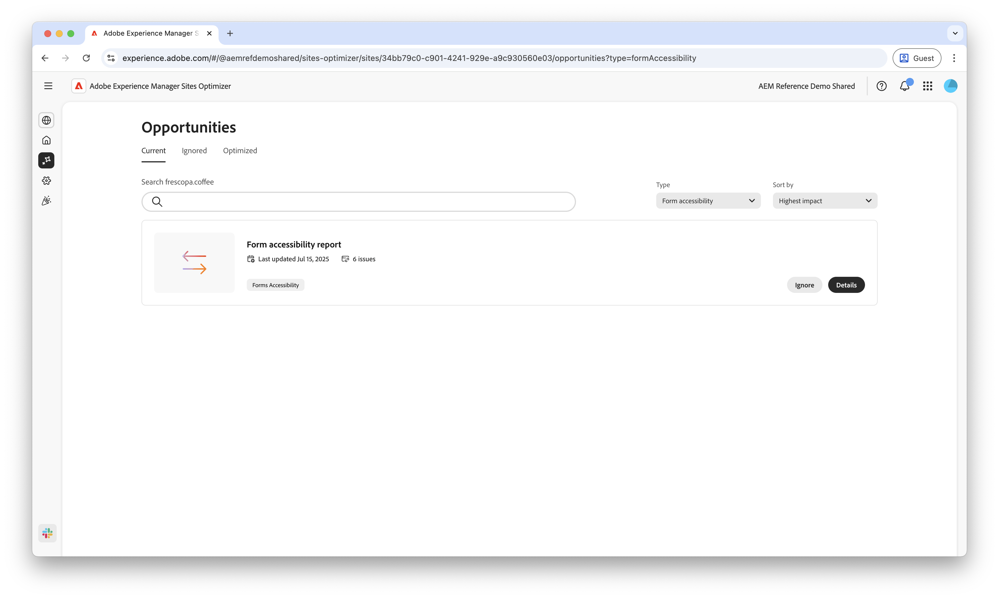

# Opportunità di accessibilità dei moduli

 La funzionalità di ottimizzazione dei moduli è disponibile in un programma di accesso anticipato. Per partecipare al programma di accesso anticipato e richiedere l’accesso alla funzionalità, invia un’e-mail dal tuo ID e-mail ufficiale all’indirizzo aem-forms-ea@adobe.com. 

{align="center"}

Le opportunità di accessibilità dei moduli sono fondamentali per migliorare le interazioni degli utenti e aumentare le conversioni. La valutazione della conformità dei moduli alle linee guida per l’accessibilità dei contenuti web (WCAG) garantisce un’esperienza inclusiva per gli utenti con disabilità visive, uditive, cognitive e motorie. Questa funzionalità non solo soddisfa i requisiti etici e legali, ma aumenta anche i tassi di completamento dei moduli e amplia il tuo pubblico, garantendo una migliore esperienza utente e risultati di business più solidi.

## Opportunità

<!--
CARDS

 
* ../documentation/opportunities/low-views.md
  {title=Low views}
  {image=../assets/common/card-bag.png}
* ../documentation/opportunities/low-conversions.md
  {title=Low conversions}
  {image=../assets/common/card-bag.png}

-->
<!-- START CARDS HTML - DO NOT MODIFY BY HAND -->

    

        

            

                <figure class="image x-is-16by9">
                    
                </figure>
            

            

                

                    

                        <a href="../documentation/opportunities/forms-accessibility-issues.md" target="_blank" rel="referrer" title="Problemi di accessibilità dei moduli">Problemi di accessibilità dei moduli</a>
                    

                    
Scopri i problemi di accessibilità dei moduli e come utilizzarli per migliorare il coinvolgimento nei moduli sul tuo sito web.

                

                <a href="../documentation/opportunities/forms-accessibility-issues.md" target="_blank" rel="referrer" class="spectrum-Button spectrum-Button--outline spectrum-Button--primary spectrum-Button--sizeM" style="align-self: flex-start; margin-top: 1rem;">
                    Ulteriori informazioni
                </a>
            

        

    

<!-- END CARDS HTML - DO NOT MODIFY BY HAND -->
