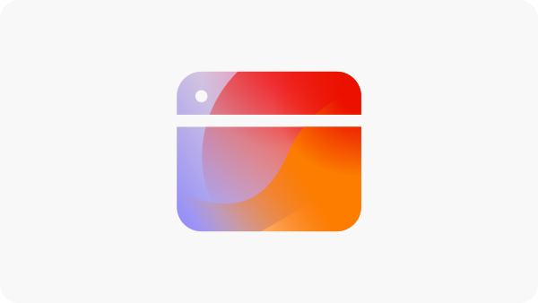

# Opportunità di ottimizzazione dei moduli

 La funzionalità Ottimizzazione dei moduli è disponibile nell’ambito del programma di accesso anticipato. Per partecipare al programma di accesso anticipato e richiedere l’accesso alla funzionalità, invia un’e-mail dal tuo ID e-mail ufficiale all’indirizzo aem-forms-ea@adobe.com. 

<!-- [!VIDEO](https://video.tv.adobe.com/v/3469472/) -->

{align="center"}

Le opportunità di ottimizzazione dei moduli consentono alle organizzazioni di migliorare sistematicamente le interazioni degli utenti e aumentare le conversioni dei moduli. Rilevando problemi quali visualizzazioni basse, conversioni basse e tassi di navigazione bassi, i team possono apportare modifiche basate sui dati alla progettazione, al posizionamento e al contenuto dei moduli. Queste ottimizzazioni aiutano a semplificare l’esperienza utente, rendendo più facile per i visitatori completare i moduli e raggiungere i risultati desiderati. L’utilizzo delle informazioni provenienti dall’ottimizzazione dei moduli supporta l’identificazione continua e la risoluzione dei divari delle prestazioni, portando a moduli più efficaci e a risultati aziendali migliori.

## Opportunità

<!-- CARDS
 
* ../documentation/opportunities/low-views.md
  {title=Low views}
  {image=../assets/common/card-bag.png}
* ../documentation/opportunities/low-conversions.md
  {title=Low conversions}
  {image=../assets/common/card-bag.png}

--->
<!-- START CARDS HTML - DO NOT MODIFY BY HAND -->

    

        

            

                <figure class="image x-is-16by9">
                    
                </figure>
            

            

                

                    

                        <a href="../documentation/opportunities/low-views.md" target="_blank" rel="referrer" title="Visualizzazioni basse">Visualizzazioni basse</a>
                    

                    
Scopri l’opportunità di visualizzazioni basse e come utilizzarla per migliorare il coinvolgimento nei moduli sul tuo sito web.

                

                <a href="../documentation/opportunities/low-views.md" target="_blank" rel="referrer" class="spectrum-Button spectrum-Button--outline spectrum-Button--primary spectrum-Button--sizeM" style="align-self: flex-start; margin-top: 1rem;">
                    Ulteriori informazioni
                </a>
            

        

    

    

        

            

                <figure class="image x-is-16by9">
                    
                </figure>
            

            

                

                    

                        <a href="../documentation/opportunities/low-conversions.md" target="_blank" rel="referrer" title="Conversioni basse">Conversioni basse</a>
                    

                    
Scopri l’opportunità da cogliere in caso di conversioni basse e come utilizzarla per migliorare il coinvolgimento nei moduli nel tuo sito web.

                

                <a href="../documentation/opportunities/low-conversions.md" target="_blank" rel="referrer" class="spectrum-Button spectrum-Button--outline spectrum-Button--primary spectrum-Button--sizeM" style="align-self: flex-start; margin-top: 1rem;">
                    Ulteriori informazioni
                </a>
            

        

    

    

        

            

                <figure class="image x-is-16by9">
                    
                </figure>
            

            

                

                    

                        <a href="../documentation/opportunities/low-navigation.md" target="_blank" rel="referrer" title="Problemi di accessibilità">Navigazione bassa</a>
                    

                    
Scopri l’opportunità di navigazione bassa e come utilizzarla per migliorare il coinvolgimento nei moduli sul tuo sito web.

                

                <a href="../documentation/opportunities/low-navigation.md" target="_blank" rel="referrer" class="spectrum-Button spectrum-Button--outline spectrum-Button--primary spectrum-Button--sizeM" style="align-self: flex-start; margin-top: 1rem;">
                    Ulteriori informazioni
                </a>
            

        

    

<!-- END CARDS HTML - DO NOT MODIFY BY HAND -->
