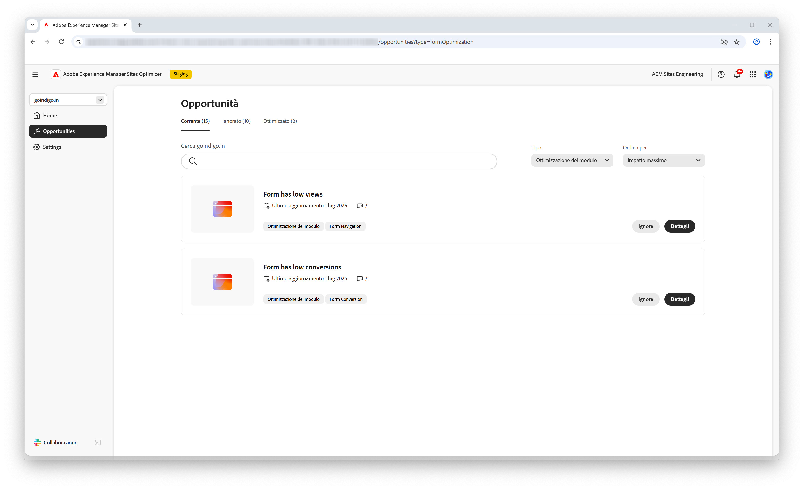

# Opportunità Ottimizzazione modulo

{align="center"}

L’ottimizzazione del modulo in AEM Sites Optimizer è essenziale per migliorare le interazioni degli utenti e massimizzare le conversioni. Identificando le aree da migliorare, ad esempio visualizzazioni e conversioni basse dei moduli, i team possono perfezionare la progettazione, il posizionamento e il contenuto del modulo per aumentare il coinvolgimento. I moduli ottimizzati garantiscono un’esperienza utente fluida, consentendo ai visitatori di completare più facilmente le azioni e promuovere i risultati aziendali. L’utilizzo delle informazioni di AEM Sites Optimizer consente agli addetti al marketing di identificare continuamente aree di miglioramento, aumentando in ultima analisi l’efficacia e migliorando le prestazioni complessive del sito.

## Opportunità

<!-- CARDS
 
* ../documentation/opportunities/low-views.md
  {title=Low views}
  {image=../assets/common/card-bag.png}
* ../documentation/opportunities/low-conversions.md
  {title=Low conversions}
  {image=../assets/common/card-bag.png}

--->
<!-- START CARDS HTML - DO NOT MODIFY BY HAND -->

    

        

            

                <figure class="image x-is-16by9">
                    
                </figure>
            

            

                

                    

                        <a href="../documentation/opportunities/low-views.md" target="_blank" rel="referrer" title="Visualizzazioni basse">Visualizzazioni basse</a>
                    

                    
Scopri l’opportunità da cogliere in caso di visualizzazioni basse e come utilizzarla per migliorare il coinvolgimento con i moduli sul tuo sito web.

                

                <a href="../documentation/opportunities/low-views.md" target="_blank" rel="referrer" class="spectrum-Button spectrum-Button--outline spectrum-Button--primary spectrum-Button--sizeM" style="align-self: flex-start; margin-top: 1rem;">
                    Ulteriori informazioni
                </a>
            

        

    

    

        

            

                <figure class="image x-is-16by9">
                    
                </figure>
            

            

                

                    

                        <a href="../documentation/opportunities/low-conversions.md" target="_blank" rel="referrer" title="Conversioni basse">Conversioni basse</a>
                    

                    
Scopri l’opportunità da cogliere in caso di conversioni basse e come utilizzarla per migliorare il coinvolgimento nei moduli sul tuo sito web.

                

                <a href="../documentation/opportunities/low-conversions.md" target="_blank" rel="referrer" class="spectrum-Button spectrum-Button--outline spectrum-Button--primary spectrum-Button--sizeM" style="align-self: flex-start; margin-top: 1rem;">
                    Ulteriori informazioni
                </a>
            

        

    

<!-- END CARDS HTML - DO NOT MODIFY BY HAND -->
