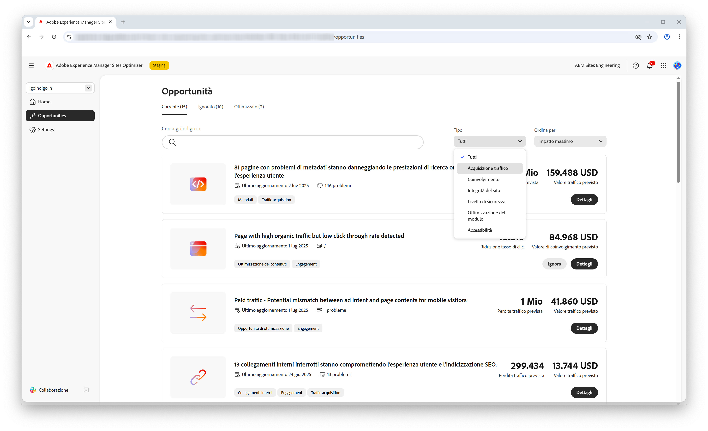
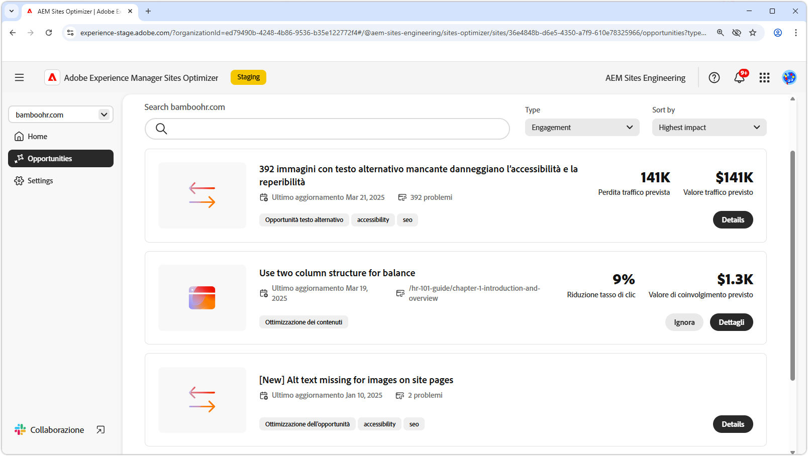
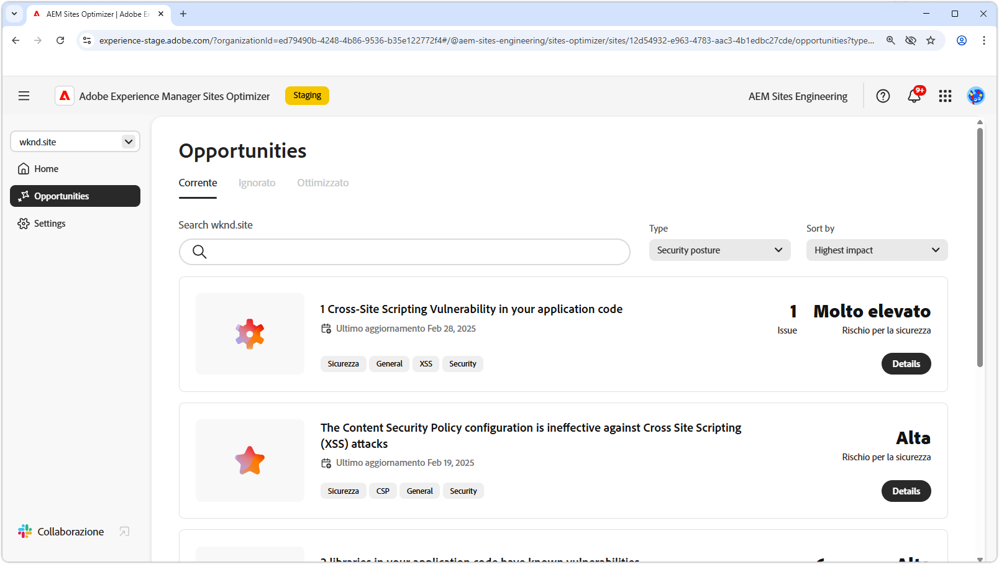
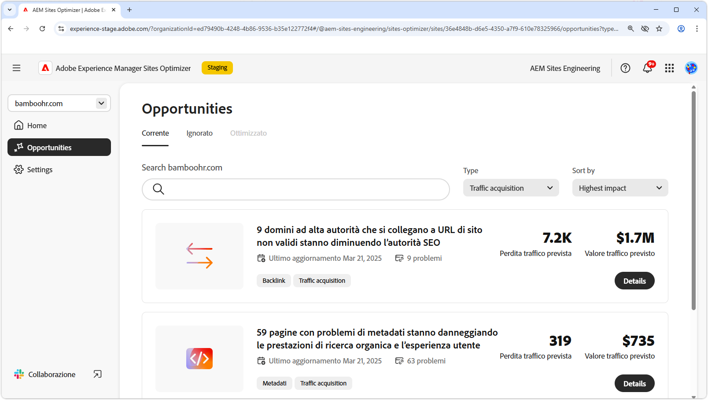

# Tipi di opportunità

{align="center"}

AEM Sites Optimizer fornisce informazioni e consigli utili per migliorare le prestazioni, l’usabilità e la sicurezza del sito web. Queste informazioni sono raggruppate nelle seguenti aree di opportunità: Coinvolgimento, Acquisizione traffico, Livello di sicurezza e Integrità del sito. Ogni categoria evidenzia modi specifici per migliorare il sito, ad esempio per aumentare le interazioni da parte del visitatore, migliorare la reperibilità del sito, rafforzarne la sicurezza o mantenerne la stabilità.

Sfruttando queste opportunità puoi migliorare l’esperienza utente, attirare il pubblico giusto e mantenere il tuo sito sicuro e affidabile. Migliorando il coinvolgimento e l’acquisizione del traffico si favoriscono l’interazione e la visibilità, mentre la solidità del livello di sicurezza e l’integrità del sito contribuiscono a garantire fiducia e stabilità.  Esplora i collegamenti riportati di seguito per visualizzare le opportunità organizzate per categoria e scoprire come migliorare il tuo sito.

## Tipi di opportunità

<!-- CARDS 

* ./engagement.md
   { title = Engagement }
* ./security-posture.md
   { title = Security posture }
* ./site-health.md
   { title = Site health }
* ./traffic-acquisition.md
   { title = Traffic acquisition }

-->
<!-- START CARDS HTML - DO NOT MODIFY BY HAND -->

    

        

            

                <figure class="image x-is-16by9">
                    
                </figure>
            

            

                

                    

                        <a href="./engagement.md" target="_blank" rel="referrer" title="Coinvolgimento">Coinvolgimento</a>
                    

                    
Scopri come migliorare il coinvolgimento con Sites Optimizer.

                

                <a href="./engagement.md" target="_blank" rel="referrer" class="spectrum-Button spectrum-Button--outline spectrum-Button--primary spectrum-Button--sizeM" style="align-self: flex-start; margin-top: 1rem;">
                    Ulteriori informazioni
                </a>
            

        

    

    

        

            

                <figure class="image x-is-16by9">
                    
                </figure>
            

            

                

                    

                        <a href="./security-posture.md" target="_blank" rel="referrer" title="Livello di sicurezza">Livello di sicurezza</a>
                    

                    
Scopri come migliorare la sicurezza del tuo sito con Sites Optimizer.

                

                <a href="./security-posture.md" target="_blank" rel="referrer" class="spectrum-Button spectrum-Button--outline spectrum-Button--primary spectrum-Button--sizeM" style="align-self: flex-start; margin-top: 1rem;">
                    Ulteriori informazioni
                </a>
            

        

    

    

        

            

                <figure class="image x-is-16by9">
                    
                </figure>
            

            

                

                    

                        <a href="./site-health.md" target="_blank" rel="referrer" title="Integrità del sito">Integrità del sito</a>
                    

                    
Scopri come migliorare lo stato del tuo sito con Sites Optimizer.

                

                <a href="./site-health.md" target="_blank" rel="referrer" class="spectrum-Button spectrum-Button--outline spectrum-Button--primary spectrum-Button--sizeM" style="align-self: flex-start; margin-top: 1rem;">
                    Ulteriori informazioni
                </a>
            

        

    

    

        

            

                <figure class="image x-is-16by9">
                    
                </figure>
            

            

                

                    

                        <a href="./traffic-acquisition.md" target="_blank" rel="referrer" title="Acquisizione traffico">Acquisizione traffico</a>
                    

                    
Scopri come aumentare l’acquisizione del traffico con Sites Optimizer.

                

                <a href="./traffic-acquisition.md" target="_blank" rel="referrer" class="spectrum-Button spectrum-Button--outline spectrum-Button--primary spectrum-Button--sizeM" style="align-self: flex-start; margin-top: 1rem;">
                    Ulteriori informazioni
                </a>
            

        

    

<!-- END CARDS HTML - DO NOT MODIFY BY HAND -->
