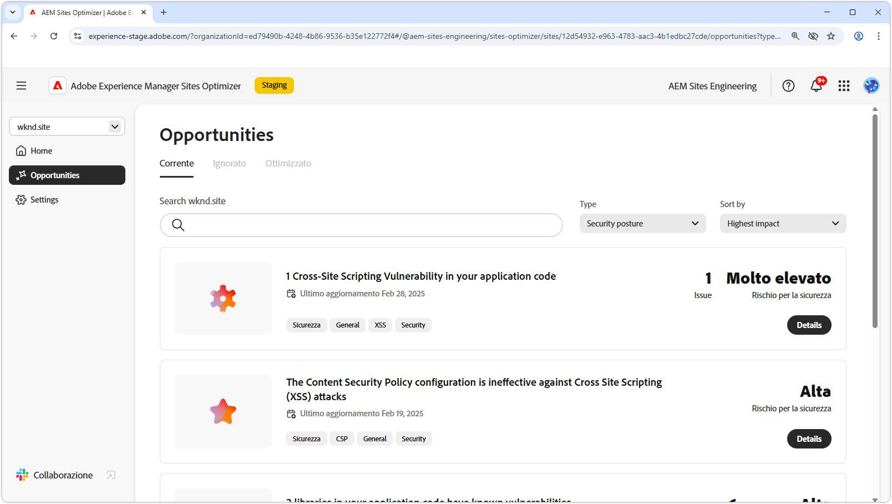

# Opportunità di postura di sicurezza

{align="center"}

Mantenere una posizione di sicurezza forte in AEM Sites Optimizer è fondamentale per proteggere le esperienze digitali e i dati utente. Identificando opportunità di miglioramento, ad esempio la configurazione CORS, gli script tra siti, le autorizzazioni per il sito Web e le vulnerabilità del sito, i team possono affrontare in modo proattivo i potenziali rischi per la sicurezza e garantire la conformità alle best practice. Il rafforzamento delle misure di sicurezza non solo tutela le informazioni sensibili, ma rafforza anche la fiducia degli utenti e l&#39;affidabilità dei siti. Sfruttando le informazioni di AEM Sites Optimizer, le organizzazioni possono monitorare e migliorare continuamente la propria posizione in materia di sicurezza, riducendo i rischi e mantenendo un ambiente digitale sicuro.

## Opportunità

<!-- CARDS

* ../documentation/opportunities/cors-configuration.md
  {title=CORS configuration}
  {image=../assets/common/card-code.png}
* ../documentation/opportunities/cross-site-scripting.md
  {title=Cross-site scripting}
  {image=../assets/common/card-gear.png}
* ../documentation/opportunities/website-permissions.md  
  {title=Website permissions}
  {image=../assets/common/card-people.png}
* ../documentation/opportunities//website-vulnerabilities.md
  {title=Website vulnerabilities}
  {image=../assets/common/card-puzzle.png}

-->
<!-- START CARDS HTML - DO NOT MODIFY BY HAND -->

    

        

            

                <figure class="image x-is-16by9">
                    
                </figure>
            

            

                

                    

                        <a href="../documentation/opportunities/cors-configuration.md" target="_blank" rel="referrer" title="Configurazione CORS">Configurazione CORS</a>
                    

                    
Scopri l’opportunità di configurazione CORS e come identificare e correggere le vulnerabilità di sicurezza del sito.

                

                <a href="../documentation/opportunities/cors-configuration.md" target="_blank" rel="referrer" class="spectrum-Button spectrum-Button--outline spectrum-Button--primary spectrum-Button--sizeM" style="align-self: flex-start; margin-top: 1rem;">
                    Ulteriori informazioni
                </a>
            

        

    

    

        

            

                <figure class="image x-is-16by9">
                    
                </figure>
            

            

                

                    

                        <a href="../documentation/opportunities/cross-site-scripting.md" target="_blank" rel="referrer" title="Cross-site scripting">Scripting tra siti</a>
                    

                    
Scopri l’opportunità di scripting tra siti e come identificare e correggere le vulnerabilità relative alla sicurezza dei siti.

                

                <a href="../documentation/opportunities/cross-site-scripting.md" target="_blank" rel="referrer" class="spectrum-Button spectrum-Button--outline spectrum-Button--primary spectrum-Button--sizeM" style="align-self: flex-start; margin-top: 1rem;">
                    Ulteriori informazioni
                </a>
            

        

    

    

        

            

                <figure class="image x-is-16by9">
                    
                </figure>
            

            

                

                    

                        <a href="../documentation/opportunities/website-permissions.md" target="_blank" rel="referrer" title="Autorizzazioni del sito web">Autorizzazioni sito Web</a>
                    

                    
Scopri l’opportunità di autorizzazioni del sito web e come utilizzarla per aumentare la sicurezza di sul sito web.

                

                <a href="../documentation/opportunities/website-permissions.md" target="_blank" rel="referrer" class="spectrum-Button spectrum-Button--outline spectrum-Button--primary spectrum-Button--sizeM" style="align-self: flex-start; margin-top: 1rem;">
                    Ulteriori informazioni
                </a>
            

        

    

    

        

            

                <figure class="image x-is-16by9">
                    
                </figure>
            

            

                

                    

                        <a href="../documentation/opportunities//website-vulnerabilities.md" target="_blank" rel="referrer" title="Vulnerabilità dei siti web">Vulnerabilità del sito Web</a>
                    

                    
Scopri l’opportunità di vulnerabilità del sito web e come utilizzarla per aumentare la sicurezza di sul sito web.

                

                <a href="../documentation/opportunities//website-vulnerabilities.md" target="_blank" rel="referrer" class="spectrum-Button spectrum-Button--outline spectrum-Button--primary spectrum-Button--sizeM" style="align-self: flex-start; margin-top: 1rem;">
                    Ulteriori informazioni
                </a>
            

        

    

<!-- END CARDS HTML - DO NOT MODIFY BY HAND -->

