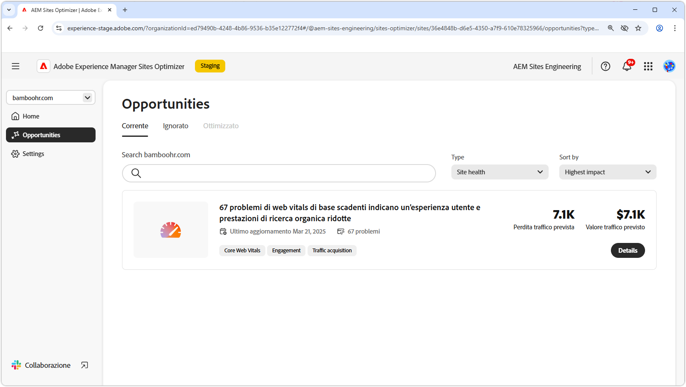

# Opportunità di integrità del sito

{align="center"}

Mantenere lo stato di salute del sito in AEM Sites Optimizer è essenziale per offrire esperienze digitali veloci, affidabili e ad alte prestazioni. Identificando opportunità di miglioramento, ad esempio Core Web Vitals, i team possono ottimizzare la velocità della pagina, l’interattività e la stabilità visiva per migliorare l’esperienza utente e la classificazione dei motori di ricerca. Un sito ben gestito garantisce una navigazione più fluida, un coinvolgimento migliore e prestazioni complessive migliorate. Sfruttando le informazioni di AEM Sites Optimizer è possibile monitorare e perfezionare continuamente il sito, garantendone l’efficienza e l’efficacia nel tempo.

## Opportunità

<!-- CARDS

* ../documentation/opportunities/core-web-vitals.md
  {title=Core web vitals}
  {image=../assets/common/card-performance.png}

-->
<!-- START CARDS HTML - DO NOT MODIFY BY HAND -->

    

        

            

                <figure class="image x-is-16by9">
                    
                </figure>
            

            

                

                    

                        <a href="../documentation/opportunities/core-web-vitals.md" target="_blank" rel="referrer" title="Elementi vitali web di base">Elementi vitali Web principali</a>
                    

                    
Scopri le principali opportunità di web vitals e come utilizzarle per migliorare l’acquisizione del traffico.

                

                <a href="../documentation/opportunities/core-web-vitals.md" target="_blank" rel="referrer" class="spectrum-Button spectrum-Button--outline spectrum-Button--primary spectrum-Button--sizeM" style="align-self: flex-start; margin-top: 1rem;">
                    Ulteriori informazioni
                </a>
            

        

    

<!-- END CARDS HTML - DO NOT MODIFY BY HAND -->

