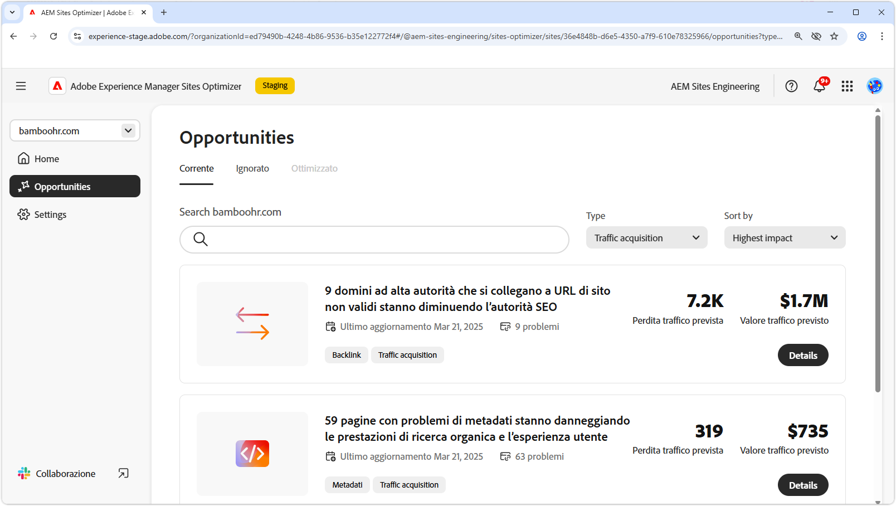

# Opportunità Acquisizione traffico

{align="center"}

L’acquisizione del traffico porta la potenziale clientela al tuo sito web e crea opportunità di vendita o di lead. Sfruttando strategie quali l’ottimizzazione dei motori di ricerca (SEO), le aziende possono migliorare la visibilità di ricerca e facilitare ulteriormente l’individuazione dei contenuti da parte degli utenti. Un flusso costante di visitatori aumenta la notorietà del brand e crea fiducia. Inoltre, fornisce informazioni preziose sul comportamento degli utenti. Queste informazioni aiutano i team a perfezionare le offerte e a migliorare l’esperienza complessiva. L’utilizzo delle informazioni di AEM Sites Optimizer consente un’ottimizzazione continua, garantendo una crescita sostenuta e tassi di conversione migliorati nel tempo.

## Opportunità

<!--
CARDS

 
* ../documentation/opportunities/broken-backlinks.md
  {title=Broken backlinks}
  {image=../assets/common/card-arrows.png}
* ../documentation/opportunities/invalid-or-missing-metadata.md
  {title=Invalid or missing metadata}
  {image=../assets/common/card-code.png}
* ../documentation/opportunities/missing-invalid-structured-data.md
  {title=Missing or invalid structured data}
  {image=../assets/common/card-bag.png}
* ../documentation/opportunities/sitemap-issues.md
  {title=Sitemap issues}
  {image=../assets/common/card-relationship.png}

-->
<!-- START CARDS HTML - DO NOT MODIFY BY HAND -->

    

        

            

                <figure class="image x-is-16by9">
                    
                </figure>
            

            

                

                    

                        <a href="../documentation/opportunities/broken-backlinks.md" target="_blank" rel="referrer" title="Backlink interrotti">Backlink interrotti</a>
                    

                    
Scopri l’opportunità Backlink interrotti e come utilizzarla per migliorare l’acquisizione del traffico.

                

                <a href="../documentation/opportunities/broken-backlinks.md" target="_blank" rel="referrer" class="spectrum-Button spectrum-Button--outline spectrum-Button--primary spectrum-Button--sizeM" style="align-self: flex-start; margin-top: 1rem;">
                    Ulteriori informazioni
                </a>
            

        

    

    

        

            

                <figure class="image x-is-16by9">
                    
                </figure>
            

            

                

                    

                        <a href="../documentation/opportunities/invalid-or-missing-metadata.md" target="_blank" rel="referrer" title="Metadati non validi o mancanti">Metadati non validi o mancanti</a>
                    

                    
Scopri l’opportunità relativa ai metadati non validi o mancanti e come utilizzarla per migliorare l’acquisizione del traffico.

                

                <a href="../documentation/opportunities/invalid-or-missing-metadata.md" target="_blank" rel="referrer" class="spectrum-Button spectrum-Button--outline spectrum-Button--primary spectrum-Button--sizeM" style="align-self: flex-start; margin-top: 1rem;">
                    Ulteriori informazioni
                </a>
            

        

    

    

        

            

                <figure class="image x-is-16by9">
                    
                </figure>
            

            

                

                    

                        <a href="../documentation/opportunities/missing-invalid-structured-data.md" target="_blank" rel="referrer" title="Dati strutturati mancanti o non validi">Dati strutturati mancanti o non validi</a>
                    

                    
Scopri l’opportunità relativa ai dati strutturati mancanti o non validi e come utilizzarla per migliorare l’acquisizione del traffico.

                

                <a href="../documentation/opportunities/missing-invalid-structured-data.md" target="_blank" rel="referrer" class="spectrum-Button spectrum-Button--outline spectrum-Button--primary spectrum-Button--sizeM" style="align-self: flex-start; margin-top: 1rem;">
                    Ulteriori informazioni
                </a>
            

        

    

    

        

            

                <figure class="image x-is-16by9">
                    
                </figure>
            

            

                

                    

                        <a href="../documentation/opportunities/sitemap-issues.md" target="_blank" rel="referrer" title="Problemi relativi alla mappa del sito">Problemi relativi alla mappa del sito</a>
                    

                    
Scopri l’opportunità Problemi relativi alla mappa del sito e come utilizzarla per migliorare l’acquisizione del traffico.

                

                <a href="../documentation/opportunities/sitemap-issues.md" target="_blank" rel="referrer" class="spectrum-Button spectrum-Button--outline spectrum-Button--primary spectrum-Button--sizeM" style="align-self: flex-start; margin-top: 1rem;">
                    Ulteriori informazioni
                </a>
            

        

    

<!-- END CARDS HTML - DO NOT MODIFY BY HAND -->
